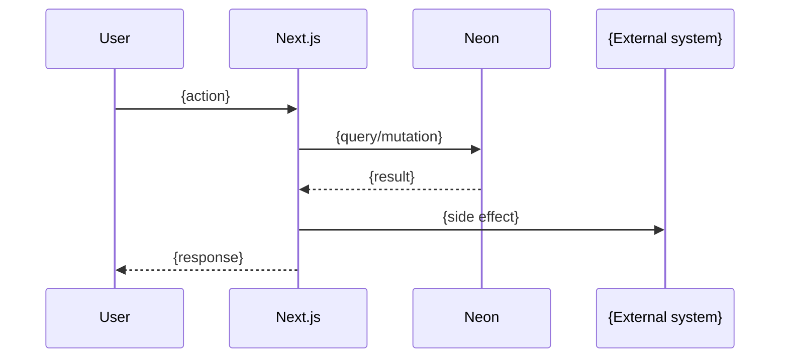

# Feature doc output template

Copy the block below into `docs/feature/{slug}.md`. Replace every `{...}` placeholder. Drop sections that genuinely don't apply (with a one-line note explaining why) — but Operations and Flow are non-negotiable.

The template is structured so the three pillars from [INTERVIEW.md](INTERVIEW.md) map 1:1 to the doc's three main sections. Frontmatter fields below are required; `pr-link`, `github-issue`, and additional fields are optional.

---

```markdown
---
status: living
last-updated: {YYYY-MM-DD}
related-adrs: [{adr001-...}]
related-design: thoughts/designs/{YYYY-MM-DD-slug}.md
related-epic: thoughts/epics/{YYYY-MM-DD-epic-name}.md
related-issues: [{#131}, {#142}]
related-prs: [{#155}]
---

# {Feature name in plain English}

> {One-sentence summary at ~grade 6. What does this thing do, for whom?}

## User value

{Pillar 1 answers — explain-mode prose, ~grade 6.}

**Who it's for**: {persona}.
**Problem it solves**: {one sentence}.
**Outcome they get**: {one sentence — the acceptance signal}.
**Out of scope**: {what this deliberately doesn't do}.

## Design

{Pillar 2 answers — tech-mode prose. Active voice, concrete file paths, no hedging.}

**Lives in**:
- `src/path/to/feature.ts` — {one-line purpose}
- `src/path/to/related.tsx` — {one-line purpose}

**Choice made**: {what was chosen}.
**Rejected alternatives**: {one or two — and why}.
**Trade-offs**: {what the next dev should know}.

> [!NOTE] {Optional — flag missing ADR if a hard-to-reverse decision lacks one. Recommend `/domain-model`. Do not create the ADR here.}

### Operations

**Health signals**: {PostHog events / log lines / metrics that say it's working}.
**Alerts**: {what fires on failure, where it fires}.
**Failure modes & fallback**: {what breaks; what we do; what the user sees}.
**Flags / env vars**: {feature flags, env-var names that gate this}.

## Flow

{Pillar 3 answers — tech-mode. Always include at least one Mermaid diagram.}

**Triggers** (all entry points):
- {UI: which button / route}
- {Cron: which schedule}
- {Webhook: which endpoint}

**Data path**: {input → store → output, in plain terms}.



<!--
Pick the diagram type that fits:
- sequenceDiagram   — ≥2 actors with ordered messages
- flowchart LR      — single-actor branching logic
- stateDiagram-v2   — explicit state transitions
- graph TD / LR     — feature spans ≥3 services/modules

Mirror the styles in /Users/sam/workspace/rekurve/rekurve/docs/README.md so they render in the existing stack.
-->

**State transitions** (if applicable): {pending → drafted → approved → sent}.
**Edge cases**: {what fails, what the user sees}.
**Side effects**: {webhooks, queue inserts, HubSpot upserts, emails, PostHog events}.

## Links

- ADRs: [{adr001-...}]({../adr/adr001-...md})
- Design: [{title}]({../../thoughts/designs/...md})
- Epic: [{title}]({../../thoughts/epics/...md})
- Related plans: [{title}]({../../thoughts/plans/...md})
- GitHub issues: [#{131}](https://github.com/{owner}/{repo}/issues/131), [#{142}](https://github.com/{owner}/{repo}/issues/142)
- Shipping PRs: [#{155}](https://github.com/{owner}/{repo}/pull/155)

---
*Generated from interview on {YYYY-MM-DD}. To regenerate, run `/document-feature {slug}`.*
```

---

## Notes for the agent

- **Bootstrap on first run**: if `docs/feature/` does not exist, create it before writing the file. Also create `docs/feature/README.md` with a short intro paragraph.
- **Existing-doc detection**: if the target slug already has a doc, ask the user "update or replace?" before overwriting.
- **Index update**: after writing the feature doc, append/update an alphabetical entry in `docs/feature/README.md`. Format: `- [Feature Name](slug.md) — one-line description from doc's intro.`
- **Empty pillars**: if a pillar genuinely has no answers (e.g. no operations instrumentation yet), keep the header and write a single italic line: `*No instrumentation yet — see [issue/ticket].*` Don't silently delete sections; absence is signal.
