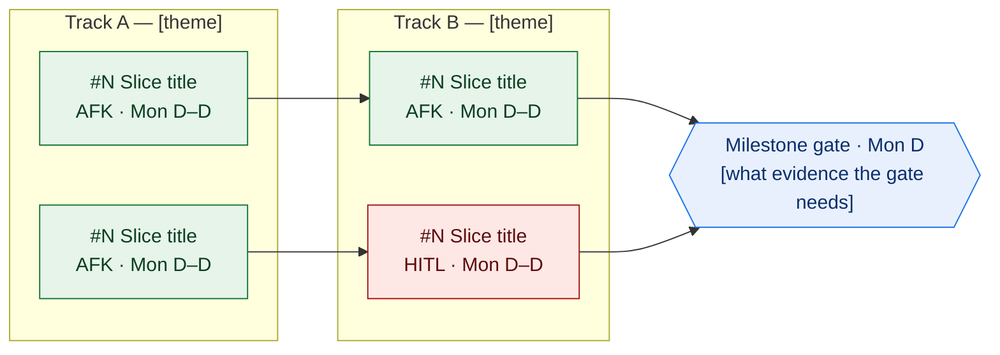

# Epic/Project Template

> Body principles (durability, behaviour-not-files, AC, out-of-scope) are in **[agent-brief.md](agent-brief.md)** — every ticket body must satisfy them. This template gives the type-specific structure on top. For breaking the epic into vertical-slice children, follow **[epic-breakdown.md](epic-breakdown.md)**.

Use this template for large initiatives, features spanning multiple tickets, and multi-week work.

## Template Structure

```markdown
Title: [High-level goal or deliverable]
Example: Launch self-service password management system

## Goal
[What are we building and why does it matter? Name the architecture/design this implements, and reference
the design doc section that governs it.]

## Business Context
**Problem**: [What problem are we solving?]
**Opportunity**: [What value does this create?]
**Success metrics**: [How will we measure success? Be specific and measurable — not "works well".]
**Stakeholders**: [Who cares about this?]

## Scope

**In Scope:**
- [Vertical-slice capability 1 — names the thing, not the files.]
- [Vertical-slice capability 2.]
- [Vertical-slice capability 3.]

**Out of Scope (explicitly):**
- [Excluded thing] — [which ticket/milestone owns it] (#N).
- [Excluded thing] — deferred; [the decision that deferred it, e.g. open-question 2, decided YYYY-MM-DD].

<!-- Each out-of-scope line must ROUTE (where the work actually lives) and, when
deferred by a decision, CITE that decision. "Separate initiative" alone is not enough. -->

## Key Deliverables
[Each entry is a child slice, wired in the dependency graph below. Group related
child slices into named tracks. Each track gets a one-line theme and, where
ordering matters, the reason it lands first/last. Reference children by #.]

<!-- Keep the required headings EXACTLY: Goal · Business context · Scope ·
Key deliverables · Dependencies · Risks and mitigations. The validator matches
them literally (case-insensitive) and only strips a trailing "(optional)" — any
other parenthetical (e.g. "Key deliverables (each a child slice…)") trips a
MISSING_* error. Put that descriptor in the body, not the heading. The extra
sections (Work breakdown, Acceptance gate, References) are not validator-required. -->

- **Track A — [theme]** ([why this track sequences where it does]): slice · slice · slice.
- **Track B — [theme]**: slice · slice · slice (#N) · slice (#M).
- **Track C — [theme]**: slice · slice.

## Work breakdown & dependencies (sub-issues)

Solid arrows are hard **"blocked by"** dependencies; a node with no incoming arrow is buildable now. **Green = AFK** (a coding agent can land it solo), **red = HITL** (needs a human — eval deltas, gold authoring, an architectural call). Dates in the node labels are the milestone schedule; the source of truth is the Project date fields.



**Critical path:** #N → #N → #N → gate ([one-line why this is the long pole]).
**Start-now (unblocked):** #N, #N, #N.

## Acceptance gate
[The epic-level definition of done — distinct from each child's acceptance
criteria. What must the whole initiative clear before it ships? For eval/ML
epics this is eval-shaped (a CI tripwire + a release gate); for others it is
the integration/release criteria.]
- **Tier 1 ([cheap, every-merge check])** — [what it catches].
- **Tier 2 ([full, per-release check])** — [the bar a change must clear to ship].
- [Any child-level gate rule: each block gates on moving its target without regressing others.]
- [Any shadow/guardrail rule: a risky lane stays computed-but-not-executed until <condition>.]

## Dependencies
- [External access / infra this needs.]
- [A child slice that is load-bearing for another track.]
- [Other teams: Design, Security, or other product/service teams.]

## Risks and mitigations
| Risk | Impact | Mitigation |
|---|---|---|
| [Risk] | High | [A concrete control — "one variable per eval run", "evaluate the router as a classifier before it gates routing" — not "test thoroughly".] |
| [Risk] | Medium | [Concrete control.] |

## References
- Design: `thoughts/designs/YYYY-MM-DD-<name>.md` (§ <sections that govern this>)
- Predecessor epic: #N (<what it established>)
- Reports / artifacts: `<path>`
- ADRs: `docs/adr/adrNNN-*.md`
- PRD: `docs/PRD.md`
```

## Guidelines

**Title style (this type):** High-level goal or deliverable phrasing — Build, Launch, Migrate, Ship. May name the architecture or major components in parentheses. Should make sense to the developer picking up the build and to non-technical stakeholders.
Example: "Build the production assessor — final architecture (router + doctrine prompt v2 + Bedrock)".

**When to use this template:** any work that breaches the 1–2 day rule from `SKILL.md` § Tracer-bullet vertical slices. Each child is a vertical slice; see `epic-breakdown.md`.

**Dates live in fields, not prose.** Don't add a Timeline section to the body. The roadmap is date-field-driven on the Project board — set Start/Target dates on publish (the field spec is in `references/github-publishing.md`). The Mermaid node labels carry human-readable dates as annotation only.
