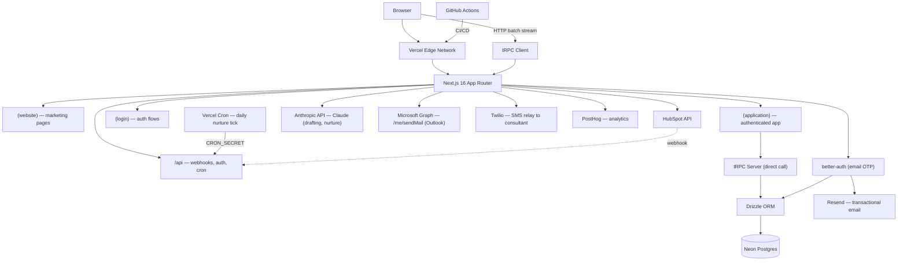
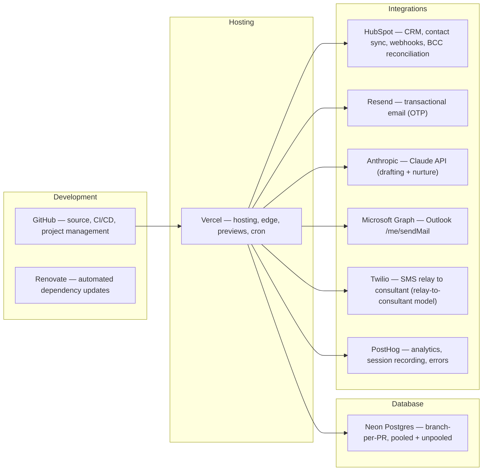
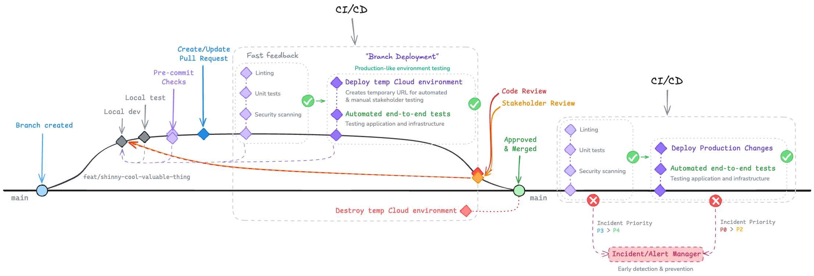
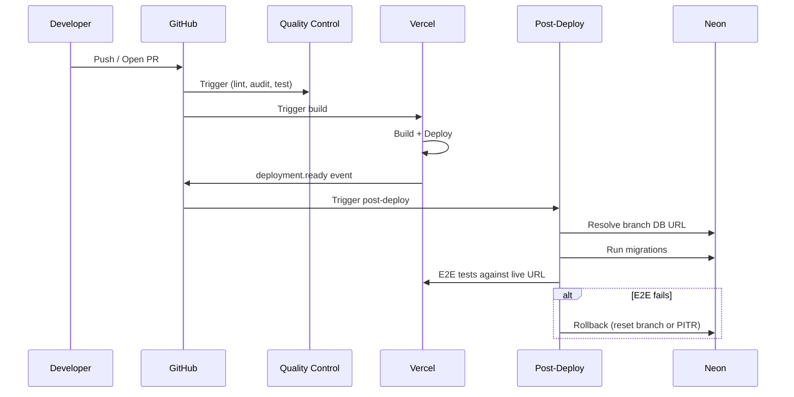
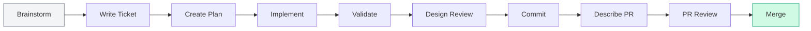

# Rekurve

> A Claude Code harness example for Real Engineers with a Real Project

Hi, I'm Sam and this is an AI sales assistant I built for my wife. She's a Sales Consultant for a new home builder in Brisbane, Australia.

The purpose of this project is to showcase the workflow and results of my personal AI enabled Software/Product Development Life Cycle (SDLC / PDLC); as Matt Pocock would say "Skills for Real Engineers". To do this properly, I chose to solve a real world problem with real commercial impact. Also my wife has been asking for something this this for some time; wo win-win, happy wife happy life and I get to prove out, teak and tune my AI Agent coding harness that I can use every day and make it work exactly how I to build and operate.

If you're interested in seeing how I use Claude Code, see the `CLAUDE.md` and `.claude/` config folder. Try it outa for yourself. Details on how I use it are roughly documented in the [Development Workflows](#development-workflows) section below.

If you would like help with building, implementing or simply discovering problems/solutions in your Enterprise, reach out to me on [Linkedin](https://www.linkedin.com/in/sam-j-marshall/) or get in touch with the [V2 AI](https://www.v2.ai/contact?utm_source=github&utm_medium=referral&utm_campaign=rekurve&utm_content=readme-contact-cta) team.

## Getting started

```bash
make install     # install deps
make env_pull    # pull env vars from Vercel (run make vercel_link first on a new clone)
make start       # dev server at https://www.localhost
```

## Architecture

### Application Stack



### Cloud Infrastructure



### Feature reference

Per-feature deep dives — what each shipped feature does today and where it lives in code — live in [`docs/feature/`](feature/README.md). These are living, present-tense docs. Run `/document-feature {slug}` from the repo root to add or refresh one.

### Decision records

Point-in-time architecture decisions — why we chose X over Y — live in [`docs/adr/`](adr/). ADRs are not living documents: each one is a snapshot of a decision and the alternatives considered at the time. Use the templates ([simple](adr/adr000-template-simple.md), [in-depth](adr/adr000-template-in-depth.md)) when adding a new one.

| ADR | Decision |
|-----|----------|
| [001](adr/adr001-imessage-integration-for-sales-automation.md) | iMessage integration for sales automation |
| [002](adr/adr002-layout-level-auth-gates-over-middleware.md) | Layout-level auth gates instead of `middleware.ts` |
| [003](adr/adr003-hubspot-source-of-truth-for-contacts.md) | HubSpot is the source of truth for contact data |
| [004](adr/adr004-webhook-swallow-and-always-200.md) | HubSpot webhook handler swallows per-event errors and always returns 200 |
| [005](adr/adr005-deterministic-lead-scoring.md) | Lead scoring is deterministic (no LLM) |
| [006](adr/adr006-lead-mutations-return-post-scoring-row.md) | Lead mutations return the post-scoring authoritative row |
| [007](adr/adr007-outlook-send-with-hubspot-bcc-reconciliation.md) | Outlook send with HubSpot BCC reconciliation |
| [008](adr/adr008-nurture-auto-start-is-best-effort.md) | Nurture auto-start failures are swallowed on the lead write path |
| [009](adr/adr009-nurture-advances-on-draft-failure.md) | Nurture scheduler advances `nextStepAt` even when `draftMessage` throws |
| [010](adr/adr010-inngest-source-of-truth-for-followup-plan.md) | Inngest is the source of truth for Follow-up plan run state |
| [011](adr/adr011-followup-drafts-retry-then-pause.md) | Follow-up drafts retry then pause on persistent failure |
| [012](adr/adr012-context-providers-for-global-state-only.md) | Context Providers reserved for genuinely global state only |
| [013](adr/adr013-local-db-canonical-for-lead-data.md) | Local DB is the canonical store for lead data |
| [014](adr/adr014-outbox-pattern-for-inngest-delivery.md) | Transactional outbox for at-least-once delivery to Inngest |
| [015](adr/adr015-upstash-rate-limit-for-otp-send.md) | Upstash rate-limit for OTP-send, email-keyed, via better-auth before-hook |

## Prerequisites

### Required

| Tool | Version | Notes |
|------|---------|-------|
| Node.js | v24 | See `.nvmrc` — use `nvm use` |
| Yarn | 3.8.7 | Enabled via Corepack: `corepack enable` |
| Git | Latest | — |

### Optional

| Tool | Purpose | Install |
|------|---------|---------|
| Neon CLI (`neonctl`) | Database branching | `npm i -g neonctl` |
| Playwright browsers | E2E tests | `yarn playwright install` |
| Claude Code CLI | AI-assisted workflows | [claude.ai/code](https://claude.ai/code) |

### Environment Setup

Vercel is the source of truth for env vars. Link the project once per clone, then pull when you need a fresh local secrets file:

```bash
make vercel_link   # one-time: links .vercel/project.json (gitignored)
make env_pull      # writes .env.local from the Vercel "development" environment
```

**Fallback (no Vercel access):** Copy and fill in manually:

```bash
cp .env.example .env
# Fill in the values below
```

| Variable | Group | Description |
|----------|-------|-------------|
| `DATABASE_URL` | Database | Neon pooled connection string |
| `DATABASE_URL_UNPOOLED` | Database | Neon direct connection (migrations) |
| `BETTER_AUTH_SECRET` | Auth | 32+ char secret (`openssl rand -base64 32`) |
| `BETTER_AUTH_URL` | Auth | App URL (`http://localhost:3000` for dev) |
| `RESEND_API_KEY` | Email | Resend API key for OTP delivery |
| `HUBSPOT_ACCESS_TOKEN` | HubSpot | Private app access token |
| `HUBSPOT_CLIENT_SECRET` | HubSpot | Private app client secret (webhook validation) |
| `HUBSPOT_BCC_ADDRESS` | HubSpot | Portal-specific `bcc-NNNNN@bcc.hubspot.com` for outbound email reconciliation |
| `ANTHROPIC_API_KEY` | AI | Claude API key — used by message drafting and nurture scheduler |
| `CRON_SECRET` | Cron | Shared secret (≥16 chars) — gates `/api/cron/*` routes from Vercel Cron |
| `MS_GRAPH_CLIENT_ID` | Outlook | Microsoft Graph app client ID (Outlook send-on-behalf) |
| `MS_GRAPH_CLIENT_SECRET` | Outlook | Microsoft Graph app client secret |
| `MS_GRAPH_REDIRECT_URI` | Outlook | OAuth redirect URI for Microsoft Graph consent flow |
| `TWILIO_ACCOUNT_SID` | SMS | Twilio Account SID (`AC…`) |
| `TWILIO_AUTH_TOKEN` | SMS | Twilio Auth Token (sensitive — mark `--sensitive` in Vercel) |
| `TWILIO_FROM_NUMBER` | SMS | E.164 Twilio sending number (e.g. `+14155551234`) |
| `TWILIO_CONSULTANT_NUMBER` | SMS | E.164 consultant phone number that receives relayed drafts |
| `NEXT_PUBLIC_POSTHOG_KEY` | Analytics | PostHog project API key |
| `NEXT_PUBLIC_POSTHOG_HOST` | Analytics | PostHog ingest host (reverse-proxied) |
| `POSTHOG_ERROR_TRACKING_API_KEY` | Analytics | PostHog error tracking key |
| `POSTHOG_PROJECT_ID` | Analytics | PostHog project ID (numeric) |
| `NEON_API_KEY` | Database | Neon API key (optional — local DB branching) |
| `NEON_PROJECT_ID` | Database | Neon project ID (optional — local DB branching) |
| `ROBOTS_TXT` | SEO | `Disallow` (default) or `Allow` |
| `INNGEST_EVENT_KEY` | Inngest | Event API key (optional — not required for local dev server) |
| `INNGEST_SIGNING_KEY` | Inngest | Signing key for webhook verification (optional — not required locally) |
| `KV_REST_API_URL` | Rate-limiting | Upstash Redis REST URL — gates OTP-send rate limiter (required; use `make env_pull` from Vercel) |
| `KV_REST_API_TOKEN` | Rate-limiting | Upstash Redis REST token (sensitive — `vercel env add KV_REST_API_TOKEN --sensitive`) |

Environment validation is enforced at build time via `src/env.js` (uses `@t3-oss/env-nextjs` + Zod). Set `SKIP_ENV_VALIDATION=1` to bypass during Docker builds or CI steps that don't need the full env.

### Make Targets

All commands go through the `Makefile`. Prefer `make` targets over raw `yarn`/`npm` commands.

| Target | Description |
|--------|-------------|
| `make install` | Install dependencies (`yarn`) |
| `make build` | Clean build (`rm -rf .next` + `yarn build`) |
| `make start` | Local dev server (`yarn dev --turbo`) |
| `make check` | Lint + typecheck (`biome check` + `tsc --noEmit`) |
| `make fix` | Auto-fix lint + formatting |
| `make test` | Run Rstest unit tests |
| `make test_coverage` | Unit tests with Istanbul coverage |
| `make test_e2e` | Run Playwright E2E tests |
| `make audit` | NPM security audit (production deps) |
| `make db_generate` | Generate a Drizzle migration SQL file in `drizzle/` |
| `make db_migrate` | Apply pending migrations and record them in `__drizzle_migrations` |
| `make db_studio` | Open Drizzle Studio GUI |
| `make db_branch` | Create/switch Neon DB branch for current git branch |
| `make db_branch_delete` | Delete current branch's Neon DB branch |
| `make db_branch_delete_all` | Delete all `local/*` Neon branches |
| `make db_branch_status` | List all local Neon branches |
| `make hubspot_setup` | Run HubSpot setup script |
| `make vercel_link` | Link local project to Vercel (one-time per clone) |
| `make env_pull` | Pull development env vars from Vercel into `.env.local` |
| `make env_pull_preview` | Pull preview env vars from Vercel for the current branch |
| `make inngest_dev` | Start Inngest dev server at `http://localhost:8288` (run alongside `make start`) |
| `make release` | Semantic release via `auto shipit` |
| `make clean` | Remove `.next`, `node_modules`, caches |

## Integrations

### Microsoft Graph setup

Email dispatch routes through each consultant's Microsoft 365 mailbox via the Microsoft Graph API. This requires a multi-tenant Azure AD app registration.

#### Azure AD app registration

1. Go to [portal.azure.com](https://portal.azure.com) → Azure Active Directory → App registrations → New registration
2. Set **Supported account types** to `Accounts in any organizational directory (Any Azure AD directory - Multitenant)`
3. Add a Redirect URI: `https://www.localhost/api/auth/ms-graph/callback` (Web platform)
4. Under **Certificates & secrets**, create a client secret
5. Under **API permissions**, add delegated permissions: `Mail.Send`, `User.Read`, `offline_access`

#### Environment variables

Add these to Vercel (use `--sensitive` for secrets):

```bash
vercel env add MS_GRAPH_CLIENT_ID
vercel env add MS_GRAPH_CLIENT_SECRET   # --sensitive
vercel env add MS_GRAPH_REDIRECT_URI    # e.g. https://www.localhost/api/auth/ms-graph/callback
vercel env add HUBSPOT_BCC_ADDRESS      # e.g. 12345678@bcc.hubspot.com (from HubSpot Settings → Integrations → Email)
```

#### Connecting a consultant's mailbox

Navigate to `/api/auth/ms-graph/start` while logged in. This redirects to Microsoft's OAuth consent screen. After consent, the user lands at `/dashboard?ms_connected=1` and email dispatch is enabled.

The connect banner on the dashboard also appears when no token row exists for the current user.

#### E2E testing with a real mailbox

Set `MS_GRAPH_TEST_ACCESS_TOKEN` in your local `.env.local` (not committed, not pushed to Vercel) to a valid Graph access token for a test mailbox. The `email-dispatch.spec.ts` E2E spec uses this token to seed the `ms_graph_tokens` table for the test user.

### Twilio SMS setup

Approved SMS drafts are relayed to the consultant's personal phone via Twilio. The consultant forwards the message from the native Messages app. **Drafts are never sent directly to leads** — only to `TWILIO_CONSULTANT_NUMBER`. This sidesteps A2P/10DLC consumer registration and keeps data forward-compatible with ADR-001 (iMessage device-bridge) which will replace the manual-forward step.

#### Environment variables

Add these to Vercel (use `--sensitive` for the auth token):

```bash
vercel env add TWILIO_ACCOUNT_SID                # e.g. ACxxxxxxxxxxxxxxxxxxxxxxxxxxxxxxxx
vercel env add TWILIO_AUTH_TOKEN --sensitive      # Twilio Auth Token
vercel env add TWILIO_FROM_NUMBER                 # E.164, e.g. +14155551234
vercel env add TWILIO_CONSULTANT_NUMBER           # E.164, the consultant's phone
```

#### Status callback

Twilio posts delivery status updates (queued → sent → delivered / failed) to:

```
<deployment-url>/api/twilio/status
```

Configure this URL in the Twilio Console → Phone Numbers → Manage → Active Numbers → select your number → Messaging → A message comes in → Status Callback. Set it for both Preview and Production deployment URLs.

The route validates `X-Twilio-Signature` using the SDK. Unsigned requests return 403.

### HubSpot integrations

#### Webhook subscriptions

The webhook endpoint at `/api/hubspot/webhook` handles:

| Subscription type | Behaviour |
|---|---|
| `contact.creation` | Upserts local lead from HubSpot contact |
| `contact.propertyChange` | Syncs mapped property changes to local lead |
| `contact.deletion` | Deletes local lead |
| `email.creation` | Reconciles `conversations.hubspotActivityId` for outbound emails sent via Graph + BCC |

To add the `email.creation` subscription: HubSpot Settings → Integrations → Private Apps → your app → Webhooks → Add subscription → `email.creation`.

#### BCC ingestion address

`HUBSPOT_BCC_ADDRESS` is your portal-specific BCC address (format: `<portalId>@bcc.hubspot.com`). Find it in HubSpot Settings → Integrations → Email → BCC address. Every outbound email sent via Graph includes this address in BCC so HubSpot auto-ingests it as an email engagement on the contact's timeline.

## CI/CD Pipeline



### Active Workflows

#### Quality Control (`quality-control.yml`)

- **Trigger**: Push to `main`, PRs targeting `main`
- **Jobs**:
  - **Lint & Type Check** — `make check`
  - **NPM Audit** — `make audit` (production dependencies)
  - **Unit Tests** — `make test_coverage` with Istanbul coverage summary posted as a PR comment

#### Release (`release.yml`)

- **Trigger**: Push to `main` (skips if commit message contains `ci skip` or `skip ci`)
- **Job**: Semantic release via `auto shipit` — creates GitHub releases and git tags

#### Neon Branch Cleanup (`neon.yml`)

- **Trigger**: PR closed
- **Job**: Deletes the PR's Neon preview branch (`preview/<branch-name>`)

#### Post-Deploy Verification (`post-deploy.yml`)

- **Trigger**: Vercel `deployment.ready` event (`repository_dispatch`)
- **Steps**:
  1. Resolve the Neon branch database URL for the deployment environment
  2. Record pre-migration timestamp (for rollback)
  3. Run `db:check` and `db:migrate` against the branch database
  4. Run Playwright E2E tests against the live Vercel URL
- **Rollback on failure**:
  - Preview: resets Neon branch to parent
  - Production: point-in-time restore to pre-migration timestamp

### Local Database Branching

When you switch git branches locally, a Neon database branch named `local/{branch}` is automatically created (via the `post-checkout` hook). This gives each feature branch its own isolated copy of the production database.

**Setup** (one-time):
1. Get your API key from Neon Console → Account Settings → API Keys
2. Get the project ID from Neon Console → Project Settings → General
3. Add both to your `.env`:
   ```
   NEON_API_KEY=your-key-here
   NEON_PROJECT_ID=your-project-id
   ```

**Manual control**:
- `make db_branch` — create/switch to the branch DB
- `make db_branch_delete` — delete the current branch's DB
- `make db_branch_delete_all` — clean up all `local/*` branches
- `make db_branch_status` — list all local branches

**Opting out**: If `NEON_API_KEY` is not set, the hook silently skips. Developers who don't need isolated databases can continue using their existing connection strings.

### Vercel Environment Management

Vercel is the source of truth for all env vars. Use the Vercel CLI (installed as a devDependency — available via `yarn vercel`) to manage them without touching the dashboard.

**One-time setup per clone:**

```bash
make vercel_link   # writes .vercel/project.json (gitignored)
make env_pull      # writes .env.local from the Vercel "development" environment
```

**Managing secrets:**

```bash
# Add a secret (prompts for value — no shell history leak)
yarn vercel env add NAME production --sensitive
# Repeat for preview and development as needed

yarn vercel env rm NAME production    # remove
yarn vercel env ls                    # list all

# Per-branch preview override
yarn vercel env add NAME preview <branch>
```

Use `--sensitive` for `CRON_SECRET`, `BETTER_AUTH_SECRET`, `HUBSPOT_*`, `ANTHROPIC_API_KEY`, `RESEND_API_KEY` — hides the value in the dashboard after creation.

**Never:**
- `vercel deploy` from a dev machine — Git integration drives deploys so preview/prod URLs stay traceable to commits.
- `vercel pull` into `.env` — always target `.env.local` (pull overwrites the file).
- Commit `.vercel/` — already in `.gitignore`.

### Deployment Flow



### Planned Claude CI Workflows

These workflows are defined in `.github/todo/` and will be activated as the project matures.

| Workflow | File | Purpose |
|----------|------|---------|
| `@claude` Agent | `claude.yml` | Responds to `@claude` mentions in issues/PRs |
| Code Review | `claude-code-review.yml` | Automated PR code review |
| PR Description | `claude-pr-description.yml` | Auto-generate PR descriptions |
| Issue Triage | `claude-issue-triage.yml` | Auto-label and categorize new issues |
| Renovate Fix | `claude-renovate-fix.yml` | Auto-fix Renovate dependency update breakage |
| Security Review | `claude-security-review.yml` | Security-focused PR review |

### Dependency Management

Automated via [Renovate](https://docs.renovatebot.com/). Configuration in `.github/renovate.json`:

- Extends shared org config (`github>V2-Digital/renovate-config`)
- Schedule: weekdays, 9am–4pm AEST
- Max 10 concurrent PRs

## Development Workflows

### SDLC Overview



Not every task uses every step. Small fixes can skip straight to Implement → Commit. The full flow is available when needed.

### Interactive Claude Workflows

These commands are invoked inside [Claude Code](https://claude.ai/code) via slash commands.

| Command | What it does | When to use |
|---------|-------------|-------------|
| `/brainstorm` | Socratic exploration of rough ideas into a design doc | Before writing code — refine what you're building |
| `/write_ticket` | Collaborative ticket writing | Creating GitHub issues with clear scope |
| `/review_roadmap` | GitHub Project prioritization review | Re-assessing milestone priorities |
| `/create_plan` | Research-heavy plan creation → `thoughts/plans/`. Applies `frontend-design` skill for UI work | Starting a new feature or significant change |
| `/iterate_plan` | Update existing plan with new feedback | Plan needs revision after code review or discovery |
| `/implement_plan <path>` | Execute a plan phase-by-phase. Invokes `frontend-design` skill for UI phases | Working through an approved plan |
| `/validate_plan <path>` | Verify implementation matches plan intent | After implementing — check nothing was missed |
| `/plan-to-ralph-spec <path>` | Convert markdown plan to `.spec.json` for Ralph | Before running `ralph.sh` — produces the JSON spec Ralph reads |
| `/commit` | Structured conventional commit | Ready to commit (follows repo conventions) |
| `/design_review` | Visual/accessibility/brand review via Playwright | After UI/UX changes, before committing |
| `/pull-request` | Create or update a PR — generates title (create) and description from diff + template | Before opening or updating a PR |

### Automated: Ralph Loop

Ralph is a headless Claude agent that implements plans unattended, section by section.

**How it works:**
1. Reads a `.spec.json` file (generated by `/plan-to-ralph-spec`) for section discovery
2. Creates a git worktree for isolation
3. Finds the next incomplete section from the spec
4. Runs Claude in implement mode (code changes)
5. Runs Claude in validate mode (verification, commit)
6. Writes state transitions to the spec (`pending` → `implemented` → `validated`)
7. Repeats until all sections are complete, then pushes and creates a PR
8. Records JSONL metrics for cost/performance tracking

**Workflow:**

```bash
# 1. Convert plan to spec (review the output)
/plan-to-ralph-spec thoughts/plans/2026-04-01-my-feature.md

# 2. Run ralph
scripts/ralph.sh thoughts/plans/2026-04-01-my-feature.md [options]
```

Ralph auto-detects a sibling `.spec.json` when given a `.md` path. You can also pass the `.spec.json` directly.

**Options:**

| Flag | Default | Description |
|------|---------|-------------|
| `--billing MODE` | max | `max` (subscription) or `api` (API key, metered) |
| `--max-turns N` | 15 | Max Claude agent turns per session |
| `--max-budget USD` | 5.00 | Max USD per session (api mode only) |
| `--implement-model MODEL` | sonnet | Claude model for implement phase |
| `--validate-model MODEL` | opus | Claude model for validate phase |
| `--implement-prompt PATH` | `.claude/prompts/ralph-implement.md` | Override implement prompt |
| `--validate-prompt PATH` | `.claude/prompts/ralph-validate.md` | Override validate prompt |
| `--granularity MODE` | section | `section` or `checkbox` |
| `--no-devserver` | — | Skip dev server (yarn dev) |
| `--no-neon` | — | Skip Neon branch even if migrations detected |
| `--no-pr` | — | Skip PR creation after loop completes |
| `--dry-run` | — | Parse spec and print sections without running Claude |

**Environment:** Set `NEON_PROJECT_ID` for automatic Neon branch provisioning.

**When to use Ralph vs interactive `/implement_plan`:**
- Use **Ralph** for well-defined plans where you want hands-off execution (e.g., overnight runs, large multi-section plans)
- Use **`/implement_plan`** when you want to stay in the loop, review changes as they happen, or the plan requires judgment calls

### Contributing Workflow

Step-by-step for human developers and AI agents:

1. **Branch** — Create a branch from `main`
2. **Plan** — Use `/brainstorm` or `/create_plan` (or write code directly for small changes)
3. **Implement** — Write code, use `/implement_plan` for plan-driven work
4. **Check locally** — `make check` + `make test`
5. **Review UI** — Run `/design_review` if you touched anything visual
6. **Commit** — Use `/commit` for conventional commit messages
7. **Push + PR** — Use `/pull-request` to push (if needed) and create the PR with a generated description
8. **CI** — Quality Control workflow runs automatically on PR
9. **Preview** — Vercel deploys a preview, post-deploy runs migrations + E2E
10. **Merge** — Review + merge → Release workflow creates a tag

### Prerequisites by Task Type

| Task | Node + Yarn | `.env` vars | Neon CLI | Playwright | Claude Code |
|------|:-----------:|:-----------:|:--------:|:----------:|:-----------:|
| Frontend development | Yes | Core set | — | — | — |
| Backend / API | Yes | + `DATABASE_URL` | Optional | — | — |
| E2E testing | Yes | + test env | — | Yes | — |
| AI-assisted development | Yes | Full set | Optional | Optional | Yes |
| Ralph automation | Yes | Full set | Optional | Optional | Yes + plan file |

## License

[MIT](../LICENSE) © 2025–2026 Samuel Marshall
