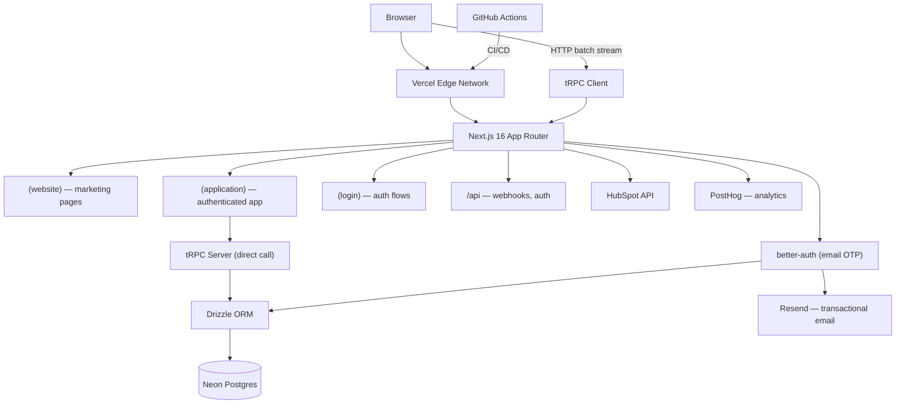
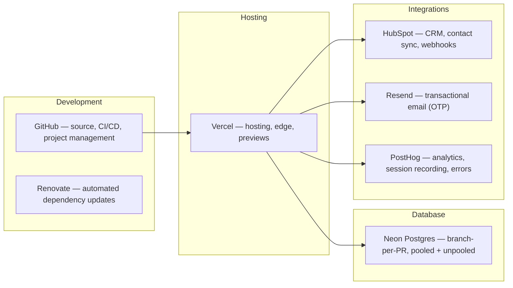
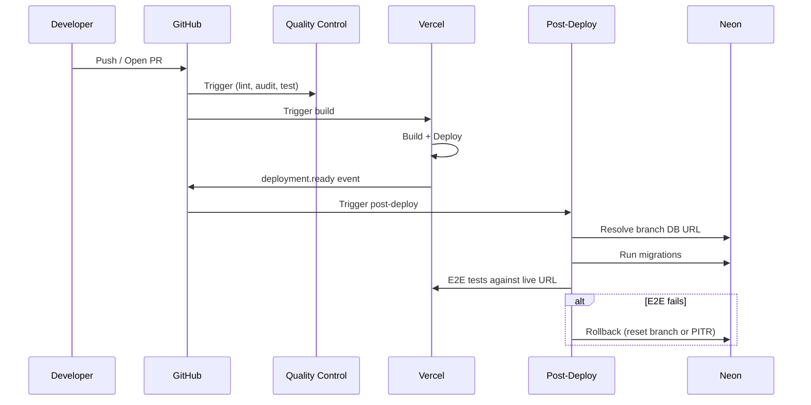

# Rekurve — Developer Guide

## Architecture

### Application Stack



### Cloud Infrastructure



## Prerequisites

### Required

| Tool | Version | Notes |
|------|---------|-------|
| Node.js | v24 | See `.nvmrc` — use `nvm use` |
| Yarn | 3.8.7 | Enabled via Corepack: `corepack enable` |
| Git | Latest | — |

### Optional

| Tool | Purpose | Install |
|------|---------|---------|
| Neon CLI (`neonctl`) | Database branching | `npm i -g neonctl` |
| Playwright browsers | E2E tests | `yarn playwright install` |
| Claude Code CLI | AI-assisted workflows | [claude.ai/code](https://claude.ai/code) |

### Environment Setup

```bash
cp .env.example .env
# Fill in the values below
```

| Variable | Group | Description |
|----------|-------|-------------|
| `DATABASE_URL` | Database | Neon pooled connection string |
| `DATABASE_URL_UNPOOLED` | Database | Neon direct connection (migrations) |
| `BETTER_AUTH_SECRET` | Auth | 32+ char secret (`openssl rand -base64 32`) |
| `BETTER_AUTH_URL` | Auth | App URL (`http://localhost:3000` for dev) |
| `RESEND_API_KEY` | Email | Resend API key for OTP delivery |
| `HUBSPOT_ACCESS_TOKEN` | HubSpot | Private app access token |
| `HUBSPOT_CLIENT_SECRET` | HubSpot | Private app client secret (webhook validation) |
| `NEXT_PUBLIC_POSTHOG_KEY` | Analytics | PostHog project API key |
| `NEXT_PUBLIC_POSTHOG_HOST` | Analytics | PostHog ingest host (reverse-proxied) |
| `POSTHOG_ERROR_TRACKING_API_KEY` | Analytics | PostHog error tracking key |
| `POSTHOG_PROJECT_ID` | Analytics | PostHog project ID (numeric) |
| `ROBOTS_TXT` | SEO | `Disallow` (default) or `Allow` |

Environment validation is enforced at build time via `src/env.js` (uses `@t3-oss/env-nextjs` + Zod). Set `SKIP_ENV_VALIDATION=1` to bypass during Docker builds or CI steps that don't need the full env.

### Make Targets

All commands go through the `Makefile`. Prefer `make` targets over raw `yarn`/`npm` commands.

| Target | Description |
|--------|-------------|
| `make install` | Install dependencies (`yarn`) |
| `make build` | Clean build (`rm -rf .next` + `yarn build`) |
| `make start` | Local dev server (`yarn dev --turbo`) |
| `make check` | Lint + typecheck (`biome check` + `tsc --noEmit`) |
| `make fix` | Auto-fix lint + formatting |
| `make test` | Run Rstest unit tests |
| `make test_coverage` | Unit tests with Istanbul coverage |
| `make test_e2e` | Run Playwright E2E tests |
| `make audit` | NPM security audit (production deps) |
| `make db_generate` | Generate Drizzle migration files |
| `make db_push` | Push schema to database |
| `make db_studio` | Open Drizzle Studio GUI |
| `make release` | Semantic release via `auto shipit` |
| `make clean` | Remove `.next`, `node_modules`, caches |

## CI/CD Pipeline

### Active Workflows

#### Quality Control (`quality-control.yml`)

- **Trigger**: Push to `main`, PRs targeting `main`
- **Jobs**:
  - **Lint & Type Check** — `make check`
  - **NPM Audit** — `make audit` (production dependencies)
  - **Unit Tests** — `make test_coverage` with Istanbul coverage summary posted as a PR comment

#### Release (`release.yml`)

- **Trigger**: Push to `main` (skips if commit message contains `ci skip` or `skip ci`)
- **Job**: Semantic release via `auto shipit` — creates GitHub releases and git tags

#### Neon Branch Cleanup (`neon.yml`)

- **Trigger**: PR closed
- **Job**: Deletes the PR's Neon preview branch (`preview/<branch-name>`)

#### Post-Deploy Verification (`post-deploy.yml`)

- **Trigger**: Vercel `deployment.ready` event (`repository_dispatch`)
- **Steps**:
  1. Resolve the Neon branch database URL for the deployment environment
  2. Record pre-migration timestamp (for rollback)
  3. Run `db:check` and `db:migrate` against the branch database
  4. Run Playwright E2E tests against the live Vercel URL
- **Rollback on failure**:
  - Preview: resets Neon branch to parent
  - Production: point-in-time restore to pre-migration timestamp

### Deployment Flow



### Planned Claude CI Workflows

These workflows are defined in `.github/todo/` and will be activated as the project matures.

| Workflow | File | Purpose |
|----------|------|---------|
| `@claude` Agent | `claude.yml` | Responds to `@claude` mentions in issues/PRs |
| Code Review | `claude-code-review.yml` | Automated PR code review |
| PR Description | `claude-pr-description.yml` | Auto-generate PR descriptions |
| Issue Triage | `claude-issue-triage.yml` | Auto-label and categorize new issues |
| Renovate Fix | `claude-renovate-fix.yml` | Auto-fix Renovate dependency update breakage |
| Security Review | `claude-security-review.yml` | Security-focused PR review |

### Dependency Management

Automated via [Renovate](https://docs.renovatebot.com/). Configuration in `.github/renovate.json`:

- Extends shared org config (`github>V2-Digital/renovate-config`)
- Schedule: weekdays, 9am–4pm AEST
- Max 10 concurrent PRs

## Development Workflows

### SDLC Overview


Not every task uses every step. Small fixes can skip straight to Implement → Commit. The full flow is available when needed.

### Interactive Claude Workflows

These commands are invoked inside [Claude Code](https://claude.ai/code) via slash commands.

| Command | What it does | When to use |
|---------|-------------|-------------|
| `/brainstorm` | Socratic exploration of rough ideas into a design doc | Before writing code — refine what you're building |
| `/write_ticket` | Collaborative ticket writing | Creating GitHub issues with clear scope |
| `/review_roadmap` | GitHub Project prioritization review | Re-assessing milestone priorities |
| `/create_plan` | Research-heavy plan creation → `thoughts/plans/` | Starting a new feature or significant change |
| `/iterate_plan` | Update existing plan with new feedback | Plan needs revision after code review or discovery |
| `/implement_plan <path>` | Execute a plan phase-by-phase | Working through an approved plan |
| `/validate_plan <path>` | Verify implementation matches plan intent | After implementing — check nothing was missed |
| `/plan-to-ralph-spec <path>` | Convert markdown plan to `.spec.json` for Ralph | Before running `ralph.sh` — produces the JSON spec Ralph reads |
| `/commit` | Structured conventional commit | Ready to commit (follows repo conventions) |
| `/design_review` | Visual/accessibility/brand review via Playwright | After UI/UX changes, before committing |
| `/describe_pr` | Generate PR description from diff + template | Before opening a PR |

### Automated: Ralph Loop

Ralph is a headless Claude agent that implements plans unattended, section by section.

**How it works:**
1. Reads a `.spec.json` file (generated by `/plan-to-ralph-spec`) for section discovery
2. Creates a git worktree for isolation
3. Finds the next incomplete section from the spec
4. Runs Claude in implement mode (code changes)
5. Runs Claude in validate mode (verification, commit)
6. Writes state transitions to the spec (`pending` → `implemented` → `validated`)
7. Repeats until all sections are complete, then pushes and creates a PR
8. Records JSONL metrics for cost/performance tracking

**Workflow:**

```bash
# 1. Convert plan to spec (review the output)
/plan-to-ralph-spec thoughts/plans/2026-04-01-my-feature.md

# 2. Run ralph
scripts/ralph.sh thoughts/plans/2026-04-01-my-feature.md [options]
```

Ralph auto-detects a sibling `.spec.json` when given a `.md` path. You can also pass the `.spec.json` directly.

**Options:**

| Flag | Default | Description |
|------|---------|-------------|
| `--billing MODE` | max | `max` (subscription) or `api` (API key, metered) |
| `--max-turns N` | 15 | Max Claude agent turns per session |
| `--max-budget USD` | 5.00 | Max USD per session (api mode only) |
| `--implement-model MODEL` | sonnet | Claude model for implement phase |
| `--validate-model MODEL` | opus | Claude model for validate phase |
| `--implement-prompt PATH` | `.claude/prompts/ralph-implement.md` | Override implement prompt |
| `--validate-prompt PATH` | `.claude/prompts/ralph-validate.md` | Override validate prompt |
| `--granularity MODE` | section | `section` or `checkbox` |
| `--no-devserver` | — | Skip dev server (yarn dev) |
| `--no-neon` | — | Skip Neon branch even if migrations detected |
| `--no-pr` | — | Skip PR creation after loop completes |
| `--dry-run` | — | Parse spec and print sections without running Claude |

**Environment:** Set `NEON_PROJECT_ID` for automatic Neon branch provisioning.

**When to use Ralph vs interactive `/implement_plan`:**
- Use **Ralph** for well-defined plans where you want hands-off execution (e.g., overnight runs, large multi-section plans)
- Use **`/implement_plan`** when you want to stay in the loop, review changes as they happen, or the plan requires judgment calls

### Contributing Workflow

Step-by-step for human developers and AI agents:

1. **Branch** — Create a branch from `main`
2. **Plan** — Use `/brainstorm` or `/create_plan` (or write code directly for small changes)
3. **Implement** — Write code, use `/implement_plan` for plan-driven work
4. **Check locally** — `make check` + `make test`
5. **Review UI** — Run `/design_review` if you touched anything visual
6. **Commit** — Use `/commit` for conventional commit messages
7. **Push + PR** — Push branch, use `/describe_pr` to generate the PR description
8. **CI** — Quality Control workflow runs automatically on PR
9. **Preview** — Vercel deploys a preview, post-deploy runs migrations + E2E
10. **Merge** — Review + merge → Release workflow creates a tag

### Prerequisites by Task Type

| Task | Node + Yarn | `.env` vars | Neon CLI | Playwright | Claude Code |
|------|:-----------:|:-----------:|:--------:|:----------:|:-----------:|
| Frontend development | Yes | Core set | — | — | — |
| Backend / API | Yes | + `DATABASE_URL` | Optional | — | — |
| E2E testing | Yes | + test env | — | Yes | — |
| AI-assisted development | Yes | Full set | Optional | Optional | Yes |
| Ralph automation | Yes | Full set | Optional | Optional | Yes + plan file |
