# The transactional-outbox posture is system-wide: write → deliver → backstop → read, with canonical state in rows and the UI never reading the event tape

## Context and Problem Statement

[adr013](adr013-local-db-canonical-for-lead-data.md), [adr014](adr014-outbox-pattern-for-inngest-delivery.md), and [adr017](adr017-atomic-outbox-writes-via-neon-http-batch.md) defined the canonical store, the delivery contract, and the atomicity mechanism for the *Lead* surface; [adr010](adr010-inngest-source-of-truth-for-followup-plan.md) fixed the control-state-vs-output-state split for the *nurture* surface. Since then, every new write surface — message approve/dispatch, HubSpot webhook ingest, engagement reconciliation — has reused exactly the same machinery. The posture is de-facto system-wide, but it is recorded only as a constellation of four leads/nurture-scoped ADRs plus consequence notes.

Two details have drifted from the recorded text. First, the sweep cadence: the cron sweep runs **hourly** in code (`cron: "0 * * * *"` in `src/inngest/functions/outbox/sweep.ts`), and the 30-second value survives only as the row-age anti-race floor in the sweep's filter (`created_at < now() - interval '30 seconds'`) — while adr014's headline still says "30s cron sweep." Second, the helper shape: adr014's future-work sketch of a typed `outbox.publish(tx, event, payload)` helper is signature-impossible under adr017's batch-only rule — interactive transactions do not exist on `neon-http` — and the helper that actually shipped is the batch-shaped `buildOutboxEvent` in `src/server/outbox/index.ts`, which returns an unexecuted insert for inclusion in the caller's single `db.batch`.

The sibling ai-insurance-claims project consolidated exactly these four decisions into one project-local ADR for its claims domain, and proved that the single-statement form is what new-domain authors actually cite. The upcoming domain-by-domain 3-tier refactor ([adr020](adr020-domain-oriented-3-tier-server-architecture.md), epic #323) needs one contract to cite per domain repository, not four documents plus consequence notes.

Is the outbox posture a leads-domain decision or the system-wide write contract — and where does the authoritative statement of its current state live?

## Decision Drivers

- **One citation target for the adr020 migration.** Every domain repository created during the 3-tier refactor (epic #323) must cite the write contract it enforces. Four scoped ADRs plus notes is not a citable contract; one umbrella statement is.
- **The drift needs a recorded, dated home.** The hourly sweep cadence and the batch-shaped helper are live in code but recorded nowhere authoritative. Undocumented drift between ADR text and code is exactly what the ADR log exists to prevent.
- **The four sub-decisions must not be relitigated or reversed.** This repo's supersede convention is reversal-only (adr003 → adr013, adr008 → adr010, adr009 → adr011). Nothing here reverses; adr010/adr013/adr014/adr017 remain the detailed records of their drivers and rejected alternatives.
- **Direction toward compile-time event-payload safety.** Event names and payload shapes are currently spread across untyped const maps and per-worker casts; the posture statement should fix the direction of travel.
- **Serverless constraints unchanged.** Vercel serverless functions over `neon-http` — no long-running listeners, no interactive transactions, no pool lifecycle. The posture must restate, not renegotiate, those constraints.

## Considered Options

1. Umbrella ADR that generalizes the posture system-wide; sub-decisions stay Accepted as the detailed records
2. Supersede adr010/adr013/adr014/adr017 with a single consolidated mega-ADR
3. Status quo — leave the posture scattered; patch drift with consequence notes only

## Decision Outcome

Chosen option: "1. Umbrella ADR that generalizes the posture system-wide; sub-decisions stay Accepted as the detailed records", because supersede is reserved for reversals in this repo and nothing is reversed — the umbrella states the posture once, reconciles the cadence and helper-shape drift with dated provenance, and leaves each sub-decision's drivers and rejected alternatives intact where they were argued.

Architecture at a glance: [Option 1 — system-wide outbox posture: write → deliver → backstop → read](diagrams/adr019-option1-outbox-posture.svg) (rendered in full under Option 1 below).

This ADR is recorded as **Accepted**, not Proposed: the machinery is live, and the four sub-decisions it generalizes are already Accepted and implemented — this document mostly consolidates and reconciles. The one forward-looking clause (the typed event surface, clause 7) follows the "decision outruns the code" precedent set by the sibling ai-insurance-claims project's adr008: record the committed direction as Accepted and carry the gap as an explicit Negative Consequence. rekurve's own adr013 was Accepted ahead of its #258 implementation — the same precedent locally.

The posture, stated once — the specifics that bind:

1. **Canonical store.** Local Postgres rows own all durable domain state — `leads`, `message_queue`, `conversations`, `lot_matches`, `ms_graph_tokens`, and every table after them. This generalizes adr013 beyond Leads: local-canonical is the rule for every domain, not a leads-surface choice. Fully implemented; nothing is deferred — see `src/server/outbox/` and `src/inngest/functions/outbox/`.
2. **Atomic write.** Every DB write with side effects commits its canonical rows and its outbox rows in **one** `db.batch([...])` over `neon-http` — Neon's array-transaction endpoint, a single `BEGIN … COMMIT` (adr017). No interactive transactions exist anywhere in the system; ids are pre-resolved before the batch.
3. **Delivery.** The post-commit `inngest.send` per outbox row is the best-effort fast path — stamp `processed_at` on success, log-and-swallow on failure, because the mutation's success contract is "the canonical state was committed," not "every downstream system has been notified." The **hourly** cron sweep (`0 * * * *` in `src/inngest/functions/outbox/sweep.ts`) is the durable backstop; the 30-second value survives only as the sweep's row-age floor (`created_at < now() - interval '30 seconds'`), protecting the fast path from a duplicate-delivery race. **This ADR is the authoritative record of the current cadence**; adr014 carries a dated consequence note.
4. **Idempotency.** The outbox row id is the Inngest idempotency key, unchanged from adr014. A sweep racing the post-commit send is a guaranteed no-op.
5. **Control vs output state, system-wide.** Inngest owns live run/control state — nurture plan instances, dispatch correlation waits. The DB owns the canonical *output* rows the dashboard reads. **The UI never reads the event tape.** This generalizes adr010's nurture carve-out to every domain.
6. **Not event-sourcing.** Rows are canonical; the outbox exists only for delivery. No surface may fold state out of the event history.
7. **Typed event surface (direction — lands in the enabling-infra PR, #325).** A single Zod `EVENT_REGISTRY` maps event name → payload schema. The registry and the generic `buildOutboxEvent` land in #325 — `buildOutboxEvent<K extends EventName>(name, payload: EventPayload<K>)`, parsing the payload against the registry and returning `{ id, name, data, insert }`; workers adopt typed `eventType()` trigger definitions, retiring per-worker payload casts, as each domain migrates (#326–#330). The registry replaces, as the naming authority, the scattered const maps: `OUTBOX_EVENTS`, `MESSAGE_EVENTS`, and `HUBSPOT_EMAIL_EVENTS` in `src/server/outbox/index.ts`, and `NURTURE_EVENTS` in `src/inngest/functions/nurture/nurture-plan-runner.ts`.

### Positive Consequences

- **One contract for adr020 repositories to cite.** The repository primitive `commit(writes, outboxEvents)` is this posture's structural enforcement — the "typed helper someday" wish recorded in adr013 and adr014 finally lands as a batch-shaped, compile-checked surface, retiring the tx-shaped sketch adr014's cons table imagined.
- **Drift reconciled with dated provenance.** The hourly cadence and the batch-shaped helper are now recorded here, dated, with adr014 carrying the reciprocal consequence note — no more gap between ADR text and code.
- **Event payloads become compile-time and runtime checked.** Clause 7 turns event-name typos and payload-shape drift from runtime surprises into type errors plus Zod parse failures at the emit site.
- **New-domain onboarding reads one document.** A new write surface cites this ADR for *what* the contract is and follows the links for *why* each piece is shaped the way it is.

### Negative Consequences

- **Umbrella maintenance duty.** Any future change in adr010/adr013/adr014/adr017 territory must update this ADR too, and changes here flow back via consequence notes. Two documents can now be stale instead of one.
- **Worst-case backstop delivery widens from ~30 s to ~1 h.** Accepted because live traffic rides the post-commit send — under real load the sweep delivers nothing — and observability per [adr018](adr018-observability-foundation-posthog-pagerduty.md) alerts on stuck outbox rows before an operator would otherwise notice.
- **The typed-surface clause outruns the code** until the enabling-infra PR (#325) lands — the "decision outruns the code" cost, deliberately bounded to one PR.
- **A reading-order rule to keep documented:** this ADR first for *what* the posture is; the sub-decisions for *why*. A reader who starts at adr014 without following the "Generalized by" link reads a stale cadence headline.

## Pros and Cons of the Options

### 1. Umbrella ADR that generalizes the posture system-wide; sub-decisions stay Accepted

<picture>
  <source media="(prefers-color-scheme: dark)" srcset="diagrams/adr019-option1-outbox-posture-dark.svg">
  
</picture>

One document states the write → deliver → backstop → read topology as the system-wide contract and records the current cadence and helper shape; adr010/adr013/adr014/adr017 remain the detailed records of each sub-decision's drivers and rejected alternatives.

| Pros                                                                                                                       | Cons                                                                                                     |
| --------------------------------------------------------------------------------------------------------------------------- | ----------------------------------------------------------------------------------------------------------- |
| Nothing is relitigated — the four Accepted sub-decisions keep their drivers, options, and consequence history intact      | Two-level documentation: readers must learn that the umbrella is the *what* and the sub-decisions the *why* |
| Single citation target for every adr020 domain repository and every future write surface                                  | Umbrella upkeep: changes in sub-decision territory must now touch two documents                             |
| The cadence and helper-shape drift gets one dated, authoritative home instead of scattered patch notes                    |                                                                                                             |

### 2. Supersede adr010/adr013/adr014/adr017 with a single consolidated mega-ADR

Mark all four as superseded and merge their content into one comprehensive document.

- Bad, because this repo's supersede convention is reversal-only (adr003 → adr013, adr008 → adr010, adr009 → adr011) and nothing here is reversed — a supersede that changes zero behaviour corrupts the signal the Status field carries.
- Bad, because it orphans four sets of decision drivers and rejected alternatives: the mega-ADR either drops them (losing the record of why LISTEN/NOTIFY, neon-serverless, bidirectional sync, and the rest were rejected) or inlines them all (an unreadable document).
- Bad, because re-arguing four settled decisions to change zero behaviour is pure documentation churn with review cost and no payoff.

### 3. Status quo — leave the posture scattered; patch drift with consequence notes only

Add a consequence note to adr014 for the cadence and leave the posture implied by the constellation.

- Bad, because every domain migrated under adr020 re-derives the write contract from four documents plus notes — the exact per-domain re-derivation cost the migration cannot afford, repeated once per domain.
- Bad, because the hourly cadence stays recorded nowhere authoritative — a consequence note on adr014 amends a headline that still says 30 s, and no document states the current contract in one place.
- Bad, because adr014's tx-shaped helper sketch stays in the record as a trap: the next author to reach for it discovers only at implementation time that adr017 made it signature-impossible.

## Links

- Generalizes: [adr013](adr013-local-db-canonical-for-lead-data.md) — canonical local store; the Leads instance of clause 1
- Generalizes: [adr014](adr014-outbox-pattern-for-inngest-delivery.md) — the delivery contract of clauses 2–4; sweep cadence updated here, consequence note added there
- Generalizes: [adr010](adr010-inngest-source-of-truth-for-followup-plan.md) — the control-vs-output split of clause 5, extended system-wide
- Generalizes: [adr017](adr017-atomic-outbox-writes-via-neon-http-batch.md) — the `db.batch` atomicity mechanism behind clause 2
- Enforced by: [adr020](adr020-domain-oriented-3-tier-server-architecture.md) — the repository `commit(writes, outboxEvents)` primitive makes the outbox structurally unavoidable at every write site
- Logging/alert destination governed by: [adr018](adr018-observability-foundation-posthog-pagerduty.md)
- Prior art (sibling ai-insurance-claims project, Accepted there — named for provenance, deliberately not cross-repo linked): its adr008 consolidated these same four rekurve decisions for its claims domain; this ADR mirrors that consolidation back to the system of origin.
