# Domain-oriented 3-tier server architecture with factory-closure DI and an atomic `commit(writes, outboxEvents)` repository primitive

## Context and Problem Statement

`src/server/` is ~88 files / ~8.8k LOC sliced by technical concern (`ai`, `api`, `db`, `dispatch`, `hubspot`, `leads`, `ms-graph`, `nurture`, `outbox`, `scoring`, `twilio`), and `src/inngest/` is a separate ~2.6k LOC tree — a second entry-point class not co-located with the domains it serves. The three tiers exist de-facto but are unnamed and partially fused: `src/server/api/routers/messages.ts` (315 LOC) carries the heaviest service/repository leakage (`loadActionable`, `checkEmailPreconditions`, and inline `db.batch` + `sendPostCommit` in both `approve` and `editAndApprove`), and the `leads` router runs inline queries of its own.

The client/server boundary is convention-only: `import "server-only"` appears exactly once in the codebase (`src/trpc/server.tsx`). Isomorphic code is misfiled under `~/server` and imported by client components — the lead form and pipeline filters value-import `~/server/api/schemas/leads`, while `scoring/` (628 LOC, pure per [adr005](adr005-deterministic-lead-scoring.md)) and `dispatch/correlation.ts` (104 LOC, pure) sit behind a `~/server` path nothing stops a client bundle from pulling in.

There are also strengths to preserve, not rewrite: `leads/intake.ts` is already a real service (explicit `db` parameter, atomic batch + outbox insert), and every Inngest function already splits a pure `run*(event, step)` core from a thin `createFunction` adapter. The sibling ai-insurance-claims project executed this exact refactor (13 tickets, inside-out per domain) on a codebase that copied rekurve's outbox — the template is production-proven. This ADR is the architectural record for refactor epic #323 (this docs slice: #324).

How should server code be organized so the boundary is compiler-enforced, every read and write has one obvious home, and the outbox atomicity contract ([adr019](adr019-system-wide-transactional-outbox-posture.md) / [adr017](adr017-atomic-outbox-writes-via-neon-http-batch.md)) is structurally enforced rather than remembered?

## Decision Drivers

- **Navigability ("where does this live?").** One consistent answer per concern, derivable without reading the code — the primary pain today.
- **Compiler-enforced client/server boundary.** Misfiled-isomorphic imports must become build failures, not review catches.
- **Preserve adr017/adr019 atomicity.** The service/repository seam must not split the batch — canonical rows and outbox rows commit in one `db.batch` no matter where the seam falls.
- **Keep tests injectable.** Move the seam from `rs.doMock` module-mocking toward `make*(deps)` fakes without discarding the ~60-file unit-test suite's style.
- **Small, mostly-singleton graph.** A handful of domains with singleton lifecycles — no DI container earns its weight here.
- **Strangler-able.** One domain per PR, green at every step (`make check` / `make test` / `make test_e2e`).
- **Honest ceremony budget.** Several rekurve domains are CRUD-thin; forcing full domain-object write-sets everywhere is ceremony without payoff.

## Considered Options

1. Named by-domain 3-tier, factory-closure DI, hybrid write path — universal `commit(writes, outboxEvents)` primitive plus pure `decide()` only where earned
2. Same 3-tier with full write-set fidelity — uniform domain-object write-sets and `decide()` on every domain
3. Adopt NestJS proper
4. Horizontal layers (`controllers/`, `services/`, `repositories/`)
5. Status quo

## Decision Outcome

Chosen option: "1. Named by-domain 3-tier, factory-closure DI, hybrid write path", because it resolves the navigability and boundary drivers in full, makes the adr019 atomicity contract structural rather than remembered, and — unlike option 2 — spends ceremony only where a flow's write complexity earns it. Status is Accepted as committed direction: the strangler migration starts immediately with the epic's enabling-infra PR, and the gap between record and code is carried below as an explicit negative consequence.

Architecture at a glance: [Option 1 — by-domain 3-tier with atomic `commit(writes, outboxEvents)`](diagrams/adr020-option1-domain-3tier.svg) (rendered in full under Option 1 below).

Specifics that bind:

- **By-domain vertical modules, rekurve's domain list.** `leads/` (intake, owner — scoring relocates to the isomorphic kernel), `messaging/` (messages router + dispatch/reconcile workers; correlation relocates to the kernel), `nurture/` (rhythm, plan-runner), `hubspot/` (a full domain: owns webhook ingest, contact sync, engagement reconciliation, and the hubspot half of lead-fanout), and `lots/` (stub). **`ms-graph/`, `twilio/`, and `ai/` are thin adapter modules** — the collapse rule applies: no router/service/repository ceremony, just a typed client surface injected into the owning domains (messaging, hubspot, nurture); the `ms_graph_tokens` table lives with the ms-graph module. **`outbox/`, `db/`, `auth/`, and `inngest/` are collapsed infra** (worker → repository, no service tier): auth (better-auth config, session, rate limits) relocates from `src/lib/` to `src/server/auth/`, and the Inngest client + function registry consolidate under `src/server/inngest/`, retiring the separate `src/inngest/` tree.
- **Named tiers, dotted suffixes** (`*.router.ts`, `*.worker.ts`, `*.service.ts`, `*.repository.ts`, `*.module.ts`, `*.schema.ts`). Greps cleanly; every file declares its tier in its name.
- **Two thin controller adapters over one service.** `*.router.ts` (tRPC: zod, auth, domain-error mapping) and `*.worker.ts` (Inngest: event schema, `step.run`, retries) both delegate to the same service — guards like `checkEmailPreconditions`, shared today by neither entry point, become shared by both.
- **Hybrid write path — the heart of this ADR.** Every domain repository exposes **one atomic primitive** `commit(writes, outboxEvents)` that materializes outbox events via the typed `buildOutboxEvent` ([adr019](adr019-system-wide-transactional-outbox-posture.md)) and executes a **single `db.batch`** — the outbox is structurally required by the signature, turning adr014's code-review rule into a compile-shaped one. Pure `decide()` functions (input + current state → writes + events) are introduced **only on write-heavy flows: lead capture/update, message approve/editAndApprove.** CRUD-thin domains stay imperative service→repository calls that still terminate in `commit`. Explicitly recorded: rekurve does **not** adopt uniform domain-object write-sets (the sibling's `ClaimWriteSet` pattern) — the `commit` primitive is the invariant; `decide()` is earned per-flow. Rationale under option 2 below.
- **Hard server ↔ isomorphic boundary — isomorphic-by-need, not a purity museum.** Every server file carries `import "server-only"`. The isomorphic kernel `src/domain/` holds **only** what client code genuinely shares: scoring (`qualifyAndScore()` + the score factors), messaging correlation, and the client-imported Zod schemas (lead create/filter). `decide()` functions are **not** kernel residents — they live server-side as `src/server/<domain>/*.decide.ts`, `server-only`-marked; purity alone does not buy a module a kernel seat. Tooling note that binds: drizzle-kit and tsx under plain Node break on the `server-only` marker — run them with `--conditions=react-server` (proven in the sibling project).
- **Functional composition root.** Every tier exports a `make*` factory; `*.module.ts` is the only place real deps are wired (import-time singletons). Public surface is `{ router, workers, service }`; **the repository is never exported**, so no domain can bypass another's service tier. Cross-domain consumption is service-to-service, wired module→module.
- **Collapse rule.** Domain reads go through all three tiers even as one-line pass-throughs (the designated home for future role-scoping). Infra with no domain collapses: outbox sweep/prune are worker → repository. Genuine external adapters (ms-graph, twilio, ai) collapse to typed client modules.
- **Migration shape.** Strangler, one domain per PR: reference domain first (leads), shared infra relocated last. Standard `make check` / `make test` / `make test_e2e` verification per PR; the pilot is not live, so larger PRs are acceptable.

### Positive Consequences

- "Where does this live?" has one answer: the domain folder, the tier named by suffix — and `src/inngest/` workers move home to their domains.
- Client bundles cannot import server code — `import "server-only"` fails the build, retiring the known misfiled-isomorphic import paths (`~/server/api/schemas/leads` into the lead form and pipeline filters) as the kernel absorbs them.
- adr019 atomicity is structurally enforced: `commit(writes, outboxEvents)` is the only write door, and its signature carries the outbox with it.
- The `messages.ts` leakage resolves with `checkEmailPreconditions` and friends shared by both adapters instead of trapped in the router.
- The hybrid keeps CRUD-thin domains cheap — no one-element write-set assembly on `lots` or `nurture`.
- Test seams move up (`makeLeadsService(fakeDeps)`) while keeping the suite's fake-injection style.

### Negative Consequences

- A large multi-PR epic touching nearly every server file — costly to land and review, even as a strangler.
- **Two write styles to hold.** The "when does a flow earn `decide()`" rule must be documented (module README or CLAUDE.md) or drift sets in — either "everything imperative" erodes the pure seam, or ceremony creep rebuilds option 2 by accident.
- More files per domain, and hand-wired composition roots mean cross-domain wiring is manual.
- Pass-through read services look like dead weight until the first role-scoping requirement lands; documented so nobody "optimizes them away."
- The decision outruns the code during the migration window — bounded by the one-domain-per-PR plan.

## Pros and Cons of the Options

### 1. Named by-domain 3-tier, factory-closure DI, hybrid write path

<picture>
  <source media="(prefers-color-scheme: dark)" srcset="diagrams/adr020-option1-domain-3tier-dark.svg">
  
</picture>

Vertical domain folders with named tiers; two thin adapters (tRPC router, Inngest worker) over one service; the repository's single `commit(writes, outboxEvents)` primitive executes one `db.batch` carrying canonical rows and outbox rows together; pure `decide()` extracted only on the write-heavy flows; `*.module.ts` hand-wires the `make*` factories.

| Pros                                                                                                   | Cons                                                                                                      |
| ------------------------------------------------------------------------------------------------------ | ---------------------------------------------------------------------------------------------------------- |
| One home per concern; greppable tier suffixes; Inngest workers co-located with their domain            | Large, hard-to-reverse multi-PR migration                                                                 |
| Compiler-enforced server/client boundary — misfiled imports become build failures                      | Two write styles to hold; the "earns `decide()`" rule needs documenting or it drifts                      |
| adr019/adr017 atomicity structurally enforced by the `commit` signature                                | More files per domain; manual cross-domain wiring (no auto-resolution)                                    |
| Hybrid write path keeps CRUD-thin domains cheap while write-heavy flows get a pure, testable core      | Pass-through reads look redundant until role-scoping lands                                                |
| Test seams move up without discarding the fake-injection style                                          | Decision outruns the code until the per-domain PRs land                                                   |

### 2. Same 3-tier with full write-set fidelity (uniform domain-object write-sets)

The sibling project's shape verbatim: every service method returns a domain-object write-set (its `ClaimWriteSet`), every domain gets a `decide()`-style pure core, and the repository maps domain objects to rows uniformly.

- Good, because one uniform mental model — every write everywhere reads the same way, and service purity is maximal.
- Good, because it matches the production-proven sibling template with zero adaptation risk.
- Bad, because rekurve's aggregates are thinner than the claims `Claim` — there is no multi-child append-only aggregate here, so most domains would assemble one-element write-sets: pure ceremony.
- Bad, because uniform write-sets on stub and CRUD-thin domains (`lots`, `nurture`) directly contradict the ceremony-budget driver.
- Bad, because the `commit(writes, outboxEvents)` primitive already preserves the entire atomicity payoff at a fraction of the cost — the extra fidelity buys uniformity, not safety. This is why rekurve deviates from the sibling here.

### 3. Adopt NestJS proper

- Good, because the tier vocabulary and module system are first-class, and a DI container auto-resolves the graph.
- Bad, because NestJS owns the request lifecycle and fights Next.js for it — two frameworks contesting the same seam.
- Bad, because the container's payoff (request-scoped providers, large graphs) never collects on this small, mostly-singleton graph.
- Bad, because it is a far heavier migration than naming the tiers we already have.

### 4. Horizontal layers (`controllers/`, `services/`, `repositories/`)

- Good, because each tier is trivially discoverable as a top-level folder.
- Bad, because a single domain change fans out across three distant folders — the opposite of the navigability driver.
- Bad, because it offers no natural seam for the client/server boundary, which is domain-shaped (shared schemas, shared pure logic), not tier-shaped.

### 5. Status quo

- Good, because zero migration cost; the system works today.
- Bad, because every driver stays unsolved: `messages.ts` keeps its fused tiers, the boundary stays vigilance-only, and "where does this live?" stays unanswerable.
- Bad, because the ambiguity compounds as domains and entry points multiply — each new worker deepens the `src/server` / `src/inngest` split.

## Consequence update (2026-07-13, #330)

The strangler migration (epic #323, PRs #325–#330) has executed. Three deviations from the specifics above are now the settled convention, recorded here rather than silently drifting:

- **Module public surface is `{ service }` (plus `channels` where a realtime surface exists), not `{ router, workers, service }`.** Entry-point adapters are wired by their host registries instead of the module: tRPC routers in `src/server/api/root.ts` (`makeLeadsRouter({ service: leadsModule.service })`), Inngest workers in `<domain>.workers.ts` feeding the functions registry (`src/server/inngest/functions.ts`). The driver is import-graph hygiene: service-only consumers (webhook routes, cross-domain worker deps) must not load the trpc/auth graph or the inngest adapter graph as a side effect of touching a module. The "repository is never exported" clause is unchanged.
- **The tier vocabulary grew five emergent suffixes** beyond the six named above: `*.decide.ts` (the pure decision cores the hybrid write path earns on lead capture/update and message approve/editAndApprove), `*.channels.ts` (realtime channel adapters, e.g. `leads.channels.ts`), `*.workers.ts` (the per-domain workers composition root), `*.errors.ts` (domain error classes, mapped to transport in `src/server/api/trpc-error-map.ts`), and `*-schemas.ts` (Zod validation schemas — dash-suffixed to stay distinct from the Drizzle `*.schema.ts` homes of adr021).
- **The commit primitive landed plural: `commit(writes, outboxEvents)` takes a write-descriptor *list*.** Each domain repository switches on a discriminated union of write kinds (e.g. `LeadWrite`: insert/upsert/update/stamp/delete) and executes all writes plus the materialized outbox rows in one `db.batch` via `makeCommitWithOutbox` (`src/server/outbox/commit.ts`). Emit-only surfaces with no canonical rows use the outbox's write-less `publish` (`src/server/outbox/index.ts`).

The operational statement of these conventions — including the frozen-external-identifier rule (Inngest function/step ids, event names) and its golden-test tripwires — lives in `.claude/rules/server-architecture.md`.

## Links

- Enforces: [adr019](adr019-system-wide-transactional-outbox-posture.md) — `commit(writes, outboxEvents)` is the structural enforcement of the atomic write+outbox clause
- Atomicity mechanism: [adr017](adr017-atomic-outbox-writes-via-neon-http-batch.md) — `commit` is a single `db.batch`; no interactive transactions exist anywhere in the system
- Refined by: [adr021](adr021-per-domain-schema-files.md) — schema-location sub-decision within this architecture
- Preserves: [adr010](adr010-inngest-source-of-truth-for-followup-plan.md) — workers relocate into domain modules; the Inngest-owns-control-state contract is unchanged
- Preserves: [adr005](adr005-deterministic-lead-scoring.md) — pure scoring relocates to the isomorphic kernel unchanged
- Prior art (sibling ai-insurance-claims project, Accepted there — named for provenance, deliberately not cross-repo linked): its adr010 is the proven template this ADR adapts; deviations recorded above (hybrid write path in place of uniform `ClaimWriteSet`)
- Executed by: refactor epic #323 (PRs #325–#330); executed deviations recorded in the consequence update above
