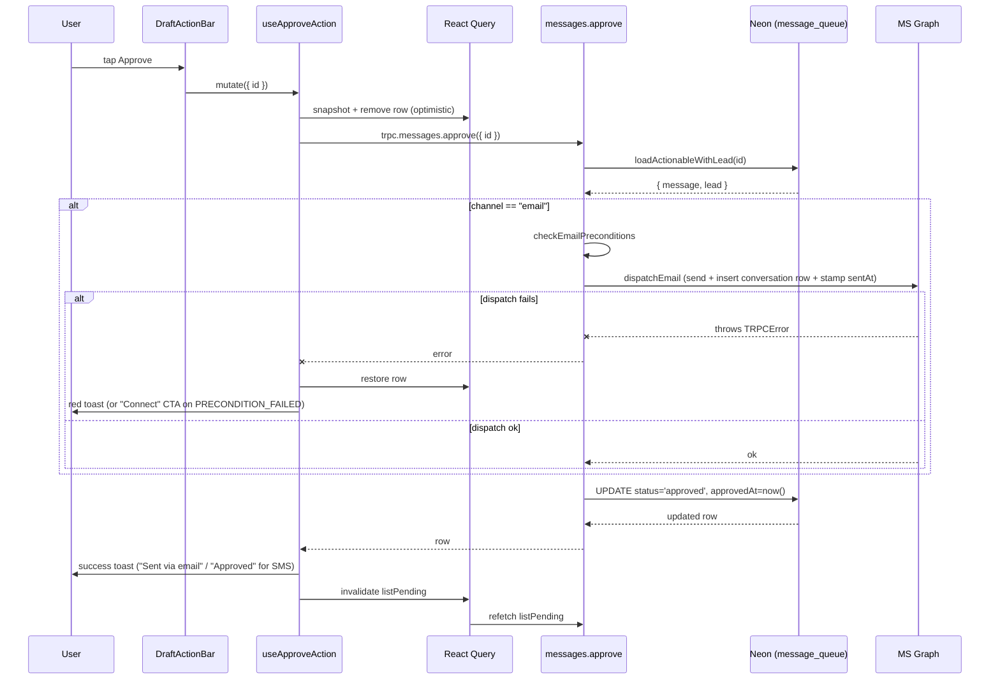
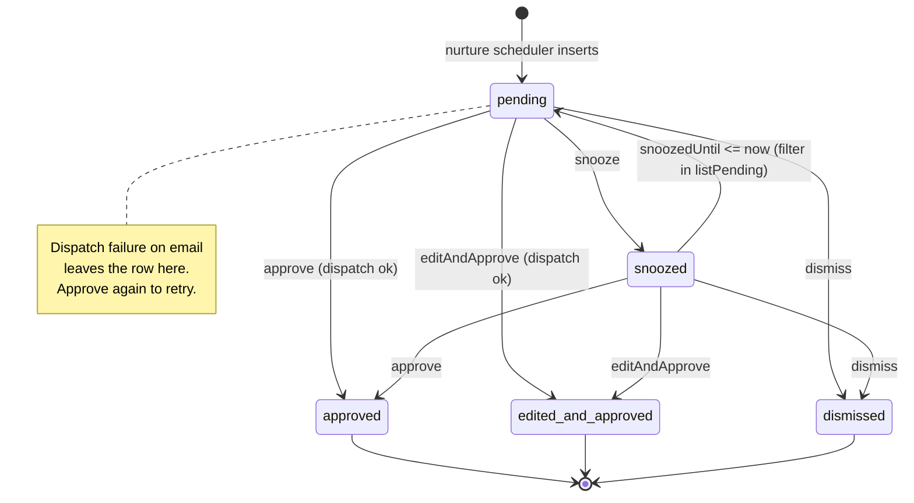

# Action queue

> The consultant's home screen at `/dashboard` — a priority-sorted list of AI-drafted follow-ups to approve, edit, snooze, or dismiss in one tap.

## User value

**Who it's for**: the Creation Homes QLD pilot consultant.

**Problem it solves**: drafts only matter if a human reviews them fast. Without a single morning queue, the consultant has to hunt through the [pipeline board](pipeline-board.md) for stale leads, decide what to send, and write each follow-up by hand. The action queue collapses that into "open the app, tap through 5–15 rows over coffee."

**Outcome they get**: open `/dashboard` → see a priority-sorted list of pending drafts (hot leads bubble to the top via the `priority` integer set by [ai-message-drafting](ai-message-drafting.md)). Each row shows the lead name, score badge, stage label, channel icon, the draft body, and a "Why this message?" disclosure. Tap **Approve** → row disappears within ~300ms (optimistic), email sends via Outlook (see [hubspot-email-dispatch](hubspot-email-dispatch.md)), success toast confirms. **Edit** opens an inline dialog pre-filled with the draft, **Snooze** opens a datetime picker (default +1 day), **Dismiss** asks for confirmation. Empty state: "You're all caught up."

**Out of scope**:
- **SMS dispatch** — `useApproveAction` shows "Approved" (not "Sent via SMS") because Twilio send lives in #129. The row still flips to `approved` server-side.
- **Retry button** — the row staying `pending` on dispatch failure (the ENG-152 reorder) means the existing **Approve** button doubles as Retry. No dedicated UI.
- **Batch approvals, swipe gestures, keyboard shortcuts** — post-MVP.
- **Pagination** — queue is bounded by pilot volume (~5–15 rows/day).
- **Conversation log link from the row** — that's [lead-profile](lead-profile.md) → conversation history (#131).
- **Failure-indicator badge** on rows whose last dispatch attempt failed — a "last attempt failed" hint is a follow-up.

## Design

**Lives in**:
- `src/app/(application)/dashboard/page.tsx` — RSC entry, prefetches `messages.listPending`, reads `msGraphTokens` to gate the connect banner
- `src/app/(application)/dashboard/_components/queue-list.tsx` — client list with loading skeletons, error/retry, empty state, header count
- `src/app/(application)/dashboard/_components/draft-row.tsx` — one card per draft; `ResizeObserver` measures overflow to gate the "Show more" toggle
- `src/app/(application)/dashboard/_components/draft-action-bar.tsx` — four buttons + dialog state, single `isPending` gate across all four mutations
- `src/app/(application)/dashboard/_components/use-queue-actions.ts` — `useApproveAction` / `useDismissAction` / `useEditAndApproveAction` / `useSnoozeAction`, each owning its own optimistic-remove helper
- `src/app/(application)/dashboard/_components/edit-dialog.tsx` — `Dialog` + `Textarea`, 1600-char counter, surfaces server-side Zod field errors
- `src/app/(application)/dashboard/_components/snooze-dialog.tsx` — `<input type="datetime-local">` + quick chips (`+1 day`, `+3 days`, `Next Monday 9am`)
- `src/app/(application)/dashboard/_components/dismiss-dialog.tsx` — confirm dialog
- `src/app/(application)/dashboard/_components/ms-graph-connect-banner.tsx` — amber banner above the list when `msGraphTokens` is empty for the user
- `src/app/(application)/dashboard/_lib/edit-validation.ts` — `MAX_BODY = 1600`, `validateEditBody` (trim + length)
- `src/app/(application)/dashboard/_lib/snooze.ts` — `MIN_BUFFER_MS = 15 * 60 * 1000`, `validateSnoozeTime`, `nextMonday9am`, `toLocalInputValue`
- `src/server/api/routers/messages.ts` — `listPending` query + `approve` / `editAndApprove` / `snooze` / `dismiss` mutations + `loadActionable` / `loadActionableWithLead` / `checkEmailPreconditions` helpers
- `src/server/api/schemas/messages.ts` — Zod schemas; `MIN_SNOOZE_BUFFER_MS = 15 * 60 * 1000` mirrors the client constant
- `src/server/db/schema/message-queue.ts` — `message_queue` table, single composite index `(status, priority)`
- `e2e/features/action-queue.spec.ts` — five end-to-end specs (approve, edit, snooze, dismiss, priority order)
- `e2e/pages/sections/action-queue.section.ts` — Playwright section object exposing every `data-testid` the spec needs

**Choice made**:
- **Reused `/dashboard` rather than introducing `/queue`**. The `(application)` nav already labels `/dashboard` as "Action Queue" (`src/app/(application)/_components/nav-config.ts`), so the route group ships the consultant straight here on login. No redirect, no nav change.
- **Per-mutation hooks**, not one shared `useQueueAction`. Each of the four hooks calls `useOptimisticRemove()` independently so concurrent mutations on different rows don't restore each other on rollback (the snapshot only captures the one row that's mutating).
- **Client-side `comparePriority` mirrors the server `ORDER BY priority DESC, createdAt ASC`** so an error rollback slots the row back into its original position without waiting for the `invalidate` refetch.
- **Email dispatch runs *before* the status flip** (`messages.ts:146-157`). A Graph 4xx/5xx, network failure, or expired token leaves the row at `pending`/`snoozed`; the **Approve** button is the retry. Pre-flip ordering was the original implementation; ENG-152 reversed it after a corrupt-token incident silently dropped messages.
- **`editAndApprove` passes `input.body` to `dispatchEmail`**, not the row's stored body, so the consultant's edits actually land in the sent email. The `originalBody` snapshot still preserves the AI's draft for audit (`messages.ts:184`).
- **MS-Graph-not-connected → actionable Connect toast** (links to `/api/auth/ms-graph/start`) plus a persistent amber banner above the list. The toast distinguishes the "connect your account" case from a generic dispatch failure via a sentinel string match on the server `PRECONDITION_FAILED` message.

**Rejected alternatives**:
- **A new `/queue` route or a `listPendingWithLeads` procedure** — the route group already points at `/dashboard` and the only caller of `listPending` is this view, so the join went straight into `listPending` rather than a parallel procedure.
- **A unified `useQueueAction` factory** — drafted in the original plan; the per-hook pattern was simpler and avoided the typing acrobatics of a generic mutation factory.
- **Try/catch + roll-row-back-to-pending after dispatch failure** — same outcome as dispatch-before-flip but more code and a wider window where a failed second write could leave a sent message marked pending. Reorder is cleaner.
- **Pagination** — queue is intentionally bounded; pilot rarely sees >15 rows.
- **A reusable Calendar/Popover component for snooze** — native `<input type="datetime-local">` is mobile-first, zero new dependencies. Reconsider when a second caller appears.
- **Skeleton loading states** — initially deferred (RSC prefetch was supposed to make first paint hydrated), then added back via `DraftRowSkeleton` for the not-yet-hydrated case.
- **A "Retry" button on failed rows** — relies on the row staying pending so Approve doubles as retry. Defer until a "last-attempt-failed" hint becomes useful.

> [!NOTE]
> The "row stays non-terminal on dispatch failure" contract this view depends on lives in [`messages.ts:137-191`](../../src/server/api/routers/messages.ts) — but no ADR records it. The reorder is a single-write window: a post-dispatch status update that itself fails could leave a sent message marked pending and let the consultant re-approve, double-sending. The HubSpot BCC reconciler dedupes timeline entries by `subject + timestamp`, but the inbox does not. Recommend running `/domain-model` to capture the ordering decision and the accepted double-send window.

**Trade-offs**:
- **The "Approved" toast for SMS is half-true** — the row flips to `approved` server-side, but no SMS goes out yet. SMS dispatch (#129) will swap the toast copy to "Sent via SMS" without changing the queue UX.
- **Per-row optimistic restore depends on the client's `comparePriority` matching the server's `ORDER BY`** — drift between the two would slot rolled-back rows into the wrong place. Both are pinned to `priority DESC, createdAt ASC`; change them together.
- **No PostHog events, no structured log lines** on the queue surface. A drafting / dispatch outage shows up only as an empty queue or red toasts. *Open observability gap.*
- **`listPending` joins `leads` on every fetch** — fine at pilot scale; an `n+1` shape would only emerge if the queue grew to thousands of rows.
- **`ResizeObserver` runs per-row** to decide whether to render the "Show more" toggle. Cheap at 5–15 rows; revisit if the queue grows.
- **The MS-Graph banner reads `msGraphTokens` server-side on every `/dashboard` request**. One indexed PK lookup; negligible.
- **The snooze min-buffer (15 min) is duplicated** in `_lib/snooze.ts` and `messages.ts` Zod refinement. Both must move together.
- **The `aria-live="polite"` count badge announces every change** — fine when the consultant approves one row at a time, potentially noisy if the queue gets long.

### Operations

**Health signals**: *No PostHog events or structured logger output from the queue UI or `messagesRouter` today — open gap.* Indirect signals:
- The MS Graph connect banner renders or hides based on `msGraphTokens` row presence. A persistent amber banner means OAuth never completed (or the token row was deleted).
- E2E spec `e2e/features/action-queue.spec.ts` is the de-facto health check; `make test_e2e` exercises every action against a real Neon branch.
- `[email-dispatch]` console output from `src/server/dispatch/email-dispatch.ts` (Graph errors) is the closest thing to a queue-side log.

**Alerts**: none. A regression surfaces as the consultant seeing repeated red "Approve failed" toasts or an unexpectedly empty queue.

**Failure modes & fallback**:

| Failure | What the user sees | What happens server-side |
|---|---|---|
| `listPending` query throws | Red "Couldn't load drafts" panel + "Try again" button | Server log; mutation surface stays usable once query recovers |
| Approve on a row already in a terminal state (race) | Red "Approve failed" toast with the server message; row restored | `loadActionable` rejects with `BAD_REQUEST`; status untouched |
| Approve on email row, no MS Graph token | Amber "Microsoft account not connected" toast with **Connect** action | `checkEmailPreconditions` throws `PRECONDITION_FAILED`; row stays pending |
| Approve on email row, dispatch throws (corrupt token, Graph 5xx, network) | Red "Approve failed" toast (from `dispatchEmail`); row stays in queue | ENG-152 reorder: status flip never runs; Approve again retries |
| Approve on email row, lead lacks `email` or `hubspotContactId` | Red precondition toast | `checkEmailPreconditions` throws before dispatch |
| Edit body empty / >1600 chars | **Save** disabled by client validation; Zod also rejects server-side | No mutation fires |
| Edit, server returns Zod field error | Inline `` under the textarea + counter turns red | Mutation rejected; row restored |
| Snooze < 15 min in the future | Inline alert below the input | Mutation never fires (client + server both check) |
| Concurrent mutations on different rows | Rows disappear independently; on error only the failing row restores | Per-row snapshot in `useOptimisticRemove` |
| `listPending` returns a row whose `lead` was deleted | Filtered out — `innerJoin(leads, …)` excludes it | None |

**Flags / env vars**: none beyond the `(application)` route-group session gate ([adr002](../adr/adr002-layout-level-auth-gates-over-middleware.md)). Email dispatch depends on `MS_GRAPH_*` env vars and the per-user `msGraphTokens` row, both gated upstream of this view.

## Flow

**Triggers** (all entry points):
- Consultant signs in → redirect lands on `/dashboard` → RSC prefetch → list renders.
- Consultant taps the bottom-nav "Action Queue" tab from any other `(application)` page.
- Background refetch from `useOptimisticRemove.invalidate` after every successful or failed mutation (TanStack Query `onSettled`).
- No cron, no webhook trigger directly into this view — the [nurture scheduler](nurture-scheduler.md) inserts new pending rows; they appear on the next `listPending` refetch.

**Data path** (load):
RSC `prefetch(messages.listPending)` → Drizzle `select … from message_queue inner join leads … where (status='pending' AND (snoozedUntil IS NULL OR snoozedUntil <= now)) OR (status='snoozed' AND snoozedUntil <= now) order by priority desc, createdAt asc` → `<HydrateClient>` ships the populated cache → client `useQuery` reads same key → `<DraftRow>` per row.

**Data path** (approve, email channel):
click → `useApproveAction.onMutate` snapshots and removes the row → `messages.approve` mutation → `loadActionableWithLead` → `checkEmailPreconditions` → `dispatchEmail` (Graph send + insert into `conversations` + stamp `sentAt`) → `update message_queue set status='approved', approvedAt=now()` → return updated row → `onSuccess` "Sent via email" toast → `onSettled` invalidate `listPending`.

**State transitions** (the message_queue row, owned by `messagesRouter`):

**Edge cases**:
- **Empty queue** → `Inbox` icon + "You're all caught up — we'll let you know when new follow-ups are ready to review."
- **`listPending` errors** → red panel with **Try again** that calls `refetch()`.
- **Loading (cache miss)** → three skeleton rows.
- **Row body fits in 3 lines** → no "Show more" toggle (gated by `ResizeObserver` measurement).
- **Lead missing score** → badge shows `0`.
- **`aiReasoning` null** → "Why this message?" disclosure hidden.
- **Subject null on SMS rows** → no subject line rendered.
- **Snoozed row whose `snoozedUntil` has passed** → returns to the list via the `OR (status='snoozed' AND snoozedUntil <= now)` clause.
- **Approve on a row that another tab just dismissed** → `loadActionable` rejects → restore + red toast.
- **Edit dialog opened on a row that was just edited** → `useEffect` resets the textarea to the latest `row.body` when `open` flips true.

**Side effects**:
- **DB**: `update message_queue` for every action (`approve` / `edited_and_approved` / `snoozed` / `dismissed`).
- **MS Graph**: one Outlook send per `approve` / `editAndApprove` on email-channel rows.
- **Conversations table**: one row inserted per successful email dispatch (HubSpot BCC reconciler later upserts the inbound copy).
- **HubSpot timeline**: indirect — the `dispatchEmail` BCCs HubSpot's logging address; the reconciler picks it up.
- **No PostHog, no Resend, no webhook fan-out from this view.**
- **No cache writes outside `messages.listPending`** — `lead-profile` re-fetches its own data when navigated to.

## Links

- Design: [AI sales assistant for new home builders](../../thoughts/designs/2026-03-27-ai-sales-assistant-new-home-builders.md) — see "Dashboard UX" → "Action Queue" and "Human-in-the-Loop (HITL)".
- Plans:
  - [Action queue view](../../thoughts/plans/2026-04-13-ENG-128-action-queue-view.md) — initial seven-phase build, shipped in PR #145.
  - [Action queue residual fixes](../../thoughts/plans/2026-04-27-ENG-152-action-queue-disappear-on-dispatch-failure.md) — the dispatch-before-status-flip reorder, shipped inside PR #158.
- Companion plans:
  - [`messagesRouter`](../../thoughts/plans/2026-04-12-ENG-126-messages-router.md) — the four mutations this view drives.
  - [`draftMessage`](../../thoughts/plans/2026-04-13-ENG-127-draft-message.md) — the source of the rows.
- ADRs: [adr002 — layout-level auth gates over middleware](../adr/adr002-layout-level-auth-gates-over-middleware.md) (gates this view).
- Sibling features:
  - [AI message drafting](ai-message-drafting.md) — produces the `body`, `subject`, `aiReasoning`, `priority` rendered here.
  - [Nurture scheduler](nurture-scheduler.md) — the cron that inserts pending rows.
  - [HubSpot email dispatch](hubspot-email-dispatch.md) — what `approve`/`editAndApprove` invoke for email rows.
  - [Lead profile](lead-profile.md) — where the consultant goes after approving (conversation history).
  - [Dashboard app shell](dashboard-app-shell.md) — provides the route group, nav, and bottom-nav offset.
- GitHub issues: [#128](https://github.com/samjmarshall/rekurve-www/issues/128) (this feature), [#152](https://github.com/samjmarshall/rekurve-www/issues/152) (dispatch-failure fix), [#87](https://github.com/samjmarshall/rekurve-www/issues/87) (Epic 3 parent).
- Shipping PRs: [#145](https://github.com/samjmarshall/rekurve-www/pull/145) (initial build), [#146](https://github.com/samjmarshall/rekurve-www/pull/146) (ultrareview fixes), [#158](https://github.com/samjmarshall/rekurve-www/pull/158) (ENG-152 reorder + email-dispatch wiring).

---
*Generated from interview on 2026-04-28. To regenerate, run `/document-feature action-queue`.*
