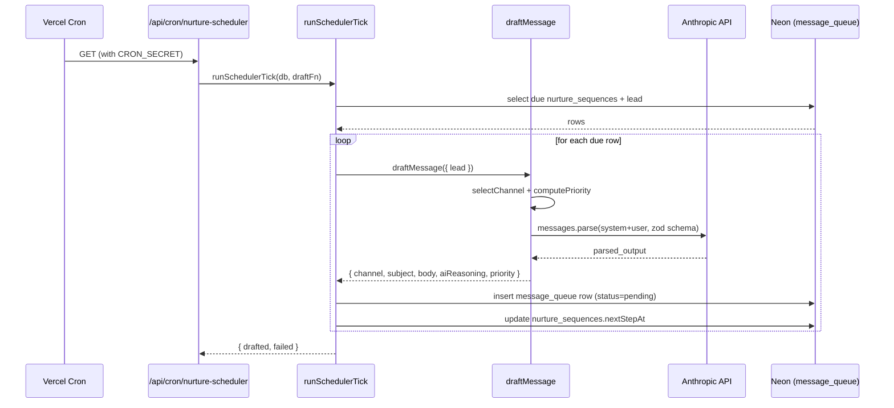

# AI message drafting

> Server-side helper that asks Claude to write one follow-up SMS or email per lead. Returns a row ready for the action queue.

## User value

**Who it's for**: the Creation Homes QLD pilot consultant — indirectly. The consultant never calls `draftMessage`; the nurture scheduler does, and drafts land in the action queue for review.

**Problem it solves**: a HITL queue only works if drafts appear without a human writing them. Hand-drafting a stage-appropriate follow-up for every stale lead would burn the consultant's whole morning. This module produces body, subject, channel, and priority for each draft so the consultant reviews instead of writing.

**Outcome they get**: when the nurture cron tick runs, every due sequence yields one queued message with the right channel and priority, referencing the lead's top qualification gap. The consultant opens the action queue and approves, edits, or dismisses. Hot leads always rank ≥ 80; unqualified leads cap at 25 (35 when overdue).

**Out of scope**:
- **Sending** — `draftMessage` returns a row; the caller inserts into `message_queue`. [hubspot-email-dispatch](hubspot-email-dispatch.md) handles sending.
- **Direct tRPC exposure** — `aiRouter` stays a `healthCheck` stub. Server-only callers import from `~/server/ai`.
- **Multi-tenant tone tuning** — the system prompt hard-codes Creation Homes QLD.
- **Retries/backoff** — Anthropic failures throw; the caller decides what to do.
- **PostHog telemetry** — drafting emits no analytics events.
- **Lead create/update hooks** — only the nurture scheduler calls `draftMessage` today, despite the plan naming lead flows as a future caller.
- **Bulk/batch drafting** — one call per lead.

## Design

**Lives in**:
- `src/server/ai/draft-message.ts` — `draftMessage(input)` orchestrator
- `src/server/ai/anthropic-client.ts` — singleton client, `DRAFT_MODEL = "claude-sonnet-4-6"`, `DRAFT_MAX_TOKENS = 1024`, `DRAFT_TEMPERATURE = 0.3`
- `src/server/ai/channel-selection.ts` — `selectChannel(lead)`
- `src/server/ai/priority.ts` — `computePriority(lead)`, `isOverdue(lead)`
- `src/server/ai/prompts.ts` — `DRAFT_SYSTEM_PROMPT` (Creation Homes QLD persona) + `buildUserPrompt()`
- `src/server/ai/schema.ts` — `claudeDraftSchema`, `draftMessageOutputSchema`, `DraftMessageInput`/`DraftMessageOutput` types
- `src/server/ai/index.ts` — barrel: `draftMessage` + types only
- `src/server/ai/stub.ts` — `resolveDraftFn(req)` — returns a deterministic stub when an inbound request carries `x-ai-stub: 1`
- `src/server/ai/__tests__/` — `channel-selection.test.ts`, `priority.test.ts`, `prompts.test.ts`, `draft-message.test.ts`, `stub.test.ts`, `fixtures.ts`
- `src/server/nurture/scheduler.ts:83-136` — `runSchedulerTick(db, draftFn?)`, the only caller
- `src/app/api/cron/nurture-scheduler/route.ts` — wires `resolveDraftFn(req)` into the tick so E2E runs hit the stub

**Choice made**: a server-side helper, not a tRPC procedure. TypeScript computes channel and priority deterministically from the lead row; only `subject`, `body`, and `reasoning` come from Claude. The Anthropic SDK's `messages.parse()` plus `zodOutputFormat(claudeDraftSchema)` enforces structured output. The system prompt ships as a content block with `cache_control: { type: "ephemeral" }` so batch ticks amortise the persona tokens.

**Rejected alternatives**:
- **Expose `draftMessage` as an `ai.draftMessage` tRPC procedure** — callers are all server-internal (nurture cron, future lead flows). A public surface adds an auth boundary and a serialisation hop for no caller. `aiRouter` stays a `healthCheck` stub.
- **Trust Claude with channel and priority** — these are policy, not language. TypeScript keeps the rules grep-able and testable without mocking the SDK.
- **Forced tool use for structured output** — `messages.parse()` is the modern equivalent and returns a Zod-typed `parsed_output` directly.
- **Retry on Anthropic failure here** — the caller already advances `nextStepAt` and increments `failed`. A retry inside `draftMessage` would either double-charge tokens or hide transient errors the caller wants to count.
- **Inline the Anthropic call in the nurture scheduler** — the dynamic import at `scheduler.ts:88` keeps cron-route bundles slim and lets E2E swap a stub in via `resolveDraftFn`.

**Trade-offs**:
- **SMS forces `subject = null`** even when Claude emits one — guards against the model ignoring the channel instruction.
- **`originalBody` is a caller concern** — `draftMessage` returns no `originalBody` field. The messages router snapshots `body → originalBody` on first edit (`messages.ts:184`).
- **Hard-coded persona** — Creation Homes QLD specifics live in `DRAFT_SYSTEM_PROMPT`. A second pilot needs a refactor.
- **Empty `scoreMetadata` still calls Claude** — the user prompt switches to a generic stage-appropriate fallback line rather than skipping the call. Cheap drafts beat no drafts.
- **Determinism floor** — temperature 0.3 + cached system prompt give stable but not identical output across runs.
- **No backoff** — a flaky Anthropic minute fails every due sequence in that tick. The caller logs and moves on; the next tick re-tries naturally because `nextStepAt` advanced.

### Operations

**Health signals**:
- Caller log: `[nurture-scheduler] draftMessage failed for sequence <id>: <err>` (`scheduler.ts:118`) — the only signal that a draft call threw.
- Stub log: `[ai-stub] route=<path> leadId=<id>` (`stub.ts:12`) — proves E2E routed around Claude.
- No PostHog events, no structured logger output. *Open observability gap.*

**Alerts**: none. A drafting outage surfaces as an empty action queue the next morning.

**Failure modes & fallback**:

| Failure | What happens | What the user sees |
|---|---|---|
| Lead has no phone and no email | `selectChannel` throws before Claude runs | Caller logs the failure, skips this lead, advances `nextStepAt` — no row in queue |
| Anthropic API or network error | `messages.parse()` throws | Same — caller swallows, increments `failed`, moves on |
| Claude returns `parsed_output: null` | `draftMessage` throws `"Claude returned no structured output"` | Same |
| Lead has no `scoreMetadata` | User prompt adds a fallback line; Claude still drafts a generic stage-appropriate check-in | Draft lands in queue without a gap reference |
| `ANTHROPIC_API_KEY` missing at boot | `~/env` validation fails before the route handler runs | Cron route 500s; queue stays empty |

**Flags / env vars**:
- `ANTHROPIC_API_KEY` — required by `~/env`. Set in Vercel preview + production.
- `x-ai-stub: 1` request header — on the cron route, `resolveDraftFn` returns the deterministic stub instead of the real `draftMessage`. E2E only.
- No PostHog flag. No runtime kill switch.

## Flow

**Triggers** (all entry points):
- Vercel cron → `/api/cron/nurture-scheduler` → `runSchedulerTick(db, resolveDraftFn(req))` → `draftMessage({ lead })` for each due sequence.
- Direct import from server code via `~/server/ai` — zero consumers today besides the nurture scheduler.

**Data path**: lead row → `selectChannel` + `computePriority` + `daysSinceLastContact` → `buildUserPrompt` → Anthropic `messages.parse` (cached system prompt + Zod-typed output schema) → `parsed_output` (`subject`, `body`, `reasoning`) → merge with deterministic `channel` + `priority` (force `subject = null` for SMS) → `DraftMessageOutput`. The caller inserts that into `message_queue` with `status = 'pending'`.

**State transitions**: `draftMessage` owns no state. The row it produces enters `message_queue` at `status = 'pending'`; the messages router drives transitions from there (`pending → approved | edited_and_approved | snoozed | dismissed`).

**Channel & priority decision** (deterministic, no Claude involvement):

```mermaid
flowchart LR
    L[Lead row] --> S{stage == hot<br/>AND email?}
    S -- yes --> E[channel = email]
    S -- no --> P{phone?}
    P -- yes --> SMS[channel = sms]
    P -- no --> M{email?}
    M -- yes --> E2[channel = email]
    M -- no --> X[throw — no contact method]

    L --> B[base = stage map<br/>hot 80 / warm 50 / nurture 25 / unqualified 10]
    B --> O{lastContactedAt<br/>past stage threshold?}
    O -- yes --> Bump[priority = min&#40;100, base + 10&#41;]
    O -- no --> Keep[priority = base]
```

**Edge cases**:
- `email = null` on a hot lead → falls through to the SMS branch (needs `phone`).
- `phone = null` on warm/nurture/unqualified with email present → email as last resort.
- `lastContactedAt = null` → `isOverdue` returns false, no overdue bump. First-touch belongs to the nurture scheduler, not this module.
- `preferredEstates`/`notes` empty → user prompt drops those lines.
- `gaps` empty array → user prompt skips the gap line; Claude still gets stage + score + next-question.
- `subject` over 78 chars → `claudeDraftSchema` rejects Claude's output → `messages.parse()` throws.
- SMS body > 1600 chars → same Zod gate.

**Side effects**:
- Anthropic API: one `POST /v1/messages` per call. System prompt block carries `cache_control: ephemeral` for cache reuse across the tick.
- No DB writes from this module — the caller owns the `message_queue` insert and `nurture_sequences.nextStepAt` update.
- No HubSpot calls, no PostHog events, no Resend sends.

## Links

- Design: [AI sales assistant for new home builders](../../thoughts/designs/2026-03-27-ai-sales-assistant-new-home-builders.md) — see "Human-in-the-Loop (HITL)" and "Action Queue".
- Plan: [`draftMessage` implementation plan](../../thoughts/plans/2026-04-13-ENG-127-draft-message.md)
- Companion plan (router that consumes the output): [tRPC messages router + Zod schemas](../../thoughts/plans/2026-04-12-ENG-126-messages-router.md)
- GitHub issues: [#127](https://github.com/samjmarshall/rekurve-www/issues/127) (this feature), [#87](https://github.com/samjmarshall/rekurve-www/issues/87) (Epic 3 parent)
- Shipping commit: [`0f39355`](https://github.com/samjmarshall/rekurve-www/commit/0f39355aa0bcd1dee8336c5742d348762b02a9a3) — landed direct to `main`, no PR.
- Sibling features:
  - [Action queue](action-queue.md) — UI that surfaces the drafted rows (lands when documented).
  - [Nurture scheduler](nurture-scheduler.md) — the only caller (lands when documented).
  - [HubSpot email dispatch](hubspot-email-dispatch.md) — what happens after a drafted email is approved.
  - [AI qualification scoring](ai-qualification-scoring.md) — produces the `scoreMetadata` this module reads.

---
*Generated from interview on 2026-04-28. To regenerate, run `/document-feature ai-message-drafting`.*
