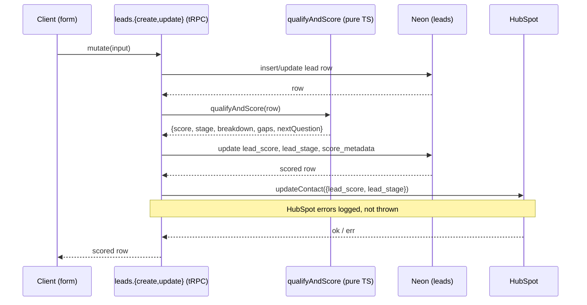
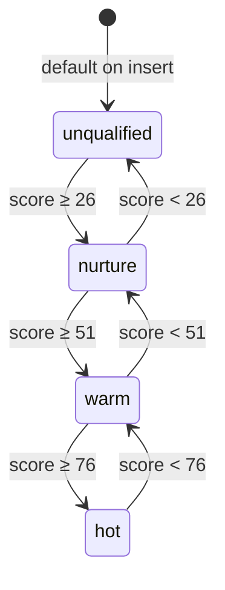

# AI qualification scoring

> Every lead gets a 0–100 score, a stage (unqualified/nurture/warm/hot), a per-factor breakdown, a list of missing data, and the next question to ask — calculated the moment the lead is saved.

## User value

**Who it's for**: the Creation Homes QLD pilot consultant.

**Problem it solves**: walk-ins arrive with patchy info — some have land picked out, some have finance sorted, most have neither. Without a consistent score, the consultant guesses who to chase and forgets which question moves a lead to the next stage.

**Outcome they get**: when a lead is saved, the score, stage, and a ranked gap list appear instantly on the lead profile. The "next question" prompt names the one thing worth asking on the next call. Re-saving the lead with new info bumps the score and stage automatically.

**Out of scope**:
- Reading tone or intent from free-text `notes` — `notes` is excluded from `SCORING_FIELDS`, so editing it skips re-scoring.
- Pre-approval granularity — `seenBroker` is a boolean, so finance caps at **15/25** until the field becomes an enum.
- Engagement signals — engagement is hardcoded to **0/5** until reply/open data exists.
- Budget range parsing — `"500-700k"` matches the first number only.
- Async/background scoring — scoring runs synchronously inside `leads.create`/`leads.update` because the function is sub-millisecond.
- Score-driven UI beyond the lead profile and the pipeline-stage bucket — no other consumers today.

## Design

**Lives in**:
- `src/server/scoring/score-factors.ts` — six pure-TS scoring functions (`scoreLand`, `scoreFinance`, `scoreTimeline`, `scoreBudget`, `scorePropertyType`, `scoreEngagement`), `parseBudgetAmount`, `detectGaps`, `pickNextQuestion`
- `src/server/scoring/qualify-and-score.ts` — `qualifyAndScore()` orchestrator + `deriveStage()` (0-25 unqualified · 26-50 nurture · 51-75 warm · 76-100 hot)
- `src/server/scoring/schema.ts` — Zod `scoreResultSchema`, `ScoreResult`, `ScoreMetadata` (= `ScoreResult & { scoredAt: string }`)
- `src/server/scoring/index.ts` — barrel export
- `src/server/scoring/__tests__/{score-factors,qualify-and-score,schema}.test.ts` — direct input/output tests, no mocking
- `src/server/api/routers/leads.ts:30-62` — `scoreLead()` orchestrator: persists `leadScore`/`leadStage`/`scoreMetadata`, fire-and-log HubSpot push
- `src/server/api/routers/leads.ts:65-78` — `SCORING_FIELDS` set (12 keys) gates re-scoring on update
- `src/server/db/schema/leads.ts:52-54` — `lead_score int default 0`, `lead_stage enum default 'unqualified'`, `score_metadata jsonb`
- `drizzle/0001_boring_giant_man.sql` — adds the `score_metadata` column
- `src/server/hubspot/properties.ts:23-24,77` — maps `leadScore` (integer) and `leadStage` to HubSpot contact properties
- `src/app/(application)/leads/[id]/_components/score-breakdown.tsx` — per-factor breakdown card on the lead profile
- `src/app/(application)/leads/[id]/_components/qualification-gaps.tsx` — gap list + next-question prompt

**Choice made**: a deterministic TypeScript scoring engine. Six factors total 100 points: land (30) · finance (25) · timeline (20) · budget (10) · property type (10) · engagement (5). Each factor returns `{ score, maxScore, reasoning }`. Stages derive from the total. Gaps come from a fixed list of qualification fields ranked by weight; the highest-impact gap picks a hard-coded follow-up question.

See [adr005 — Lead scoring is deterministic](../adr/adr005-deterministic-lead-scoring.md) for the rule, the rejected Claude Haiku alternative, and the consequences (no LLM in scoring, no rubric backfill, sync write path stays fast, eval-suite obligation if determinism is ever broken).

**Rejected alternatives**:
- **Claude Haiku scoring** — shipped first (commit `7dc57dc`) and ripped out hours later in the same PR (commit `25588bc`). The rubric is a set of lookup tables — no sentiment analysis, no unstructured interpretation. Haiku functioned as a `switch` statement with non-determinism, ~$0.001-0.003 per call, network latency, and a hard dependency on Anthropic's uptime. Pure TypeScript wins on every axis.
- **Async/background scoring** — the original epic flagged "score asynchronously — don't block the form submission" as a hedge against API latency. Removing the API call cut scoring to sub-millisecond, so it runs synchronously inside `leads.create`/`leads.update` and the response carries the final score.
- **Re-score on every update** — gating to the 12 `SCORING_FIELDS` keys lets name/phone/email edits skip a redundant DB write.
- **Storing breakdown in a separate `lead_scores` table** — a single `score_metadata jsonb` column on `leads` keeps reads to one row.
- **Engagement scoring from PostHog signals** — engagement returns 0/5 until reply/open data exists.

**Trade-offs**:
- **`seenBroker` is boolean.** A fully qualified lead caps at **85/100** instead of 95 (engagement adds the missing 5 once data exists; finance adds the other 10 once `seenBroker` becomes an enum). Stage thresholds account for this cap — `hot` starts at 76.
- **Budget parser is greedy.** Free-text like `"500-700k"` matches `500` × `k` = `500_000`. Good enough for the pilot.
- **No re-scoring on backfill.** If rubric weights ever change, old leads keep their old scores until the next edit. No batch re-score job exists.
- **Deterministic by design.** Identical inputs always produce identical scores. A regression in `score-factors.ts` fails every lead — direct unit tests cover this, no API to mock.

### Operations

**Health signals**: *No instrumentation today — open gap.* The engine emits no PostHog events and no structured log lines. Unit tests verify correctness; the lead-profile breakdown surfaces it for the consultant. The only log line is `console.error("[scoring] HubSpot sync failed for lead <id>:", err)`.

**Alerts**: none wired up. A scoring regression surfaces as wrong scores on the lead profile, not as a page.

**Failure modes & fallback**:
| Failure | What the user sees | What to check |
|---|---|---|
| Scoring throws (unexpected input shape) | The whole `leads.create` / `leads.update` mutation fails — no lead row is written | Server logs for the stack trace; `qualifyAndScore` input shape vs `LeadInput` interface |
| DB write of score/stage/metadata fails | Same as above — error propagates and rolls back the row | Neon connection, `score_metadata` column type |
| HubSpot push of `lead_score`/`lead_stage` fails | Local score persists; HubSpot contact keeps stale score/stage | `[scoring] HubSpot sync failed` console error; HubSpot API status |
| Lead saved with no qualification fields | Score 0, stage `unqualified`, 5 gaps, next question = land | Expected — quick capture always lands here |

**Flags / env vars**: none. The engine has zero env-var dependencies — `ANTHROPIC_API_KEY` left when the AI version did.

## Flow

**Triggers** (all entry points):
- `leads.create` tRPC mutation — always re-scores after the DB insert
- `leads.update` tRPC mutation — re-scores only if any of the 12 `SCORING_FIELDS` keys changed (`hasLand`, `landRegistered`, `landAddress`, `landSizeSqm`, `landWidth`, `landDepth`, `seenBroker`, `constructionTimeline`, `budget`, `propertyType`, `preferredEstates`, `preferredSuburbs`)

**Data path**: lead row → `qualifyAndScore(lead)` → `{ score, stage, breakdown, gaps, nextQuestion }` → write `lead_score`/`lead_stage`/`score_metadata` to Neon → push `lead_score`/`lead_stage` to HubSpot (fire-and-log) → return scored row to caller → lead profile renders breakdown card + gaps card.

**State transitions** — driven by total score:

**Edge cases**:
- **Empty lead** (name + phone only via quick capture): score 0, stage `unqualified`, 5 gaps (land, finance, timeline, budget, property type), next question = "Do you have land picked out, or are you still exploring options?".
- **Has-land + no dimensions + no preference**: 15/30 land — `"Has land, not yet registered"`.
- **`preferredEstates` set, no land**: 15/30 land — `"Actively searching specific estates"`. The same 15 points as has-land-not-registered.
- **`preferredSuburbs` set, no estates**: 5/30 land — `"Exploring suburbs, no specific land yet"`.
- **`budget = "not sure"`**: 2/10 budget (parser returns null, partial credit for "mentioned").
- **`budget = "$1.2M"`** (outside $400k-$900k range): 5/10 budget — `"outside Creation Homes range"`.
- **Unknown `propertyType` value**: 2/10 — `"Unrecognised property type"`.
- **Update touches non-scoring field** (e.g. `email`): scoring skips and `score_metadata.scoredAt` stays put.
- **All gaps filled**: `gaps: []`, `nextQuestion = "Is there anything else you'd like to know about the build process?"`.

**Side effects**:
- Neon: one `UPDATE leads` per scoring run, writing `lead_score`, `lead_stage`, `score_metadata`, `updated_at`.
- HubSpot: one `updateContact` per scoring run with `lead_score` (string-coerced) and `lead_stage`. Failures log to console and do not roll back the DB write.
- Nurture scheduler: `startOrUpdateSequence(leadId, leadStage)` runs *after* scoring on both create and update — a stage change moves the lead into a different cadence (covered in the [nurture-scheduler](nurture-scheduler.md) doc when it lands).

## Links

- Design: [AI sales assistant for new home builders](../../thoughts/designs/2026-03-27-ai-sales-assistant-new-home-builders.md) — see "AI Qualification & Scoring"
- Epic: [Epic 2: Lead Management & AI Qualification Scoring](../../thoughts/epics/2026-03-27-epic-2-lead-management-ai-scoring.md)
- Plan: [Deterministic Lead Scoring Engine — Refactor Plan](../../thoughts/plans/2026-04-08-99-ai-qualification-scoring-engine.md)
- Sibling features that consume the score:
  - [Quick capture form](quick-capture-form.md) — every quick-captured lead lands at score 0 / `unqualified`
  - [Full lead enquiry form](full-lead-enquiry-form.md) — fills enough fields to score `warm`/`hot` on submit
- GitHub issue: [#99](https://github.com/samjmarshall/rekurve/issues/99)
- Shipping PR: [#122](https://github.com/samjmarshall/rekurve/pull/122) (commits `7dc57dc` AI engine + `25588bc` deterministic refactor)

---
*Generated from interview on 2026-04-28. To regenerate, run `/document-feature ai-qualification-scoring`.*
