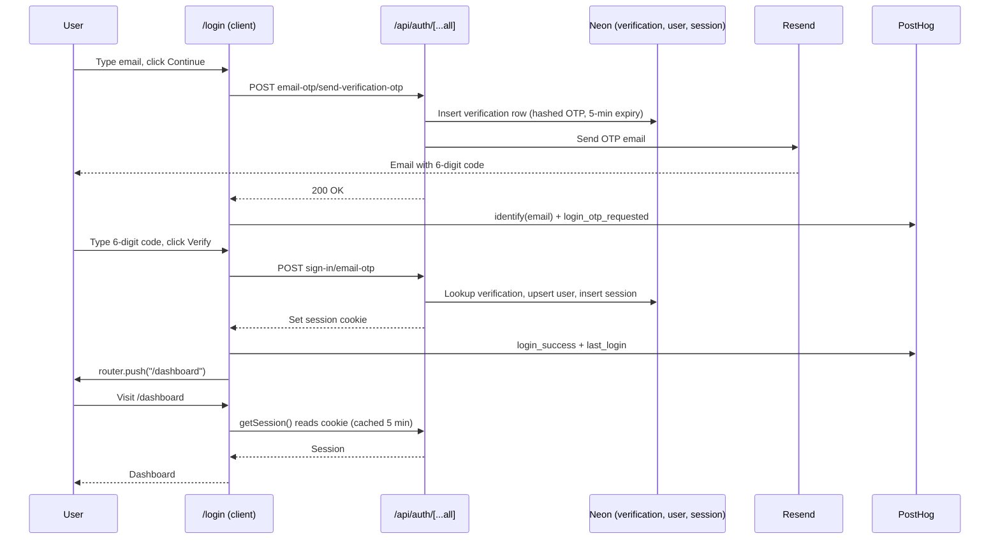

# Email OTP login

> A no-password sign-in: type your email, get a 6-digit code, type the code, you're in.

## User value

**Who it's for**: Sam (founder/developer) today. The Creation Homes QLD pilot consultant lands here once onboarded.

**Problem it solves**: The pilot app is phone-first. A password field on a phone adds friction, and the consultant has nothing to remember with email OTP. It was the lowest-friction option at the time.

**Outcome they get**: Type email, receive a code, type the code, land on `/dashboard` with a 7-day session.

**Out of scope**:
- Sign-up controls — anyone with an email can sign in today. We must gate sign-up before the pilot consultant onboards (see *Failure modes* below).
- Google OAuth, social login, password auth.
- Custom OTP email templates (plain `
` for now).
- Multi-user roles or org-level access.
- Middleware-based protection — see *Choice made*.

## Design

**Lives in**:
- `src/lib/auth.ts` — better-auth server config: Drizzle adapter, `emailOTP` plugin, Resend send, `nextCookies()`
- `src/lib/auth-client.ts` — `createAuthClient` + `emailOTPClient()` for the browser
- `src/lib/session.ts` — `cache()`-wrapped `getSession()` for server components and layouts
- `src/app/api/auth/[...all]/route.ts` — catch-all handler mounting better-auth's HTTP API
- `src/app/(login)/login/page.tsx` — two-step UI: email form → 6-digit `InputOTP`
- `src/app/(login)/layout.tsx` — redirects authed users to `/dashboard`, sets `noindex`
- `src/app/(application)/layout.tsx` — redirects unauthed users to `/login`
- `src/server/db/schema/auth.ts` — 4 tables: `user`, `session`, `account`, `verification`
- `src/lib/posthog.ts` — `authTracking.identify` and `authTracking.loginSuccess`

**Choice made**: better-auth + `emailOTP` plugin, Drizzle adapter on Neon Postgres, Resend for OTP delivery, layout-level session checks in each route group.

Layout-level checks (vs `middleware.ts`) keep auth logic next to the routes it protects — `(application)/layout.tsx` enforces "must be signed in", `(login)/layout.tsx` enforces "must be signed out". Each route group owns its own gate instead of sharing one middleware.

**Rejected alternatives**:
- **Password auth / Google OAuth** — too much UX friction for a phone-first pilot; OAuth waits until after the pilot.
- **NextAuth** — initial schema used NextAuth-style tables; PR #104 replaced them with better-auth's.
- **`middleware.ts` route protection** — moves auth logic away from the route group it protects, harder to vary per-group.
- **Sign-up flow** — `emailOTP` handles new + existing users in one path, no separate sign-up.

See [ADR-002: Layout-level auth gates instead of `middleware.ts`](../adr/adr002-layout-level-auth-gates-over-middleware.md) for the full rationale.

**Trade-offs**:
- **5-min cookie cache stale window**: a revoked session may stay valid on a cached client for up to 5 minutes (`src/lib/auth.ts:27`). Acceptable for the pilot. Reduce or disable `cookieCache.maxAge` if instant revocation becomes a requirement.
- **Open sign-up**: any email can request an OTP and create a `user` row. **Gate this before the pilot consultant onboards, and again before launch to other customers.**
- **Plain-text OTP email**: minimal HTML, branded template pending. Fine for pilot; replace before launch.
- **Resend lock-in**: a provider swap is a one-place code change (`auth.ts` send fn), but worth flagging.

### Operations

**Health signals**:
- PostHog event `login_otp_requested` — fires on email submit (Step 1 success)
- PostHog event `login_success` — fires after OTP verify
- Person properties: `email`, `first_login_attempt` (set once), `last_login` (updated each login)
- `posthog.identify(email)` runs on Step 1 success, linking the anonymous session to the user

**Alerts**: *None yet — pending work.* Once dashboards land, alert on the `login_success` / `login_otp_requested` ratio dropping below baseline.

**Failure modes & fallback**:
| Failure | What the user sees | What to check |
|---|---|---|
| Resend send fails / rate-limited | "Failed to send verification code" or the API's message | Resend dashboard, `RESEND_API_KEY`, sender domain `noreply@rekurve.ai` |
| OTP expired (>5 min) or wrong code | "Invalid or expired code" | `verification` table; OTP invalidates after 3 wrong attempts |
| Cookie cache stale on revoked session | User stays signed in up to 5 min after revoke | Drop `cookieCache.maxAge` |
| Open sign-up abused | A stranger lands on `/dashboard` with their own `user` row | **Gap — gate sign-up before pilot onboarding** |

**Flags / env vars**:
- `BETTER_AUTH_SECRET` — ≥32 chars, signs cookies (`src/env.js:11`)
- `BETTER_AUTH_URL` — resolves per Vercel env / Portless dev; falls back to the literal value (`src/env.js:12-25`)
- `RESEND_API_KEY` — required, no fallback (`src/env.js:27`)

No feature flags. Auth always runs for the `(application)` and `(login)` route groups.

## Flow

**Triggers** (all entry points):
- User visits `/login` → email form renders
- User visits any path under `(application)` without a session → `(application)/layout.tsx` redirects to `/login`
- User submits email → `POST /api/auth/email-otp/send-verification-otp` → Resend sends OTP
- User submits 6-digit code → `POST /api/auth/sign-in/email-otp` → session cookie set
- Authed user visits `/login` → `(login)/layout.tsx` redirects to `/dashboard`

**Data path**: email → `verification` (hashed OTP, 5-min expiry) → on verify, upsert `user` + insert `session` row → signed cookie set → `getSession()` reads the cookie on every protected request.

**State transitions**:
- Login UI: `email` → `otp` (client `useState`); Back returns to `email` and clears the code
- OTP: created → verified (success) | expired after 5 min | invalidated after 3 wrong attempts
- Session: created → refreshed once per day on active use → expired after 7 days

**Edge cases**:
- **Wrong code**: the page shows an inline error; the user can retry up to 3 times before the OTP invalidates and they must Resend.
- **Expired OTP**: same UX as wrong code — Resend issues a fresh one.
- **Resend rate limit**: API error message bubbles to the inline error region.
- **Already authed visiting `/login`**: layout redirects before render — no flash.
- **Preview deploys**: `BETTER_AUTH_URL` resolves to the Vercel branch URL (`src/env.js:12-25`); `trustedOrigins` and the Portless HTTPS fallback handle dev-vs-prod cookie domains.

**Side effects**:
- Resend email send (per OTP request, including each Resend-button click)
- `verification`, `user`, `session` row writes
- `nextCookies()` plugin sets a signed session cookie
- PostHog: `identify` + `login_otp_requested` on Step 1; `login_success` + `last_login` person property on Step 2

## Links

- ADRs: [ADR-002: Layout-level auth gates instead of `middleware.ts`](../adr/adr002-layout-level-auth-gates-over-middleware.md)
- Design: [AI sales assistant for new home builders](../../thoughts/designs/2026-03-27-ai-sales-assistant-new-home-builders.md)
- Epic: [Epic 1: MVP Foundation](../../thoughts/epics/2026-03-27-epic-1-foundation.md)
- Related plans:
  - [better-auth — Email OTP setup](../../thoughts/plans/2026-03-29-91-better-auth-email-otp.md)
  - [Login page & auth redirect flow](../../thoughts/plans/2026-03-30-login-page-auth-flow.md)
- GitHub issues: [#91](https://github.com/samjmarshall/rekurve/issues/91), [#92](https://github.com/samjmarshall/rekurve/issues/92)
- Shipping PRs: [#104](https://github.com/samjmarshall/rekurve/pull/104), [#106](https://github.com/samjmarshall/rekurve/pull/106), [#107](https://github.com/samjmarshall/rekurve/pull/107), [#120](https://github.com/samjmarshall/rekurve/pull/120)

---
*Generated from interview on 2026-04-28. To regenerate, run `/document-feature auth-email-otp`.*
