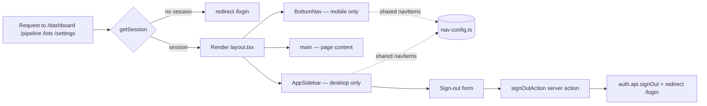

# Dashboard app shell

> The signed-in chrome — sidebar on desktop, bottom tab bar on phones — that wraps every consultant-facing page.

## User value

**Who it's for**: the Creation Homes QLD pilot consultant on a phone between display home walk-ins, and Sam on a laptop.

**Problem it solves**: the consultant needs one place to live in all day. The shell gives that place a frame: a fixed nav, a logged-in identity, and four predictable destinations (Action Queue, Pipeline, Lots, Settings).

**Outcome they get**: after sign-in, every protected page renders inside a familiar frame. On a phone, the four tabs are reachable with the thumb at the bottom. On desktop, the sidebar stays put while the page scrolls. Sign-out is one tap.

**Out of scope**:
- Page content — the shell only frames pages. Action Queue, Pipeline, and Lots pages were shipped as empty states and have been (or will be) replaced as later epics land.
- Push notifications, animated transitions, breadcrumbs, page headers.
- A collapsible/expandable sidebar — the desktop sidebar is fixed-width.
- Profile editing — Settings only shows the user's email and a sign-out button.
- Sign-up gating, role-based access — see [auth-email-otp](auth-email-otp.md).

## Design

**Lives in**:
- `src/app/(application)/layout.tsx` — auth gate (`getSession()` → redirect), `<html>` + fonts, `ThemeProvider`, `AnalyticsProvider`, `TRPCReactProvider`, `ToastProvider`, and the shell layout (`<AppSidebar>` + `<main>` + `<BottomNav>`).
- `src/app/(application)/_components/nav-config.ts` — single source of truth for nav items (label + href + lucide icon) shared by sidebar and bottom nav.
- `src/app/(application)/_components/app-sidebar.tsx` — desktop sidebar, sticky, three zones (logo · nav links · user info + sign-out form).
- `src/app/(application)/_components/bottom-nav.tsx` — fixed mobile tab bar with iOS safe-area padding and a coral top-bar indicator on the active tab.
- `src/app/(application)/settings/page.tsx` — Settings page rendering the session email and a sign-out button.
- `src/app/(application)/settings/_components/sign-out-action.ts` — `"use server"` server action that calls `auth.api.signOut()` and redirects to `/login`.
- `src/app/(application)/settings/_components/sign-out-button.tsx` — client form wrapper using `useFormStatus()` for the disabled/pending state.
- `src/app/(application)/lots/page.tsx` — empty-state page (still as-shipped).
- `src/hooks/use-mobile.ts` — `useIsMobile()` hook. Not used by the shell — kept for future components that need it in JS rather than CSS.

**Choice made**: custom lightweight nav components. Both sidebar and bottom nav share `navItems` from `nav-config.ts` and use Tailwind responsive utilities (`hidden md:flex` / `flex md:hidden`) to swap between viewports — no JS-side breakpoint detection. Sign-out is a server action submitted via a `<form>`, not a client `authClient.signOut()` call.

**Rejected alternatives**:
- **shadcn `Sidebar` primitive** — overkill for four flat nav items, and the mobile pattern here is a bottom tab bar, not a slide-in sheet.
- **Single nav component switching on `useIsMobile()`** — adds a hydration mismatch risk and an extra render pass. Two components + Tailwind classes render correctly on first paint.
- **Client-side `authClient.signOut()`** — used initially. Replaced in commit `6440b6f` because the cookie wasn't always cleared before the redirect; the server action route reliably clears it via `auth.api.signOut({ headers })`.
- **`middleware.ts` auth protection** — see [ADR-002](../adr/adr002-layout-level-auth-gates-over-middleware.md).

**Trade-offs**:
- The desktop sidebar is fixed at `w-64`. Long names (`user.name`) truncate; long emails truncate. Acceptable for the pilot.
- The bottom nav uses `position: fixed`, so `<main>` carries `pb-16 md:pb-0` to keep the last row of content visible. Any new mobile page must respect that padding.
- Both nav components are client components (they use `usePathname()`). The bundle cost is small but every protected page pays it.
- `useIsMobile()` is exported but unused. Leaving it in to avoid churn — delete when something needs to either use it or doesn't.

### Operations

**Health signals**: *None specific to the shell — it has no instrumentation of its own.* Auth-related events (`login_success`, `login_otp_requested`) are emitted by [`auth-email-otp`](auth-email-otp.md). Page-level events belong to the features that own those pages.

**Alerts**: *None.*

**Failure modes & fallback**:

| Failure | What the user sees | What to check |
|---|---|---|
| `getSession()` throws or returns null on a protected route | Hard redirect to `/login` | `BETTER_AUTH_SECRET`, cookie domain, `auth.ts` adapter state |
| Sign-out server action fails | Form stays in pending state, `redirect()` doesn't fire | `auth.api.signOut` errors in server logs; user can retry or close the tab |
| Tailwind classes don't apply (CSS not loaded) | Sidebar and bottom nav both render — broken visual | Check global CSS import in `layout.tsx` |
| iOS safe-area inset not honoured | Bottom nav clips behind home indicator | Confirm `viewport-fit=cover` and `pb-[env(safe-area-inset-bottom)]` on bottom nav |

**Flags / env vars**: none specific to the shell. Auth-related env vars (`BETTER_AUTH_SECRET`, `BETTER_AUTH_URL`) are documented in [auth-email-otp](auth-email-otp.md).

## Flow

**Triggers** (all entry points):
- User visits any path under `(application)` → `layout.tsx` runs `getSession()` and either redirects to `/login` or renders the shell.
- User clicks a sidebar link or a bottom-nav tab → Next.js client navigation; `usePathname()` updates `aria-current` on the active item.
- User submits the sidebar sign-out form **or** the Settings sign-out button → `signOutAction` server action runs → `auth.api.signOut()` clears the session cookie → `redirect("/login")`.

**Data path**: cookie → `getSession()` (cached per-request, see `src/lib/session.ts`) → render shell with `session.user.name` and `session.user.email` → client nav components read `usePathname()` for active state.

**State transitions**:
- Active route: `usePathname()` exact match → `aria-current="page"` on the matching `<Link>` in both sidebar and bottom nav.
- Sign-out button: idle → pending (via `useFormStatus()`) → redirect.

**Edge cases**:
- **Session expired mid-session**: next protected request hits `getSession()` → null → redirect to `/login`. No client-side detection.
- **Long user name / email**: truncated with `truncate` utility in the sidebar footer.
- **Active tab on a nested route** (e.g. `/leads/123`): no nav item matches `pathname` exactly, so no active indicator shows. By design — nested routes aren't top-level destinations.
- **Mobile Safari home indicator**: `pb-[env(safe-area-inset-bottom)]` on bottom nav prevents the last row from sitting under the indicator.

**Side effects**:
- Cookie read on every protected request via `getSession()`.
- On sign-out: `session` row deleted (better-auth), `Set-Cookie` clears `better-auth.session_token`, then 302 to `/login`.

## Links

- ADRs: [ADR-002: Layout-level auth gates instead of `middleware.ts`](../adr/adr002-layout-level-auth-gates-over-middleware.md)
- Design: [AI sales assistant for new home builders](../../thoughts/designs/2026-03-27-ai-sales-assistant-new-home-builders.md) — see "Three Views" in the Dashboard UX section
- Epic: [Epic 1: MVP Foundation](../../thoughts/epics/2026-03-27-epic-1-foundation.md)
- Related plans: [Dashboard App Shell — Mobile-Responsive Empty State](../../thoughts/plans/2026-03-31-94-dashboard-app-shell.md)
- Related features: [Email OTP login](auth-email-otp.md) — sits behind the auth gate this shell relies on
- GitHub issues: [#94](https://github.com/samjmarshall/www/issues/94)
- Shipping PRs: [#111](https://github.com/samjmarshall/www/pull/111)

---
*Generated from interview on 2026-04-28. To regenerate, run `/document-feature dashboard-app-shell`.*
