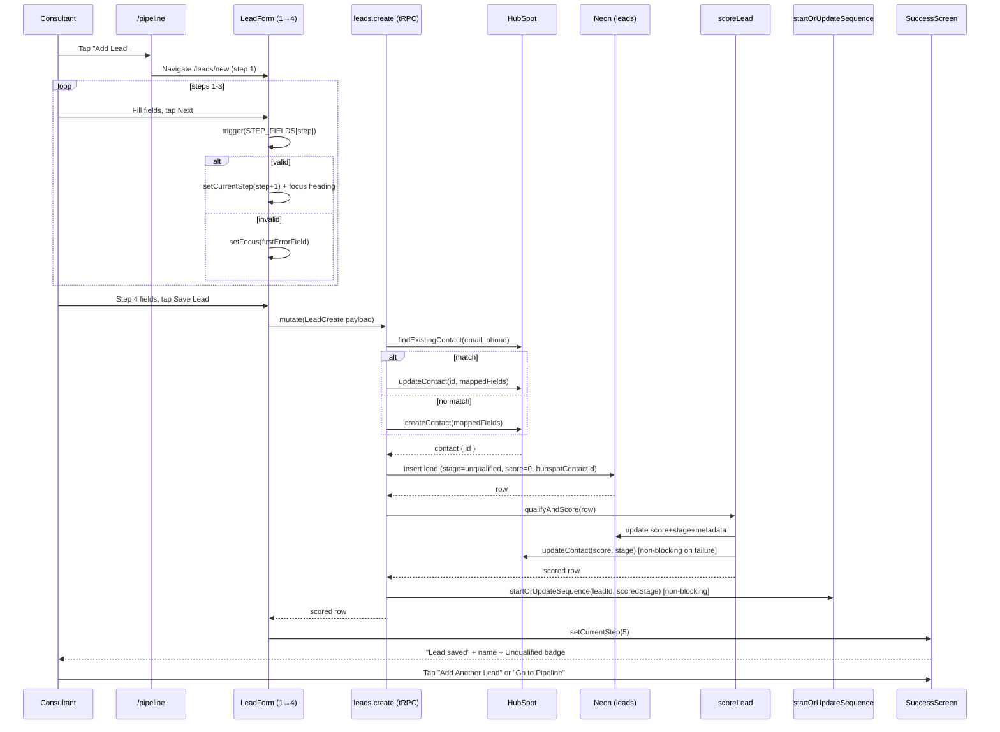

# Full lead enquiry form

> A 4-step mobile form at `/leads/new` that captures everything from the Creation Homes Display Client Enquiry Form in under 3 minutes after a display home walk-in.

## User value

**Who it's for**: the Creation Homes QLD pilot consultant.

**Problem it solves**: display home walk-ins are the consultant's main lead source. After a 10-minute conversation in the home, the consultant needs to write down everything the buyer told them — contact, land status, build preferences, finance — while it's still fresh, on a phone, standing up. The paper enquiry form takes too long and gets lost; a single-screen web form is overwhelming.

**Outcome they get**: from `/pipeline`, tap **Add Lead** → walk through four small steps (Contact → Land → Build → More) with a progress bar at the top → tap **Save Lead**. A success screen confirms the lead was saved with the name and the **Unqualified** stage badge. The consultant can tap **Add Another Lead** for the next walk-in or **Go to Pipeline** to see it in the board. Target: under 3 minutes on mobile.

**Out of scope**:
- Lead profile / detail page — separate feature (`lead-profile`, issue #101).
- Quick capture (name + phone only, ~60s) — different flow, see [quick-capture-form](quick-capture-form.md).
- Voice-to-text input on the notes field.
- Offline / PWA support.
- Form draft auto-save or persistence across reloads — abandon a step and the data is gone.
- PostHog tracking on form steps or completion time.
- A new `leads.fullCreate` tRPC procedure — the form reuses `leads.create` (see *Trade-offs*).

## Design

**Lives in**:
- `src/app/(application)/leads/new/page.tsx` — server component shell, mounts `<LeadForm />`
- `src/app/(application)/leads/new/_components/lead-form.tsx` — client orchestrator: RHF setup, step state (1-5 with 5 = success), per-step validation, mutation wiring, focus management
- `src/app/(application)/leads/new/_components/form-progress.tsx` — 4-dot progress bar with active/completed states
- `src/app/(application)/leads/new/_components/form-navigation.tsx` — bottom Back / Next / Save Lead buttons + submit-error banner
- `src/app/(application)/leads/new/_components/segmented-control.tsx` — custom `role="radiogroup"` button row, arrow-key roving tabindex, used for Yes/No and short enums
- `src/app/(application)/leads/new/_components/success-screen.tsx` — confirmation, "Add Another Lead", "Go to Pipeline"
- `src/app/(application)/leads/new/_components/form-steps/contact-details.tsx` — step 1: name, phone, email, preferred contact time
- `src/app/(application)/leads/new/_components/form-steps/land-status.tsx` — step 2: has land + conditional address/dimensions block
- `src/app/(application)/leads/new/_components/form-steps/build-details.tsx` — step 3: property type, budget, broker, timeline
- `src/app/(application)/leads/new/_components/form-steps/additional-info.tsx` — step 4: Resolve Finance, estates, suburbs, notes, lead source
- `src/app/(application)/leads/new/_lib/schema.ts` — `leadFormSchema` (extends `leadCreateSchema` with AU phone refine) + `leadFormResolver` that maps `""` → `undefined` before validation
- `src/app/(application)/leads/new/_lib/__tests__/schema.test.ts` — phone-validation unit tests
- `src/lib/phone.ts` — shared `isValidAuMobile` (also used by quick capture)
- `src/app/(application)/pipeline/_components/pipeline-board.tsx:44-50, 69-79` — header **Add Lead** button + empty-state **Add your first lead** link (the only entry points)
- `src/server/api/routers/leads.ts` — `leads.create` mutation; this form reuses it as-is
- `src/server/api/schemas/leads.ts` — `leadCreateSchema` (only `firstName`/`lastName` required, rest `.nullish()`) + `LeadCreate` type
- `e2e/pages/sections/lead-form.section.ts` — Playwright page-object section with per-step fillers
- `e2e/features/leads-crud.spec.ts` — happy-path, step-validation, and back-navigation specs

**Choice made**: a 4-step wizard rather than one long scroll. Each step renders a small `FieldGroup` with thumb-sized inputs and `<SegmentedControl>` widgets for Yes/No and short enums. React Hook Form drives the form (`mode: "onSubmit"`, `reValidateMode: "onChange"`); per-step validation is `form.trigger(STEP_FIELDS[currentStep])` before advancing. The form reuses the existing `leads.create` tRPC mutation — `leadCreateSchema` already accepts the full payload because every field except `firstName`/`lastName` is `.nullish()`.

The `_lib/schema.ts` resolver wraps `zodResolver` and maps empty-string inputs to `undefined` before validation runs. RHF's `register()` produces `""` for empty `<input>` elements but `.nullish()` only accepts `null | undefined`, so without the cleanup every empty optional field would fail with "Invalid input."

The success state is *step 5* in the same component, gated by `currentStep === 5`. There is no separate success route, so refreshing the page resets to step 1.

**Rejected alternatives**:
- **Single long form** — too much vertical scrolling on a phone; harder to recover focus after validation errors.
- **Modal/sheet over the pipeline** — full screen real estate matters more than context-preservation for a 3-minute task; deep links are also nicer (`/leads/new` is shareable).
- **Native `<select>` for property type / timeline / Yes/No** — taps too small, requires two interactions per choice. The custom `<SegmentedControl>` keeps everything visible and one-tap.
- **`leads.fullCreate` dedicated procedure** — `leadCreateSchema` already accepts the full payload; a second procedure would duplicate validation and HubSpot mapping.
- **Server-side AU phone validation** — kept on the client only. The server schema stays loose so future imports / webhooks aren't blocked by format quirks.
- **Multi-select chips for `preferredEstates` / `preferredSuburbs`** — comma-separated text inputs are good enough for the pilot; a chip picker would need an estate/suburb autocomplete which doesn't exist yet.
- **Form draft auto-save** — out of scope; if a consultant drops the page mid-form, they redo it. The 3-minute target makes this acceptable.

**Trade-offs**:
- **Shared router, shared side effects.** `leads.create` runs HubSpot dedup-and-upsert (`#102`), synchronous scoring (`#99`), and fire-and-log nurture sequence start (`#132`). This form pays for all three on every submit. Unlike quick capture (which always scores 0 because qualification fields are empty), the full form usually produces a meaningful score and may land the lead directly in `nurture`, `warm`, or `hot` — the nurture scheduler then enrols the lead in the matching sequence (or skips, for `hot`).
- **AU mobile only.** `isValidAuMobile` accepts `04xxxxxxxx` or `+614xxxxxxxx` (with optional spaces, dashes, parens). International leads can't be entered without bypassing client validation. Phone is *optional* on the schema but format-checked when filled.
- **Server schema is looser than the client.** `leadCreateSchema.phone` is `.nullish()`; the client refine adds the AU check. If a different caller needs to bypass the AU check, change the form schema, not the router.
- **Server-side Zod errors hydrate onto fields.** `error.data.zodError.fieldErrors[field]` is read in `onError` and pushed to RHF via `setError`, so server-side validation issues appear as inline field errors — not a top-of-form banner.
- **Land details are conditional.** `watch("hasLand")` toggles an `<AnimatePresence>` block of land-registered, address, and dimensions fields. If the consultant flips Yes → No, the values stay in form state but render hidden — they re-appear if Yes is reselected, and submit untouched on Save.
- **Lead source defaults to `walk_in`.** Set in `defaultValues` and again on `Add Another Lead` reset. The dropdown is on step 4, so most submits keep the default; this matches the consultant's primary use case.
- **No PostHog tracking.** No way to measure step abandonment, completion time, or which fields slow people down without instrumenting.
- **`Save Lead` is awaited synchronously.** Scoring and nurture are inside the same mutation, so the loading spinner covers ~1-2s of HubSpot + DB + scoring round-trips. There is no optimistic UI; if HubSpot is slow, the form is slow. (See *Failure modes* for what the user sees if it actually fails.)

### Operations

**Health signals**: *No instrumentation yet — same gap as quick capture.* The form fires no PostHog events; submission failures only surface in Vercel logs (`[leads.create] local insert failed for HubSpot contact …` and `[scoring] HubSpot sync failed for lead …`).

**Alerts**: none wired up.

**Failure modes & fallback**:
| Failure | What the user sees | What to check |
|---|---|---|
| Step 1-3 validation fails on Next | Inline field errors; focus jumps to the first invalid field via `setFocus(firstErrorField)` | Field error messages |
| Bad AU phone format | Inline error: "Enter a valid AU mobile number (e.g. 0412 345 678)" | Client-side only |
| HubSpot create/update fails | tRPC error bubbles up; centred destructive banner above the buttons | HubSpot API status, `HUBSPOT_*` env vars |
| Local DB insert fails after HubSpot succeeds | Banner: "Lead saved to HubSpot (contact ID: …) but local save failed. Retry or check HubSpot." | Vercel logs; HubSpot has the contact, `leads` table doesn't |
| Server-side Zod error | Field-level errors hydrate via `setError` from `error.data.zodError.fieldErrors` | tRPC error data shape |
| Scoring fails | Submission still throws — scoring is awaited and propagates errors | `[scoring]` log lines, `qualifyAndScore` input |
| Nurture sequence start fails | Submission still succeeds; error logged, not thrown | `[leads.create] nurture sequence start failed` log |
| Page refresh / nav away mid-form | Step state and field values are lost (no draft persistence) | Expected behaviour |

**Flags / env vars**: none of its own. Lives behind the `(application)` route-group auth gate. HubSpot side-effects depend on `HUBSPOT_*` env vars wired through the shared router.

## Flow

**Triggers** (all entry points):
- Tap **Add Lead** in the header of `/pipeline` (`pipeline-board.tsx:44-50`).
- Tap **Add your first lead** in the empty state on `/pipeline` (`pipeline-board.tsx:69-79`).
- Tap **Add Another Lead** on the success screen after a successful submit — same form, reset to step 1, `leadSource` defaulted to `walk_in`.
- Direct navigation to `/leads/new` (deep-linkable).

**Data path**: form values flow step by step into a single RHF state → `Save Lead` calls `leads.create` → HubSpot dedup-and-upsert by email/phone → DB insert (with `leadStage: "unqualified"`, `leadScore: 0` initially) → synchronous re-score by `qualifyAndScore` (this is where the lead's *real* stage gets assigned) → nurture sequence start (fire-and-log) → mutation returns the scored row → client transitions to step 5 (success).

**State transitions**:
- Form step: `1` → `2` → `3` → `4` → `5` (success). Back nav decrements without re-validating. `Add Another Lead` resets state to `{ leadSource: "walk_in" }` and step `1`.
- Lead row: `(none)` → row inserted with `leadStage: "unqualified"`, `leadScore: 0` → re-scored synchronously to its actual stage (`unqualified`, `nurture`, `warm`, or `hot`) and score (0-100). The success screen always shows the **Unqualified** badge regardless of the real stage — this is a known cosmetic gap (see *Edge cases*).

**Edge cases**:
- **Conditional land block**: flipping `hasLand` Yes → No collapses the land-detail block via `AnimatePresence` height/opacity but the values stay in form state. Submitting with `hasLand: false` still sends previously-entered `landAddress`, `landSizeSqm`, etc., if they were filled before flipping.
- **`hasLand: false` reassurance copy**: a small "No worries — we can help find the right land. Tap Next to continue." message renders inline so the screen isn't empty after the toggle.
- **Step heading focus**: each step transition focuses the `<h2>` step title (via a ref + `requestAnimationFrame`), so screen-reader users hear the new step name.
- **Per-step validation prevents skipping**: tapping Next with empty required fields keeps the user on the current step, sets errors, and focuses the first invalid field.
- **Comma-separated arrays**: `preferredEstates` and `preferredSuburbs` accept comma-separated text and split/trim on every keystroke. Empty input becomes `null`, not `[]`.
- **`Save Lead` double-submit**: button is `disabled={isSubmitting}` and shows a spinner while the mutation is in-flight.
- **Server-side Zod errors**: each `error.data.zodError.fieldErrors[field]` message is hydrated onto the matching form field via `setError`, but they surface on step 4 (the only step that submits) — the user must back-nav to fix step 1-3 fields.
- **Success badge always says "Unqualified"**: the badge is hardcoded in `success-screen.tsx`. The lead's *actual* stage (after scoring) lives in DB and shows on the Pipeline board, but the success screen doesn't read the mutation result. Cosmetic gap; documented here so future devs don't assume it reflects scoring output.
- **Refresh during the form**: no draft persistence; reloading sends the user back to step 1 with empty state.

**Side effects** (per submit):
- HubSpot: `findExistingContact` lookup, then `createContact` *or* `updateContact` upsert; second `updateContact` from scoring (lead score + stage).
- DB: one `INSERT … ON CONFLICT DO UPDATE` on `leads` (upsert on `hubspotContactId`), then one `UPDATE` from scoring.
- Nurture: zero or one `nurture_sequences` row depending on the scored stage (`hot` skips enrolment).
- No emails, no PostHog events, no toasts (the success *screen* replaces the form; quick capture's success-toast pattern is not used here).

## Links

- Design: [AI sales assistant for new home builders](../../thoughts/designs/2026-03-27-ai-sales-assistant-new-home-builders.md) — see "Full enquiry form" section
- Epic: [Epic 2: Lead Management & AI Qualification Scoring](../../thoughts/epics/2026-03-27-epic-2-lead-management-ai-scoring.md)
- Plan: [Full Lead Enquiry Form (#97) Implementation Plan](../../thoughts/plans/2026-04-03-97-lead-enquiry-form.md)
- Source spec: [Display Client Enquiry Form v1.2](../sales/Display-Client-Enquiry-Form-v1.2.md)
- Sibling feature using the same `leads.create` mutation: [quick-capture-form](quick-capture-form.md)
- Sibling features that hooked into the shared `leads.create` mutation:
  - [HubSpot contact sync (#102)](../../thoughts/plans/2026-04-08-102-hubspot-contact-sync.md)
  - [AI qualification scoring (#99)](../../thoughts/plans/2026-04-08-99-ai-qualification-scoring-engine.md)
  - [Nurture scheduler (#132)](../../thoughts/plans/2026-04-20-ENG-132-nurture-scheduler.md)
- GitHub issues: [#97](https://github.com/samjmarshall/rekurve/issues/97)
- Shipping PRs: [#117](https://github.com/samjmarshall/rekurve/pull/117)

---
*Generated from interview on 2026-04-28. To regenerate, run `/document-feature full-lead-enquiry-form`.*
