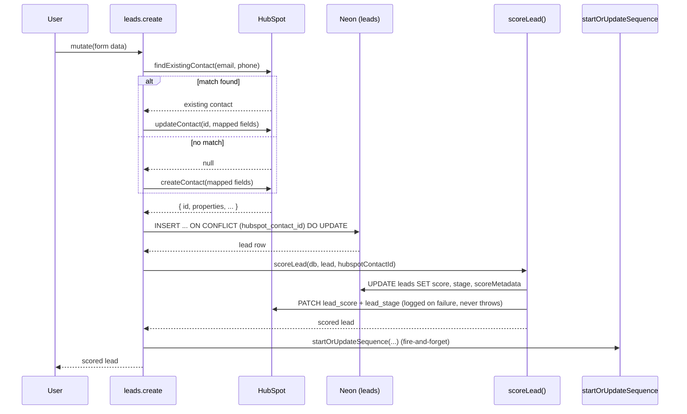
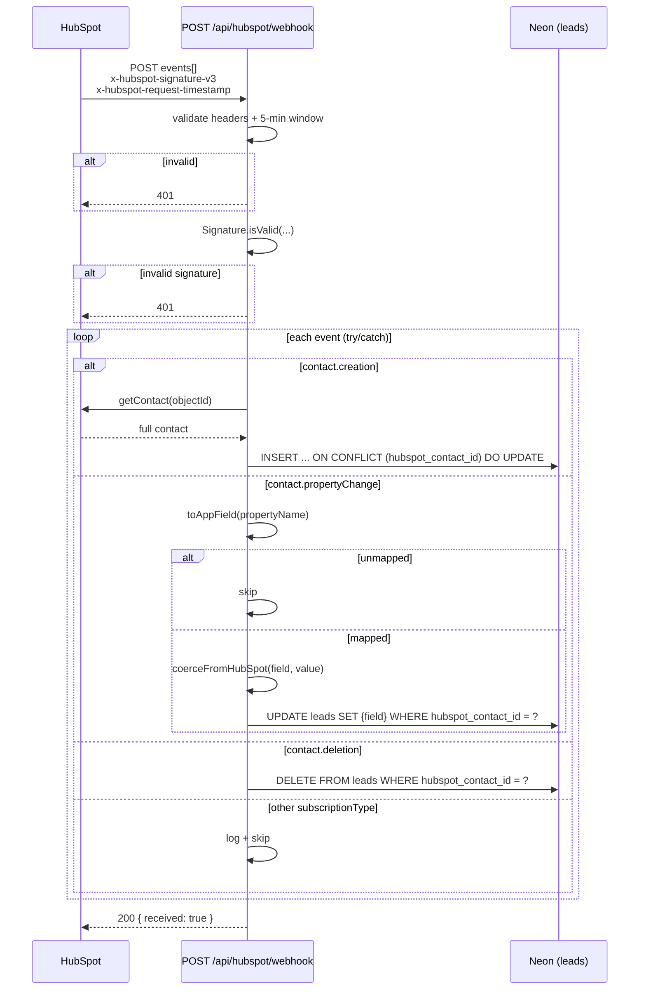
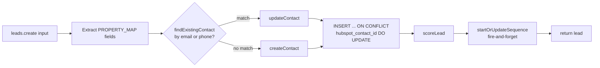

# HubSpot contact sync

> Keeps every lead in the app and every contact in HubSpot the same record. Writes go out on create and update; HubSpot's webhook brings changes back in.

## User value

**Who it's for**: the Creation Homes QLD pilot consultant, plus anyone who reads the contact in HubSpot — sales managers and the wider Creation Homes team. The feature is invisible. Its job is to keep the app and HubSpot in step.

**Problem it solves**: Creation Homes already runs HubSpot. Without this sync the Rekurve app would be a parallel database — the consultant would type each lead twice, and the team's HubSpot dashboards would show only half the activity. One contact, one record, everywhere.

**Outcome they get**: every lead the consultant creates or edits in the app appears in HubSpot before the request returns. When anyone changes a contact in HubSpot, the local `leads` table catches up within one webhook delivery.

**Out of scope**:
- Scheduled reconciliation jobs — deferred until divergence becomes a real problem.
- Sync of `preferredEstates`, `preferredSuburbs`, `referrerName` — no HubSpot equivalents (post-MVP via HubSpot associations).
- Programmatic creation of HubSpot custom properties — manual setup in [thoughts/guides/hubspot-manual-setup.md](../../thoughts/guides/hubspot-manual-setup.md).
- Webhook loop prevention via `changeSource` — handlers are idempotent, so a same-value PATCH is a no-op.
- Retry queue for failed webhook events — log the error, return 200, move on.
- Email engagement reconciliation — that lives in [hubspot-email-dispatch](#) (the `object.creation` branch of the same webhook handler).

## Design

**Lives in**:
- `src/server/hubspot/client.ts` — singleton `@hubspot/api-client` with `numberOfApiCallRetries: 3` (10s on 429, exponential on 5xx)
- `src/server/hubspot/contacts.ts` — `createContact`, `getContact`, `updateContact`, `searchContacts`, `findExistingContact` (email-first, phone-fallback dedup)
- `src/server/hubspot/properties.ts` — 20-entry `PROPERTY_MAP` plus `toHubSpotProperties` / `fromHubSpotProperties` / `toAppField` / `coerceFromHubSpot` (inbound type coercion for booleans + `leadScore`)
- `src/server/hubspot/index.ts` — barrel export
- `src/server/api/routers/leads.ts:30-62` — `scoreLead()` helper; pushes `lead_score` + `lead_stage` to HubSpot, swallows errors
- `src/server/api/routers/leads.ts:81-152` — `create` procedure; HubSpot-first, then `INSERT … ON CONFLICT (hubspot_contact_id) DO UPDATE`
- `src/server/api/routers/leads.ts:221-282` — `update` procedure; HubSpot-first PATCH of mapped+changed fields, then DB update
- `src/app/api/hubspot/webhook/route.ts` — v3 signature gate, 5-minute timestamp window, per-event try/catch, always-200 response
- `src/server/db/schema/leads.ts:26` — `hubspotContactId text("hubspot_contact_id").unique()` (the only sync state)
- `src/server/hubspot/__tests__/{client,contacts,properties}.test.ts` — unit coverage
- `src/app/api/hubspot/webhook/__tests__/route.test.ts` — signature + per-event-type processing
- `e2e/features/hubspot-sync.spec.ts` — outbound (always) + inbound (production-only, gated on `HUBSPOT_WEBHOOK_ACTIVE`)
- `e2e/utils/hubspot-helper.ts` — DB-first archival cleanup helpers, search-based fallback for orphans
- `thoughts/guides/hubspot-manual-setup.md` — one-time setup of the seven custom properties and three webhook subscriptions
- `scripts/hubspot-provision-properties.ts` — referenced by `make hubspot_provision`; provisions custom properties and the `Rekurve` group

**Choice made**:
- **HubSpot-first writes on create and update.** A local row never references a non-existent contact. If HubSpot fails, the mutation fails — by design.
- **Upsert on `hubspot_contact_id` for create.** `onConflictDoUpdate(hubspotContactId)` makes `leads.create` idempotent against the inbound `contact.creation` webhook. Whichever lands first wins; the form data overwrites the webhook's bare row. Bug-fixed in commit `db7981f` after a real race in pilot.
- **Webhook always returns 200.** The handler catches per-event errors, logs `[HubSpot Webhook] Failed to process …`, and runs the next event. HubSpot never sees a 5xx, so no retry storm.
- **`scoreLead()` swallows HubSpot errors.** A HubSpot outage during scoring must not fail the request — the local score persists, HubSpot catches up on the next qualifying edit.
- **Email-first, phone-fallback dedup.** `findExistingContact()` runs an `EQ` search on `email`, then `phone` if no email match. Existing contact → `updateContact`; otherwise `createContact`.
- **No service layer.** HubSpot calls live inline in the leads router, matching the existing pattern. Trade-off: harder to test the router without mocking HubSpot.

**Rejected alternatives**:
- **Scheduled reconciliation cron** — deferred until divergence is observed.
- **Webhook retry queue / dead-letter** — for pilot scale, log and move on.
- **Bidirectional sync with `changeSource` loop guard** — handlers are idempotent (PATCHing the same value is a no-op), so unnecessary.
- **Programmatic creation of HubSpot custom properties** — would couple deploy time to a HubSpot admin operation; the setup guide documents the manual steps instead.
- **DB-first writes with HubSpot fan-out after** — would orphan local rows on HubSpot failure and silently mask broken integrations.

**Anchored in ADRs**:
- [adr003 — HubSpot is the source of truth for contact data](../adr/adr003-hubspot-source-of-truth-for-contacts.md): governs HubSpot-first writes, the local row's role as a cache + extension, idempotent webhook handlers, and the deliberate omission of bidirectional loop guards or scheduled reconciliation.
- [adr004 — Webhook handler swallows per-event errors and always returns 200](../adr/adr004-webhook-swallow-and-always-200.md): governs the per-event try/catch + log + always-200 contract on `POST /api/hubspot/webhook`, and the idempotency requirement on every event handler.

**Trade-offs**:
- **Latency**: every `leads.create` adds 1–2 HubSpot round-trips (dedup search + create-or-update); every qualifying-field `leads.update` adds 1–2 (PATCH + score push). Expect ~200–500ms per mutation. Acceptable at pilot.
- **Orphan-on-DB-fail**: HubSpot-success / DB-fail produces a contact in HubSpot with no local row. The TRPC error message includes the contact ID; `[leads.create] local insert failed for HubSpot contact {id}` logs it. Recovery is manual.
- **Score divergence on HubSpot outage**: `scoreLead()` swallows HubSpot errors. The local score is correct; HubSpot lags until the next mutation triggers another push.
- **Silent observability**: no PostHog, no metrics. The four `console.error` format strings below are the entire signal surface.
- **Property-map drift**: adding a column to `leads` without touching `PROPERTY_MAP` silently drops it from sync. There is no compile-time link.

### Operations

**Health signals**: no PostHog events or structured metrics. Grep these console lines in the platform log:

| Source | Format string | Fires when |
|---|---|---|
| `src/server/api/routers/leads.ts:57` | `[scoring] HubSpot sync failed for lead {id}:` | `scoreLead()` could not push score+stage to HubSpot |
| `src/server/api/routers/leads.ts:126-130` | `[leads.create] local insert failed for HubSpot contact {id}:` | HubSpot create succeeded, local insert threw — orphan in HubSpot |
| `src/app/api/hubspot/webhook/route.ts:69` | `[HubSpot Webhook] Failed to process {subscriptionType} for objectId {objectId}:` | Per-event handler threw; event dropped, next event proceeds |
| `src/app/api/hubspot/webhook/route.ts:102` | `[HubSpot Webhook] Ignoring unhandled event: {subscriptionType}` | Subscription type the handler does not implement |

**Alerts**: none.

**Failure modes & fallback**:

| Failure | What the user sees | What to check |
|---|---|---|
| HubSpot 5xx on `leads.create` | Mutation fails after 3 retries | HubSpot status page, `numberOfApiCallRetries` config |
| HubSpot success, local DB insert fails | TRPC `INTERNAL_SERVER_ERROR` with HubSpot contact ID | Vercel logs for `[leads.create] local insert failed for HubSpot contact …` — manual recovery |
| HubSpot 5xx on `leads.update` | Mutation throws; local row unchanged | HubSpot status; user retries |
| HubSpot 5xx inside `scoreLead` | Mutation succeeds; score+stage update locally; HubSpot lags | `[scoring] HubSpot sync failed …` log; next qualifying edit pushes |
| Webhook signature invalid or missing | 401 to HubSpot | `HUBSPOT_CLIENT_SECRET` matches the private app's secret |
| Webhook timestamp older than 5 minutes | 401 to HubSpot | Clock skew between HubSpot and Vercel |
| Webhook event handler throws | 200 to HubSpot; event dropped | `[HubSpot Webhook] Failed to process …` log |
| Webhook arrives for unmapped property (e.g. `hs_analytics_source`) | No-op | `toAppField` returned `undefined` — working as intended |
| Webhook `contact.deletion` for unknown `hubspot_contact_id` | No-op (zero rows deleted) | Working as intended |
| Lead created with no email and no phone | `findExistingContact` returns null → `createContact` runs → possible duplicate in HubSpot for a same-named contact | See [hubspot-manual-setup.md troubleshooting](../../thoughts/guides/hubspot-manual-setup.md) |
| Type coercion: HubSpot returns `"true"` / `"85"` strings | Coerced to `true` / `85` for `hasLand`, `landRegistered`, `seenBroker`, `resolveFinanceOptedIn`, `leadScore` | `coerceFromHubSpot` in `properties.ts` |

**Flags / env vars**:
- `HUBSPOT_ACCESS_TOKEN` — private-app token; outbound calls fail without it.
- `HUBSPOT_CLIENT_SECRET` — webhook v3 signature secret; inbound calls 401 without it.

Zod in `src/env.js` validates both at boot. `HUBSPOT_BCC_ADDRESS` sits in the same env block but belongs to [hubspot-email-dispatch](#), not this feature.

## Flow

**Triggers** (all entry points):
- `leads.create` tRPC mutation — fired by [quick-capture-form](quick-capture-form.md) and [full-lead-enquiry-form](full-lead-enquiry-form.md).
- `leads.update` tRPC mutation — fired by [lead-profile](lead-profile.md) inline edit.
- `scoreLead()` (called from `leads.create` and `leads.update` when SCORING_FIELDS change) — pushes `lead_score` + `lead_stage` to HubSpot.
- `POST /api/hubspot/webhook` — HubSpot delivers `contact.creation`, `contact.propertyChange`, `contact.deletion` events.

No cron, no manual reconciliation endpoint.

**Data path (outbound, create)**:
form input → `findExistingContact(email, phone)` → `updateContact` *or* `createContact` → `INSERT … ON CONFLICT (hubspot_contact_id) DO UPDATE` on local `leads` → `scoreLead` (re-score + second HubSpot PATCH for score+stage, swallowed on failure) → fire-and-forget `startOrUpdateSequence` (nurture).

**Data path (outbound, update)**:
form input → fetch `hubspotContactId` from local row → if present and any mapped fields changed, PATCH HubSpot with mapped fields only → `UPDATE leads` → if any SCORING_FIELDS changed, `scoreLead`.

**Data path (inbound)**:
HubSpot POST → signature + 5-min timestamp gate → `JSON.parse` events array → per-event `try/catch` dispatching on `subscriptionType` → 200 OK regardless of per-event outcome.

**State transitions**: none owned by this feature. The only sync-state column is `leads.hubspot_contact_id` — null (rare; only legacy or migration rows) → set after the first sync. It stays set until `contact.deletion` removes the whole row.

**Edge cases**:
- Both email and phone null on create → dedup is skipped → `createContact` runs → possible duplicate in HubSpot for an already-existing same-named contact.
- Inbound webhook `contact.creation` arrives before the local insert (race) → upsert on `hubspot_contact_id` wins; the form data overwrites the webhook's bare row. Fixed in `db7981f`.
- HubSpot succeeds, local insert fails → orphan in HubSpot; TRPC error includes the contact ID for manual recovery.
- `contact.propertyChange` for an unmapped property → `toAppField` returns undefined → silently ignored.
- `contact.deletion` for an unknown `hubspot_contact_id` → no rows deleted → no-op.
- HubSpot 5xx during `leads.update` → throws; local row unchanged.
- HubSpot 5xx inside `scoreLead` → swallowed; score persists locally, HubSpot diverges until next qualifying edit.
- Inbound coercion: `"true"` / `"false"` → boolean for `hasLand`, `landRegistered`, `seenBroker`, `resolveFinanceOptedIn`; `"85"` → `85` for `leadScore`; everything else passes through as a string.

**Side effects**:

Outbound `leads.create`:
1. 1× HubSpot search (email).
2. 0–1× HubSpot search (phone fallback).
3. 1× HubSpot create-or-update.
4. 1× DB upsert on `leads`.
5. 1× DB update inside `scoreLead` (score, stage, scoreMetadata).
6. 1× HubSpot PATCH (score + stage) inside `scoreLead`.
7. 1× fire-and-forget call to nurture scheduler.

Outbound `leads.update` (qualifying field changed):
1. 1× DB read (fetch `hubspotContactId`).
2. 1× HubSpot PATCH (mapped fields only).
3. 1× DB update on `leads`.
4. 1× DB update inside `scoreLead`.
5. 1× HubSpot PATCH inside `scoreLead`.
6. 1× fire-and-forget nurture call.

Inbound webhook (per event):
1. 0× (`propertyChange`, `deletion`) or 1× (`creation`) HubSpot fetch.
2. 1× DB insert/update/delete on `leads`.

No PostHog events. No emails. No queue inserts.

## Links

- ADRs:
  - [adr003 — HubSpot is the source of truth for contact data](../adr/adr003-hubspot-source-of-truth-for-contacts.md)
  - [adr004 — Webhook handler swallows per-event errors and always returns 200](../adr/adr004-webhook-swallow-and-always-200.md)
- Design: [AI sales assistant for new home builders](../../thoughts/designs/2026-03-27-ai-sales-assistant-new-home-builders.md) — see "HubSpot (the data layer)"
- Epic: [Epic 1: MVP Foundation](../../thoughts/epics/2026-03-27-epic-1-foundation.md)
- Plans:
  - [HubSpot API client setup](../../thoughts/plans/2026-04-01-95-hubspot-api-client-setup.md) — shipped in PR #113 (issue #95)
  - [HubSpot contact sync on lead create/update](../../thoughts/plans/2026-04-08-102-hubspot-contact-sync.md) — shipped in PR #123 (issue #102)
  - [HubSpot property setup E2E](../../thoughts/plans/2026-04-09-102-hubspot-property-setup-e2e.md) — verification of the manual property setup
- Setup guide: [HubSpot manual setup](../../thoughts/guides/hubspot-manual-setup.md) — one-time custom properties + webhook subscriptions
- Sibling features:
  - [Quick capture form](quick-capture-form.md) — fires `leads.create`
  - [Full lead enquiry form](full-lead-enquiry-form.md) — fires `leads.create`
  - [Lead profile](lead-profile.md) — fires `leads.update`
  - [AI qualification scoring](ai-qualification-scoring.md) — `scoreLead()` pushes its score + stage to HubSpot via this feature
- GitHub issues: [#95](https://github.com/samjmarshall/www/issues/95), [#102](https://github.com/samjmarshall/www/issues/102)
- Shipping PRs: [#113](https://github.com/samjmarshall/www/pull/113), [#123](https://github.com/samjmarshall/www/pull/123)

---
*Generated from interview on 2026-04-28. To regenerate, run `/document-feature hubspot-contact-sync`.*
