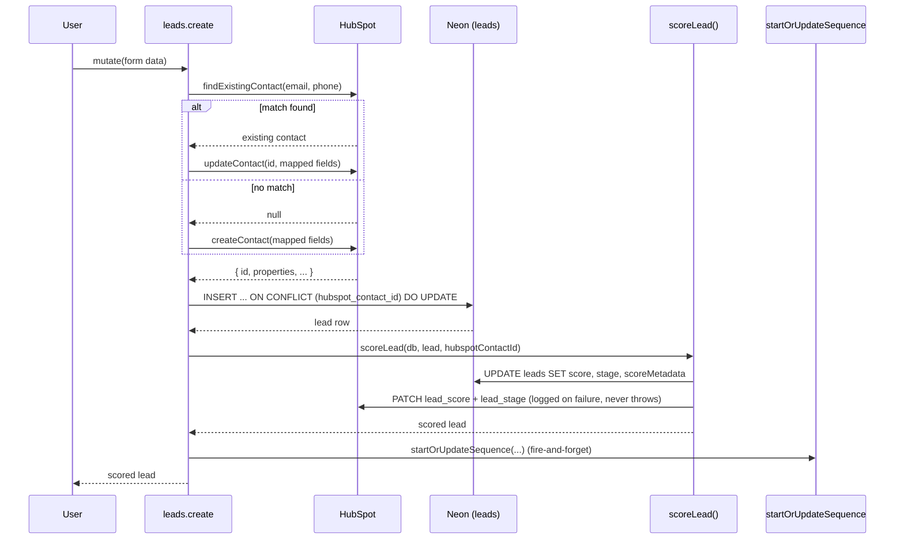
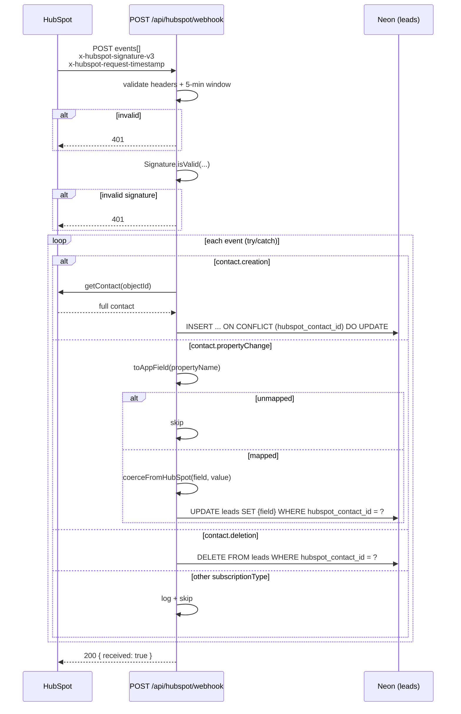
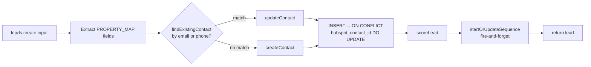

# HubSpot contact sync

> Keeps every lead in the app and every contact in HubSpot the same record. Writes go out on create and update; HubSpot's webhook brings changes back in.

## User value

**Who it's for**: the Creation Homes QLD pilot consultant, plus anyone who reads the contact in HubSpot — sales managers and the wider Creation Homes team. The feature is invisible. Its job is to keep the app and HubSpot in step.

**Problem it solves**: Creation Homes already runs HubSpot. Without this sync the Rekurve app would be a parallel database — the consultant would type each lead twice, and the team's HubSpot dashboards would show only half the activity. One contact, one record, everywhere.

**Outcome they get**: every lead the consultant creates or edits in the app appears in HubSpot before the request returns. When anyone changes a contact in HubSpot, the local `leads` table catches up within one webhook delivery.

**Out of scope**:
- Scheduled reconciliation jobs — deferred until divergence becomes a real problem.
- Sync of `preferredEstates`, `preferredSuburbs`, `referrerName` — no HubSpot equivalents (post-MVP via HubSpot associations).
- Programmatic creation of HubSpot custom properties — manual setup in [thoughts/guides/hubspot-manual-setup.md](../../thoughts/guides/hubspot-manual-setup.md).
- Webhook loop prevention via `changeSource` — handlers are idempotent, so a same-value PATCH is a no-op.
- Retry queue for failed webhook events — log the error, return 200, move on.
- Email engagement reconciliation — that lives in [hubspot-email-dispatch](#) (the `object.creation` branch of the same webhook handler).

## Design

**Lives in**:
- `src/server/hubspot/client.ts` — singleton `@hubspot/api-client` with `numberOfApiCallRetries: 3` (10s on 429, exponential on 5xx)
- `src/server/hubspot/contacts.ts` — `createContact`, `getContact`, `updateContact`, `searchContacts`, `findExistingContact` (email-first, phone-fallback dedup)
- `src/server/hubspot/properties.ts` — 20-entry `PROPERTY_MAP` plus `toHubSpotProperties` / `fromHubSpotProperties` / `toAppField` / `coerceFromHubSpot` (inbound type coercion for booleans + `leadScore`)
- `src/server/hubspot/hubspot.module.ts` — composition root (replaced the old `src/server/hubspot/index.ts` barrel)
- `src/server/leads/leads.decide.ts:70-109,160-201` — `decideCaptureLead()`/`decideUpdateLead()`; compute `lead_score` + `lead_stage` (post-commit HubSpot push lives in `src/server/hubspot/hubspot.worker.ts`)
- `src/server/leads/leads.router.ts:19-23` — `create` procedure; the `INSERT … ON CONFLICT (hubspot_contact_id) DO UPDATE` upsert now lives in `src/server/leads/leads.repository.ts:151-163` (`upsertOnHubspotContactId` write)
- `src/server/leads/leads.router.ts:39-44` — `update` procedure; the HubSpot PATCH of mapped fields now runs post-commit in `src/server/hubspot/hubspot.worker.ts`
- `src/app/api/hubspot/webhook/route.ts` — v3 signature gate, 5-minute timestamp window, per-event try/catch, always-200 response
- `src/server/leads/leads.schema.ts:60` — `hubspotContactId text("hubspot_contact_id").unique()` (the only sync state)
- `src/server/hubspot/__tests__/{client,contacts,properties}.test.ts` — unit coverage
- `src/app/api/hubspot/webhook/__tests__/route.test.ts` — signature + per-event-type processing
- `e2e/features/hubspot-sync.spec.ts` — outbound (always) + inbound (production-only, gated on `HUBSPOT_WEBHOOK_ACTIVE`)
- `e2e/utils/hubspot-helper.ts` — DB-first archival cleanup helpers, search-based fallback for orphans
- `thoughts/guides/hubspot-manual-setup.md` — one-time setup of the seven custom properties and three webhook subscriptions
- `scripts/hubspot-provision-properties.ts` — referenced by `make hubspot_provision`; provisions custom properties and the `Rekurve` group

**Choice made**:
- **DB-first writes; HubSpot is a downstream mirror via the outbox.** `leads.create` / `leads.update` commit the lead row and its outbox events (`lead.captured` / `lead.updated`) in one `db.batch` and return — HubSpot is never on the request path ([adr013](../adr/adr013-local-db-canonical-for-lead-data.md), [adr019](../adr/adr019-system-wide-transactional-outbox-posture.md)). The `lead-hubspot-sync` Inngest worker (`src/server/hubspot/hubspot.worker.ts`) does the HubSpot push post-commit, with Inngest retries; the hourly outbox sweep is the delivery backstop.
- **Upsert on `hubspot_contact_id` for HubSpot-origin ingest.** The `contact.creation` webhook path (`captureLeadFromHubspot` → `decideCaptureFromHubspot`) upserts on `hubspot_contact_id`, so ingest is idempotent against a race with a local capture. The ingest emits `lead.captured` with `hubspotSync: false` so the contact is not echoed straight back to HubSpot.
- **Inbound HubSpot edits are not honoured pre-PMF.** `contact.propertyChange` and `contact.deletion` are logged and dropped (`hubspot.webhook.ts`) — the local DB is canonical ([adr013](../adr/adr013-local-db-canonical-for-lead-data.md)); the next outbound sync overwrites HubSpot. `contact.creation` remains a one-way ingest path.
- **Webhook always returns 200.** The handler catches per-event errors, logs `[HubSpot Webhook] Failed to process …`, and runs the next event. HubSpot never sees a 5xx, so no retry storm.
- **Email-first, phone-fallback dedup.** For an unlinked lead the worker's `hs-dedup` step runs `findExistingContact()` — an `EQ` search on `email`, then `phone`. Existing contact → `hs-update`; otherwise `hs-create`; either way the contact id is stamped back onto the lead (`stamp`). An already-linked lead gets a single `hs-patch`.
- **Score and stage ride the same push.** `lead_score` / `lead_stage` are mapped contact properties, so there is no separate score PATCH; a failed push surfaces as a failed `lead-hubspot-sync` run and is retried by Inngest.
- **Service layer per adr020.** `hubspot.module.ts` exposes `{ service }` (`syncLeadContact`, the webhook handlers, the engagement read port); the raw API adapters (`client.ts` / `contacts.ts` / `emails.ts` / `properties.ts`) are module-private, and tests fake the I/O seam through factory deps.

**Rejected alternatives**:
- **Scheduled reconciliation cron** — deferred until divergence is observed.
- **Webhook retry queue / dead-letter** — for pilot scale, log and move on.
- **Bidirectional sync with `changeSource` loop guard** — inbound edits are dropped entirely pre-PMF (adr013), so no loop guard is needed; the ingest path's `hubspotSync: false` flag suppresses the one echo that could loop.
- **Programmatic creation of HubSpot custom properties** — would couple deploy time to a HubSpot admin operation; the setup guide documents the manual steps instead.
- **HubSpot-first synchronous writes** — the original design ([adr003](../adr/adr003-hubspot-source-of-truth-for-contacts.md)): every mutation blocked on 1–2 HubSpot round-trips and a HubSpot outage failed lead capture. Retired by adr013 once Inngest + the outbox provided the durable retry surface adr003 was missing.

**Anchored in ADRs**:
- [adr013 — Local DB is canonical for lead data](../adr/adr013-local-db-canonical-for-lead-data.md): governs DB-first writes, the post-commit HubSpot push, the log-and-drop of inbound `propertyChange`/`deletion`, and the nullable-then-stamped `hubspotContactId` window.
- [adr019 — System-wide transactional outbox posture](../adr/adr019-system-wide-transactional-outbox-posture.md) (mechanism: [adr014](../adr/adr014-outbox-pattern-for-inngest-delivery.md)/[adr017](../adr/adr017-atomic-outbox-writes-via-neon-http-batch.md)): governs the write → deliver → backstop path that carries `lead.captured`/`lead.updated` to the sync worker.
- [adr004 — Webhook handler swallows per-event errors and always returns 200](../adr/adr004-webhook-swallow-and-always-200.md): governs the per-event try/catch + log + always-200 contract on `POST /api/hubspot/webhook`, and the idempotency requirement on every event handler.
- [adr003 — HubSpot is the source of truth for contact data](../adr/adr003-hubspot-source-of-truth-for-contacts.md): the superseded original posture — kept for the webhook-idempotency reasoning; its canonical-store clause is reversed by adr013.

**Trade-offs**:
- **Latency**: mutations are local-only (one `db.batch`) — HubSpot's 1–2 round-trips moved off the request path into the worker. The cost moved, not vanished: HubSpot lags the local row by the fan-out latency (typically seconds; up to ~1 h if the post-commit send fails and the sweep delivers).
- **Nullable link window**: a freshly captured lead has `hubspotContactId = null` until the worker's `stamp` step lands; consumers must tolerate it. The dashboard catches the link via the worker's realtime `lead.updated` publish.
- **Orphan direction flipped**: the old "contact in HubSpot, no local row" orphan is gone; the failure mode is now "lead local, HubSpot push pending", visible as a failed/retrying `lead-hubspot-sync` run in Inngest rather than a consultant-facing error.
- **Divergence on HubSpot outage**: the local row is always correct (canonical); HubSpot catches up when Inngest retries succeed. An outage longer than the retry budget leaves a failed run to replay from the Inngest dashboard.
- **Silent observability**: no PostHog, no metrics. Failed `lead-hubspot-sync` runs in Inngest plus the webhook console lines below are the entire signal surface.
- **Property-map drift**: adding a column to `leads` without touching `PROPERTY_MAP` silently drops it from sync. There is no compile-time link.

### Operations

**Health signals**: no PostHog events or structured metrics. Grep these console lines in the platform log:

| Source | Format string | Fires when |
|---|---|---|
| `src/server/hubspot/hubspot.worker.ts` | *(console line removed — surfaces as a failed `lead-hubspot-sync` Inngest run)* | HubSpot score/stage push failed post-commit |
| `src/server/hubspot/hubspot.service.ts` (`stamp` step) | *(console line removed — surfaces as a failed `lead-hubspot-sync` Inngest run)* | HubSpot create succeeded, contact-id stamp failed — orphan in HubSpot |
| `src/server/hubspot/hubspot.webhook.ts:118` | `[HubSpot Webhook] Failed to process {subscriptionType} for objectId {objectId}:` | Per-event handler threw; event dropped, next event proceeds |
| `src/server/hubspot/hubspot.webhook.ts:147` | `[HubSpot Webhook] Ignoring unhandled event: {subscriptionType}` | Subscription type the handler does not implement |

**Alerts**: none.

**Failure modes & fallback**:

| Failure | What the user sees | What to check |
|---|---|---|
| HubSpot 5xx on `leads.create` | Mutation fails after 3 retries | HubSpot status page, `numberOfApiCallRetries` config |
| HubSpot success, local DB insert fails | TRPC `INTERNAL_SERVER_ERROR` with HubSpot contact ID | Vercel logs for `[leads.create] local insert failed for HubSpot contact …` — manual recovery |
| HubSpot 5xx on `leads.update` | Mutation throws; local row unchanged | HubSpot status; user retries |
| HubSpot 5xx inside `scoreLead` | Mutation succeeds; score+stage update locally; HubSpot lags | `[scoring] HubSpot sync failed …` log; next qualifying edit pushes |
| Webhook signature invalid or missing | 401 to HubSpot | `HUBSPOT_CLIENT_SECRET` matches the private app's secret |
| Webhook timestamp older than 5 minutes | 401 to HubSpot | Clock skew between HubSpot and Vercel |
| Webhook event handler throws | 200 to HubSpot; event dropped | `[HubSpot Webhook] Failed to process …` log |
| Webhook arrives for unmapped property (e.g. `hs_analytics_source`) | No-op | `toAppField` returned `undefined` — working as intended |
| Webhook `contact.deletion` for unknown `hubspot_contact_id` | No-op (zero rows deleted) | Working as intended |
| Lead created with no email and no phone | `findExistingContact` returns null → `createContact` runs → possible duplicate in HubSpot for a same-named contact | See [hubspot-manual-setup.md troubleshooting](../../thoughts/guides/hubspot-manual-setup.md) |
| Type coercion: HubSpot returns `"true"` / `"85"` strings | Coerced to `true` / `85` for `hasLand`, `landRegistered`, `seenBroker`, `resolveFinanceOptedIn`, `leadScore` | `coerceFromHubSpot` in `properties.ts` |

**Flags / env vars**:
- `HUBSPOT_ACCESS_TOKEN` — private-app token; outbound calls fail without it.
- `HUBSPOT_CLIENT_SECRET` — webhook v3 signature secret; inbound calls 401 without it.

Zod in `src/env.js` validates both at boot. `HUBSPOT_BCC_ADDRESS` sits in the same env block but belongs to [hubspot-email-dispatch](#), not this feature.

## Flow

**Triggers** (all entry points):
- `leads.create` tRPC mutation — fired by [quick-capture-form](quick-capture-form.md) and [full-lead-enquiry-form](full-lead-enquiry-form.md).
- `leads.update` tRPC mutation — fired by [lead-profile](lead-profile.md) inline edit.
- `scoreLead()` (called from `leads.create` and `leads.update` when SCORING_FIELDS change) — pushes `lead_score` + `lead_stage` to HubSpot.
- `POST /api/hubspot/webhook` — HubSpot delivers `contact.creation`, `contact.propertyChange`, `contact.deletion` events.

No cron, no manual reconciliation endpoint.

**Data path (outbound, create)**:
form input → `findExistingContact(email, phone)` → `updateContact` *or* `createContact` → `INSERT … ON CONFLICT (hubspot_contact_id) DO UPDATE` on local `leads` → `scoreLead` (re-score + second HubSpot PATCH for score+stage, swallowed on failure) → fire-and-forget `startOrUpdateSequence` (nurture).

**Data path (outbound, update)**:
form input → fetch `hubspotContactId` from local row → if present and any mapped fields changed, PATCH HubSpot with mapped fields only → `UPDATE leads` → if any SCORING_FIELDS changed, `scoreLead`.

**Data path (inbound)**:
HubSpot POST → signature + 5-min timestamp gate → `JSON.parse` events array → per-event `try/catch` dispatching on `subscriptionType` → 200 OK regardless of per-event outcome.

```mermaid
sequenceDiagram
    participant User
    participant API as leads.create
    participant HS as HubSpot
    participant DB as Neon (leads)
    participant Scorer as scoreLead()
    participant Nurture as startOrUpdateSequence

    User->>API: mutate(form data)
    API->>HS: findExistingContact(email, phone)

    alt match found
        HS-->>API: existing contact
        API->>HS: updateContact(id, mapped fields)
    else no match
        HS-->>API: null
        API->>HS: createContact(mapped fields)
    end

    HS-->>API: { id, properties, ... }
    API->>DB: INSERT ... ON CONFLICT (hubspot_contact_id) DO UPDATE
    DB-->>API: lead row

    API->>Scorer: scoreLead(db, lead, hubspotContactId)
    Scorer->>DB: UPDATE leads SET score, stage, scoreMetadata
    Scorer->>HS: PATCH lead_score + lead_stage (logged on failure, never throws)
    Scorer-->>API: scored lead
    API->>Nurture: startOrUpdateSequence(...) (fire-and-forget)
    API-->>User: scored lead
```

```mermaid
sequenceDiagram
    participant HS as HubSpot
    participant Route as POST /api/hubspot/webhook
    participant DB as Neon (leads)

    HS->>Route: POST events[]<br/>x-hubspot-signature-v3<br/>x-hubspot-request-timestamp

    Route->>Route: validate headers + 5-min window
    alt invalid
        Route-->>HS: 401
    end

    Route->>Route: Signature.isValid(...)
    alt invalid signature
        Route-->>HS: 401
    end

    loop each event (try/catch)
        alt contact.creation
            Route->>HS: getContact(objectId)
            HS-->>Route: full contact
            Route->>DB: INSERT ... ON CONFLICT (hubspot_contact_id) DO UPDATE
        else contact.propertyChange
            Route->>Route: toAppField(propertyName)
            alt unmapped
                Route->>Route: skip
            else mapped
                Route->>Route: coerceFromHubSpot(field, value)
                Route->>DB: UPDATE leads SET {field} WHERE hubspot_contact_id = ?
            end
        else contact.deletion
            Route->>DB: DELETE FROM leads WHERE hubspot_contact_id = ?
        else other subscriptionType
            Route->>Route: log + skip
        end
    end

    Route-->>HS: 200 { received: true }
```

```mermaid
flowchart LR
    Start[leads.create input] --> Map[Extract PROPERTY_MAP fields]
    Map --> Search{findExistingContact<br/>by email or phone?}
    Search -->|match| Update[updateContact]
    Search -->|no match| Create[createContact]
    Update --> Upsert[INSERT ... ON CONFLICT<br/>hubspot_contact_id DO UPDATE]
    Create --> Upsert
    Upsert --> Score[scoreLead]
    Score --> Nurture[startOrUpdateSequence<br/>fire-and-forget]
    Nurture --> Return[return lead]
```

**State transitions**: none owned by this feature. The only sync-state column is `leads.hubspot_contact_id` — null (rare; only legacy or migration rows) → set after the first sync. It stays set until `contact.deletion` removes the whole row.

**Edge cases**:
- Both email and phone null on create → dedup is skipped → `createContact` runs → possible duplicate in HubSpot for an already-existing same-named contact.
- Inbound webhook `contact.creation` arrives before the local insert (race) → upsert on `hubspot_contact_id` wins; the form data overwrites the webhook's bare row. Fixed in `db7981f`.
- HubSpot succeeds, local insert fails → orphan in HubSpot; TRPC error includes the contact ID for manual recovery.
- `contact.propertyChange` for an unmapped property → `toAppField` returns undefined → silently ignored.
- `contact.deletion` for an unknown `hubspot_contact_id` → no rows deleted → no-op.
- HubSpot 5xx during `leads.update` → throws; local row unchanged.
- HubSpot 5xx inside `scoreLead` → swallowed; score persists locally, HubSpot diverges until next qualifying edit.
- Inbound coercion: `"true"` / `"false"` → boolean for `hasLand`, `landRegistered`, `seenBroker`, `resolveFinanceOptedIn`; `"85"` → `85` for `leadScore`; everything else passes through as a string.

**Side effects**:

Outbound `leads.create`:
1. 1× HubSpot search (email).
2. 0–1× HubSpot search (phone fallback).
3. 1× HubSpot create-or-update.
4. 1× DB upsert on `leads`.
5. 1× DB update inside `scoreLead` (score, stage, scoreMetadata).
6. 1× HubSpot PATCH (score + stage) inside `scoreLead`.
7. 1× fire-and-forget call to nurture scheduler.

Outbound `leads.update` (qualifying field changed):
1. 1× DB read (fetch `hubspotContactId`).
2. 1× HubSpot PATCH (mapped fields only).
3. 1× DB update on `leads`.
4. 1× DB update inside `scoreLead`.
5. 1× HubSpot PATCH inside `scoreLead`.
6. 1× fire-and-forget nurture call.

Inbound webhook (per event):
1. 0× (`propertyChange`, `deletion`) or 1× (`creation`) HubSpot fetch.
2. 1× DB insert/update/delete on `leads`.

No PostHog events. No emails. No queue inserts.

## Links

- ADRs:
  - [adr003 — HubSpot is the source of truth for contact data](../adr/adr003-hubspot-source-of-truth-for-contacts.md)
  - [adr004 — Webhook handler swallows per-event errors and always returns 200](../adr/adr004-webhook-swallow-and-always-200.md)
- Design: [AI sales assistant for new home builders](../../thoughts/designs/2026-03-27-ai-sales-assistant-new-home-builders.md) — see "HubSpot (the data layer)"
- Epic: [Epic 1: MVP Foundation](../../thoughts/epics/2026-03-27-epic-1-foundation.md)
- Plans:
  - [HubSpot API client setup](../../thoughts/plans/2026-04-01-95-hubspot-api-client-setup.md) — shipped in PR #113 (issue #95)
  - [HubSpot contact sync on lead create/update](../../thoughts/plans/2026-04-08-102-hubspot-contact-sync.md) — shipped in PR #123 (issue #102)
  - [HubSpot property setup E2E](../../thoughts/plans/2026-04-09-102-hubspot-property-setup-e2e.md) — verification of the manual property setup
- Setup guide: [HubSpot manual setup](../../thoughts/guides/hubspot-manual-setup.md) — one-time custom properties + webhook subscriptions
- Sibling features:
  - [Quick capture form](quick-capture-form.md) — fires `leads.create`
  - [Full lead enquiry form](full-lead-enquiry-form.md) — fires `leads.create`
  - [Lead profile](lead-profile.md) — fires `leads.update`
  - [AI qualification scoring](ai-qualification-scoring.md) — `scoreLead()` pushes its score + stage to HubSpot via this feature
- GitHub issues: [#95](https://github.com/samjmarshall/rekurve/issues/95), [#102](https://github.com/samjmarshall/rekurve/issues/102)
- Shipping PRs: [#113](https://github.com/samjmarshall/rekurve/pull/113), [#123](https://github.com/samjmarshall/rekurve/pull/123)

---
*Generated from interview on 2026-04-28. To regenerate, run `/document-feature hubspot-contact-sync`.*
