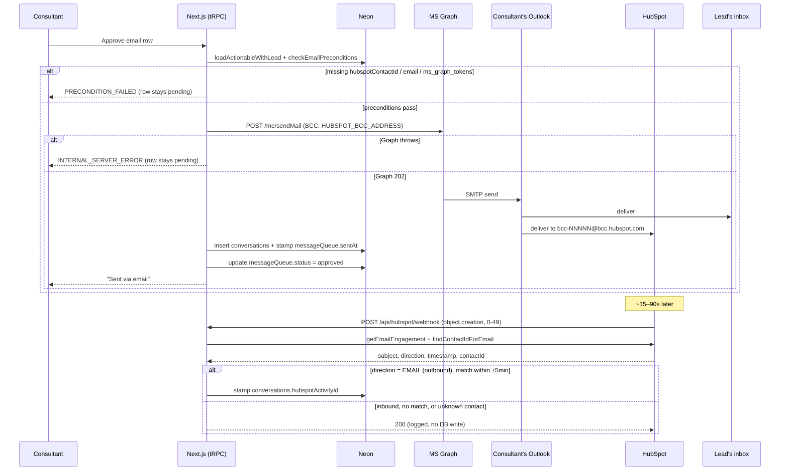
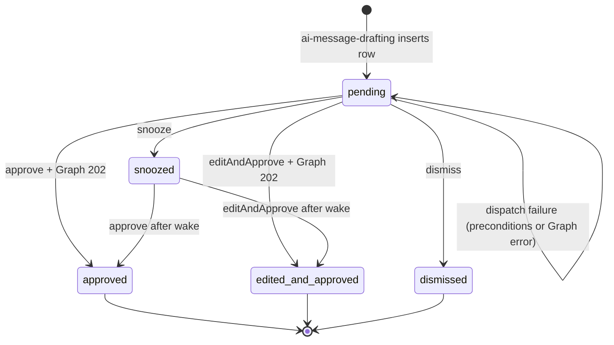
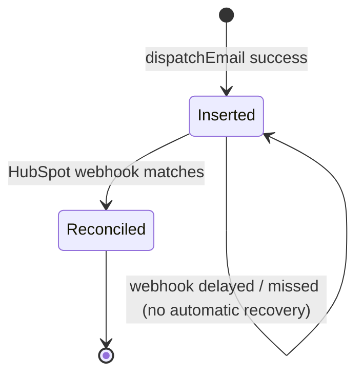

# HubSpot email dispatch

> When the consultant approves an email draft on `/dashboard`, the email goes out from their own Outlook mailbox, HubSpot gets a BCC copy so the lead's timeline shows the activity, and the local conversation log links back to that timeline entry once HubSpot acknowledges it.

## User value

**Who it's for**: the Creation Homes QLD pilot consultant. The HubSpot timeline reader (sales managers, the wider Creation Homes team) is a secondary audience — they see the same activity they would see if the consultant had typed the email by hand.

**Problem it solves**: before this shipped, tapping **Approve** on an email row in the [action queue](action-queue.md) only flipped a status — no email left the building. The consultant's morning routine ended at "approved", and the lead heard nothing. The follow-up gap (Epic 3's whole point) stayed open.

**Outcome they get**:
1. The consultant connects their Microsoft 365 account once via the amber **Connect** banner on `/dashboard`.
2. They tap **Approve** on an email-channel draft.
3. Within ~1 second the email leaves their own Outlook mailbox addressed to the lead, BCC'd to HubSpot's portal ingestion address.
4. Within ~15–90 seconds HubSpot creates the timeline engagement, fires an `object.creation` webhook back, and the local `conversations` row gets `hubspotActivityId` stamped on it.
5. The consultant sees a "Sent via email" toast; the row disappears from the queue.

**Out of scope**:
- **Inbound email** — replies in Outlook do not flow back into the conversation log. Belongs in a follow-up once the outbound foundation has soaked.
- **Inbound webhook stub** — the handler ignores `email.creation` events with `hs_email_direction = INCOMING_EMAIL`.
- **Nightly missed-webhook reconciler** — if HubSpot never fires the webhook (or it errors), `hubspotActivityId` stays `NULL` indefinitely. Acceptable trade-off for pilot.
- **SMS dispatch** — owned by [#129](https://github.com/samjmarshall/rekurve/issues/129), parallel branch.
- **Multi-tenant Microsoft onboarding UI** — one consultant, one mailbox.
- **HTML email** — body is plain text (matches the AI-drafted format from [ai-message-drafting](ai-message-drafting.md)).
- **Shared mailboxes / send-as / delegated send** — own mailbox only.
- **Live HubSpot end-to-end** — the production webhook only fires from prod; local verification stops at unit + signed-payload e2e.

## Design

**Lives in**:
- `src/server/dispatch/email-dispatch.ts` — `dispatchEmail()`: sends via Graph, inserts the `conversations` row, stamps `messageQueue.sentAt`
- `src/server/ms-graph/client.ts` — `MsGraphNotConnectedError`, `getMsalClient()` (single-tenant `ConfidentialClientApplication`), `graphClientForUser(userId)` with auto-refresh on 60s skew
- `src/server/ms-graph/emails.ts` — `sendEmail()`: posts `/me/sendMail`, always BCCs `env.HUBSPOT_BCC_ADDRESS`
- `src/server/ms-graph/index.ts` — barrel export
- `src/server/db/schema/ms-graph-tokens.ts` — `ms_graph_tokens` (`userId` PK → `user.id` cascade, `accessToken`, `refreshToken`, `expiresAt`, `microsoftUserId`, `email`)
- `src/server/hubspot/emails.ts` — `getEmailEngagement()` reads `hs_email_subject`/`hs_email_direction`/`hs_timestamp`/`hs_email_to_email`; `findContactIdForEmail()` walks the `emails → contacts` association
- `src/app/api/auth/ms-graph/start/route.ts` — builds the MSAL auth URL, redirects to Microsoft consent
- `src/app/api/auth/ms-graph/callback/route.ts` — exchanges the code for tokens via direct POST to `/oauth2/v2.0/token` (MSAL's `acquireTokenByCode` does not surface `refresh_token` in its result type), upserts `ms_graph_tokens`, enriches with `/me`, redirects `/dashboard?ms_connected=1`
- `src/app/api/hubspot/webhook/route.ts:79-106` — `processEvent` switch; the `object.creation` branch routes `objectTypeId === "0-49"` (the 1:1 Email engagement) into `handleEmailCreation`
- `src/app/api/hubspot/webhook/route.ts:160-205` — `handleEmailCreation()`: outbound-only filter, lead lookup by `hubspotContactId`, candidate match by lead + delivery method + `hubspotActivityId IS NULL` + ±5min `createdAt` window + matching subject; stamps `hubspotActivityId`
- `src/server/api/routers/messages.ts:64-90` — `checkEmailPreconditions()`: rejects missing `hubspotContactId`, missing `email`, missing `ms_graph_tokens` row before any state is mutated
- `src/server/api/routers/messages.ts:137-191` — `approve` / `editAndApprove` reordered: preconditions → dispatch → status flip
- `src/app/(application)/dashboard/page.tsx` — server component reads `ms_graph_tokens` for the session user, gates the banner
- `src/app/(application)/dashboard/_components/ms-graph-connect-banner.tsx` — amber "Connect" banner with link to `/api/auth/ms-graph/start`
- `src/app/(application)/dashboard/_components/use-queue-actions.ts:62-87` — `MS_NOT_CONNECTED_MSG` sentinel routes a `PRECONDITION_FAILED` toast into a CTA toast
- `drizzle/0003_zippy_proteus.sql` — migration for `ms_graph_tokens`
- `e2e/features/email-dispatch.spec.ts` — failure-path runs without a Graph token; happy-path UI dispatch skips unless `MS_GRAPH_TEST_ACCESS_TOKEN` is set; webhook reconciliation runs against a signed synthetic payload
- `e2e/utils/messages-helper.ts` — `seedEmailQueueItem()`, `cleanupConversationsForLead()`

**Choice made — Outlook + BCC + webhook reconciliation**:
- **Send via the consultant's own M365 mailbox** through Microsoft Graph `/me/sendMail`. The email is a real Outlook thread on their machine.
- **Always BCC `env.HUBSPOT_BCC_ADDRESS`** (the portal-specific `bcc-NNNNN@bcc.hubspot.com`). HubSpot ingests the message and creates a timeline engagement asynchronously.
- **Reconcile via the existing HubSpot webhook**. When HubSpot fires `object.creation` for the new email engagement, `handleEmailCreation` finds the local `conversations` row by lead + ±5min + matching subject and stamps `hubspotActivityId`. The approve mutation never blocks on HubSpot ingestion.

**Rejected alternatives**:
- **HubSpot Single-Send Transactional API** (what issue #130 originally specified) — requires Marketing Hub Enterprise + the Transactional Email add-on (~$400/mo). Cost-gated out of pilot.
- **HubSpot Engagements API + a separate sender** (`POST /crm/v3/objects/emails`) — creates the timeline activity directly with no async reconciliation, but loses the "real Outlook thread on the consultant's machine" benefit and still needs a sending provider on top.
- **Resend from a shared `noreply@` domain** — already installed for OTP, simpler to wire, but no Outlook thread, no inbox reply visibility, and the consultant doesn't see what they sent.
- **Status-flip-then-dispatch** — the original implementation. ENG-152 reversed it after a corrupt-token incident left rows permanently `approved` with nothing sent, no UI path to retry.
- **Try/catch + roll-row-back-to-pending after dispatch failure** — same outcome as preconditions-then-dispatch-then-flip but with a wider window where a failed second write could leave a sent message marked pending. Reorder is cleaner.

**Anchored in ADRs**:
- [adr003 — HubSpot is the source of truth for contact data](../adr/adr003-hubspot-source-of-truth-for-contacts.md): governs why HubSpot stays the system of record for the email engagement (we mirror with `hubspotActivityId`, never the other way round).
- [adr004 — Webhook handler swallows per-event errors and always returns 200](../adr/adr004-webhook-swallow-and-always-200.md): governs `handleEmailCreation`'s log-and-continue contract — HubSpot never sees a 5xx, no retry storm.
- [adr007 — Outlook send with HubSpot BCC reconciliation](../adr/adr007-outlook-send-with-hubspot-bcc-reconciliation.md): the shipped email-dispatch architecture. Records why the consultant's M365 mailbox sends (lead-side perception — Rekurve stays invisible) and why BCC + async reconciliation is preferred over the HubSpot Engagements API (HubSpot's native ingestion is highest-fidelity and forward-compatible with inbound replies). Constrains future consumers of `conversations` to tolerate indefinite null `hubspotActivityId` until missed-webhook recovery exists.

**Trade-offs**:
- **Async reconciliation window** — `conversations.hubspotActivityId` stays `NULL` for ~15–90 seconds after send (HubSpot ingestion delay). Lead profile and any other consumer must tolerate the null state.
- **No missed-webhook recovery** — if HubSpot drops the webhook, the row's `hubspotActivityId` is `NULL` forever. A nightly reconciler is a follow-up ticket.
- **Silent SMTP failure** — Graph returns 202 (queued) before SMTP delivery. Microsoft's outbound infrastructure can later bounce with `550 5.7.501 Spam abuse detected from IP range` and the dashboard already showed "Sent via email". Tracked as [#154](https://github.com/samjmarshall/rekurve/issues/154); the [compose-providers design](../../thoughts/designs/2026-04-27-email-compose-providers.md) addresses it via webhook-driven send detection.
- **Single mailbox per consultant** — `ms_graph_tokens.userId` is the primary key. No shared mailbox, no send-as.
- **Subject-based reconciliation is fuzzy** — two outbound emails to the same lead with the same subject within ±5 min would race. AI drafts vary subjects; risk is low at pilot scale.
- **No `ms_graph_tokens` token encryption at rest** — flagged as a known TODO. Postgres column-level encryption is a follow-up.
- **No PostHog events on the dispatch surface** — failures appear in toasts and `console.error`. Open observability gap.
- **MSAL `acquireTokenByCode` workaround** — the SDK's typed result drops `refresh_token`, so the callback POSTs the token endpoint directly. If MSAL changes its surface, this hand-rolled fetch needs review.

### Operations

**Health signals**: no PostHog events, no structured metrics. The signal surface is:

| Source | Format string / location | Fires when |
|--------|--------------------------|------------|
| `console.error` | `[HubSpot Webhook] Failed to process object.creation for objectId {id}` (`webhook/route.ts:69-72`) | A reconciliation event throws (per-event try/catch). Webhook still returns 200. |
| `console.log` | `[HubSpot Webhook] No matching conversation for email.creation {id}` (`webhook/route.ts:195-198`) | The webhook fired but no `conversations` row matched (lead unsynced, subject drift, ±5min window missed). |
| `console.log` | `[HubSpot Webhook] Ignoring object.creation for objectTypeId {id}` (`webhook/route.ts:97-99`) | An `object.creation` for a non-email object slipped through the subscription filter. |
| Toast | `"Failed to send email. Please try again."` (`email-dispatch.ts:46-48`) | Graph send threw something other than `MsGraphNotConnectedError`. |
| Toast | `"Connect your Microsoft account to send emails."` (`email-dispatch.ts:42` / `messages.ts:87`) | No `ms_graph_tokens` row, or the refresh failed. |
| Toast | `"This lead isn't synced with HubSpot yet."` (`messages.ts:73`) | `lead.hubspotContactId IS NULL`. |
| Toast | `"This lead has no email address."` (`messages.ts:78`) | `lead.email IS NULL`. |
| DB | `conversations.hubspotActivityId IS NULL AND createdAt < NOW() - INTERVAL '5 minutes'` | Reconciliation has not landed yet (normal up to ~90s; investigate beyond ~15min). |

**Alerts**: none wired. Tail Vercel function logs for the `[HubSpot Webhook]` prefix; query `conversations` for rows that are stale and still null on `hubspotActivityId`.

**Failure modes & fallback**:
- **Lead has no `hubspotContactId`** → `PRECONDITION_FAILED`, row stays `pending`/`snoozed`, "This lead isn't synced with HubSpot yet" toast. Recovery: fix the [hubspot-contact-sync](hubspot-contact-sync.md) issue for that lead.
- **Lead has no `email`** → `PRECONDITION_FAILED`, row stays `pending`, "This lead has no email address" toast. Recovery: edit the lead from the [lead-profile](lead-profile.md).
- **Consultant not connected to Microsoft** → `PRECONDITION_FAILED`, row stays `pending`, actionable Connect toast (and the persistent amber banner). Recovery: tap Connect → OAuth round-trip.
- **Graph send errors after the precondition check** → `INTERNAL_SERVER_ERROR`, row stays `pending`, "Failed to send email. Please try again." toast. The Approve button doubles as Retry (the row is non-terminal). No `conversations` row, no `sentAt`. The original Graph error is in `cause`.
- **Token revoked or refresh fails** → `MsGraphNotConnectedError` from `graphClientForUser`, mapped to `PRECONDITION_FAILED`, same path as "not connected".
- **Send succeeds, HubSpot webhook never arrives** → `conversations` row stays at `hubspotActivityId = NULL` indefinitely. The email landed; only the timeline link is missing. No automatic recovery in pilot.
- **Webhook delivers but matching window misses** → log line `No matching conversation for email.creation`, row stays `NULL`, no error to user. Plan: widen the ±5min window to ±15min if matches start missing.
- **Two outbound emails to the same lead with the same subject within 5 min** → the closest-by-`createdAt` candidate wins; the other stays `NULL`. Edge case; rare at pilot volume.

**Flags / env vars**:
- `MS_GRAPH_CLIENT_ID`, `MS_GRAPH_CLIENT_SECRET` (sensitive), `MS_GRAPH_TENANT_ID`, `MS_GRAPH_REDIRECT_URI` — Azure app registration.
- `HUBSPOT_BCC_ADDRESS` (sensitive) — portal-specific ingestion address (`bcc-NNNNN@bcc.hubspot.com`), set once from HubSpot Settings → Integrations → Email.
- `HUBSPOT_CLIENT_SECRET` — webhook signature validation (shared with [hubspot-contact-sync](hubspot-contact-sync.md)).
- No feature flags. The dispatch path is always on for `channel = email`.

## Flow

**Triggers** (all entry points):
- **UI**: `/dashboard` → tap **Approve** or **Edit and approve** on an email-channel row → `messages.approve` / `messages.editAndApprove` mutation.
- **OAuth**: `GET /api/auth/ms-graph/start` (consultant taps the Connect banner) → Microsoft consent → `GET /api/auth/ms-graph/callback` upserts the token row.
- **Webhook**: `POST /api/hubspot/webhook` with `subscriptionType = "object.creation"` and `objectTypeId = "0-49"` → `handleEmailCreation` reconciles the engagement back.

**Data path**: queue row + lead row → preconditions check → Graph `/me/sendMail` → `conversations` insert + `messageQueue.sentAt` stamp → status flip → (asynchronously, ~15–90s later) HubSpot webhook → `conversations.hubspotActivityId` stamped.

**State transitions** (the queue row's view):

The `conversations` row's view:

**Edge cases**:
- **Token within 60s of expiry** → `graphClientForUser` calls MSAL `acquireTokenByRefreshToken`, persists the new `accessToken` + `expiresAt`, send proceeds. If the refresh returns no result, it throws `MsGraphNotConnectedError` and the consultant sees the Connect toast.
- **`editAndApprove` body** → `dispatchEmail` sends the edited body (`{ ...existing, body: input.body }`); the row keeps the original AI draft as `originalBody` for audit.
- **Concurrent approve clicks on the same row** → `loadActionable` rejects the second call with `BAD_REQUEST` because the status is no longer `pending`/`snoozed`.
- **HubSpot webhook for an inbound reply** (`hs_email_direction = INCOMING_EMAIL`) → `handleEmailCreation` early-returns. No DB writes. Inbound is out of scope.
- **`object.creation` for a non-email object** → logged and ignored; the `objectTypeId = "0-49"` subscription filter should prevent this.
- **Webhook signature invalid or timestamp expired** → 401 before any handler runs (`webhook/route.ts:33-43`).
- **Two race candidates for reconciliation** → the timestamp-window query picks the closest-by-`createdAt` candidate; primary key breaks ties.

**Side effects**:
- **Outlook outbound email** — Microsoft Graph sends from the consultant's mailbox; Sent Items keeps a copy (`Mail.Send` scope).
- **HubSpot timeline engagement** — HubSpot ingests the BCC and creates the engagement within ~15–90s.
- **`conversations` row** — `dispatchEmail` inserts on approve (`hubspotActivityId = NULL` initially).
- **`messageQueue.sentAt`** — `dispatchEmail` stamps it on Graph 202.
- **`messageQueue.status`** — `approve` / `editAndApprove` flips it to `approved` or `edited_and_approved` after dispatch.
- **`ms_graph_tokens` columns** — `graphClientForUser` updates `accessToken`, `expiresAt`, `updatedAt` on every refresh (~hourly per Graph TTL).
- **`conversations.hubspotActivityId`** — `handleEmailCreation` stamps it once the HubSpot webhook lands.

## Links

- ADRs: [adr003 — HubSpot is the source of truth](../adr/adr003-hubspot-source-of-truth-for-contacts.md), [adr004 — Webhook always returns 200](../adr/adr004-webhook-swallow-and-always-200.md), [adr007 — Outlook send with HubSpot BCC reconciliation](../adr/adr007-outlook-send-with-hubspot-bcc-reconciliation.md)
- Forward-looking design: [Email Compose Providers — Mailto Default + Outlook Graph Drafts](../../thoughts/designs/2026-04-27-email-compose-providers.md) (re-architecture in response to #154/#156, not yet shipped)
- Epic: [Epic 3 — HITL Message Queue + Nurture Sequences](../../thoughts/epics/2026-03-27-epic-3-hitl-message-queue-nurture.md)
- Implementation plan: [ENG-130 — Outlook Email Dispatch + HubSpot Activity Reconciliation](../../thoughts/plans/2026-04-25-ENG-130-hubspot-email-outlook-dispatch.md)
- Related features: [action-queue](action-queue.md), [ai-message-drafting](ai-message-drafting.md), [hubspot-contact-sync](hubspot-contact-sync.md), [lead-profile](lead-profile.md)
- GitHub issues: [#130](https://github.com/samjmarshall/rekurve/issues/130), [#152](https://github.com/samjmarshall/rekurve/issues/152), [#87](https://github.com/samjmarshall/rekurve/issues/87) (epic), [#154](https://github.com/samjmarshall/rekurve/issues/154) (silent send-failure follow-up), [#156](https://github.com/samjmarshall/rekurve/issues/156) (MIME-content sendMail follow-up)
- Shipping PR: [#158](https://github.com/samjmarshall/rekurve/pull/158)

---
*Generated from interview on 2026-04-28. To regenerate, run `/document-feature hubspot-email-dispatch`.*
