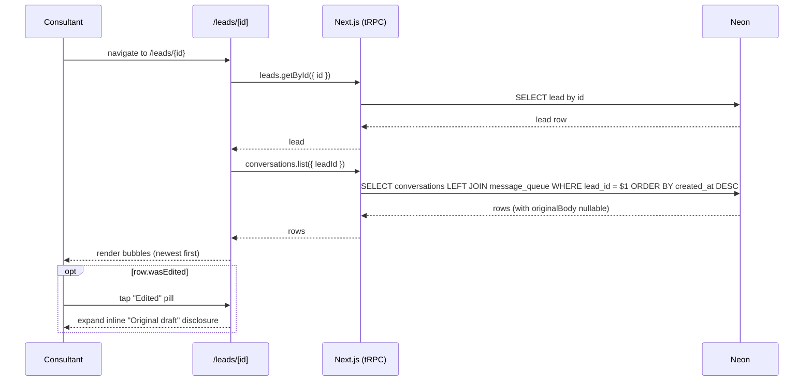
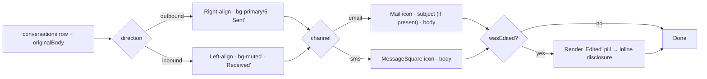

# Lead conversation history

> A chronological message log on the lead profile so the consultant sees every SMS and email ever sent — and one day, every reply — for one lead, in one place.

## User value

**Who it's for**: the Creation Homes QLD pilot consultant. They open `/leads/{id}` to decide what to do next; before this shipped they had scoring, gaps, and contact details — but no answer to "what have I already said to this person?"

**Problem it solves**: [AI drafts](ai-message-drafting.md) the message, the consultant [approves it on `/dashboard`](action-queue.md), [Outlook sends it](hubspot-email-dispatch.md) — but the resulting `conversations` rows lived only in a SQL console. The consultant either trusted memory or scrolled their phone; both fail at ~20 active leads.

**Outcome they get**:
1. They open `/leads/{id}`. The "Conversation history" card sits in the right column, below qualification gaps.
2. The card lists every `conversations` row for that lead, newest first, in chat-bubble form — outbound right-aligned, inbound left-aligned (the renderer handles inbound; no writer ships yet — see Out of scope).
3. Each row shows the channel icon (SMS or email), the direction label ("Sent" / "Received"), the relative timestamp ("2 hours ago"), the email subject when present, and the body in a bubble.
4. If the consultant edited the AI draft before send, an "Edited" pill on the row expands inline to reveal the original draft.
5. The list scrolls inside the card once it grows past `max-h-[28rem]`; the page scroll position stays put.

**Out of scope**:
- **Inbound message ingestion** — nothing writes a `direction = "inbound"` row yet. The renderer handles the inbound shape; the writer lands with the iMessage integration (see [adr001](../adr/adr001-imessage-integration-for-sales-automation.md)).
- **Composing or replying from the card** — sending stays on `/dashboard` via the action queue.
- **Pagination** — pilot volumes (~20–50 leads, low message frequency per lead) don't justify it. Revisit if any one lead exceeds ~50 messages.
- **Real-time updates** — no WebSocket, no poll. The consultant refreshes via natural navigation.
- **Editing or deleting historical rows** — `conversations` is append-only.

## Design

**Lives in**:
- `src/server/api/routers/conversations.ts` — `conversationsRouter.list({ leadId })`: single protected `select … leftJoin(message_queue) … orderBy(desc(createdAt))`
- `src/server/api/schemas/conversations.ts` — `conversationsListSchema` (Zod, uuid-validated `leadId`)
- `src/server/api/root.ts:9` — wires `conversations: conversationsRouter` into `appRouter`
- `src/server/db/schema/conversations.ts` — table definition (id, leadId, messageQueueId, channel, direction, deliveryMethod, subject, body, hubspotActivityId, createdAt) with `conversations_lead_id_idx`
- `src/app/(application)/leads/[id]/_components/conversation-history.tsx` — Card shell, `useTRPC().conversations.list` query, loading/error/empty branches, `<ul>` with `max-h-[28rem] overflow-y-auto`
- `src/app/(application)/leads/[id]/_components/conversation-item.tsx` — single-row bubble, channel icon, direction label, `formatLastContact` timestamp, "Edited" pill + inline disclosure
- `src/app/(application)/leads/[id]/_lib/conversation-display.ts` — `directionLabel`, `channelIcon` (returns a string key — `"MessageSquare" | "Mail"` — so the helper stays DOM-free for tests), `wasEdited`
- `src/app/(application)/leads/[id]/_components/lead-profile-view.tsx:85` — mounts `<ConversationHistory leadId={lead.id} />` in the right column under [`<QualificationGaps />`](lead-profile.md)
- `src/lib/format-relative-time.ts` — `formatLastContact` (hoisted out of `pipeline/_lib/` so [pipeline-board](pipeline-board.md) and lead profile share it without cross-feature imports)
- `src/server/api/__tests__/conversations-router.test.ts` — 6 Rstest unit tests (ordering, empty, `originalBody` surfacing, null link, invalid uuid rejection, `where` scoping)
- `src/app/(application)/leads/[id]/_lib/__tests__/conversation-display.test.ts` — 7 pure unit tests
- `src/lib/__tests__/format-relative-time.test.ts` — characterization tests across every `DIVISIONS` branch + null/string inputs
- `e2e/features/lead-profile.spec.ts` — `"Lead Profile — Conversation history"` describe block (4 specs, `DATABASE_URL`-guarded)
- `e2e/utils/messages-helper.ts` — `seedConversation`, `seedEditedQueueMessage`, `cleanupConversations` (direct Neon SQL, no HubSpot)

**Choice made — server-side edit detection via `LEFT JOIN message_queue`**:
- **Edit signal lives in `message_queue`, not `conversations`.** When the consultant taps **Edit and approve** on the action queue, [`messages.editAndApprove`](../../src/server/api/routers/messages.ts) sets `messageQueue.originalBody = existing.originalBody ?? existing.body` and `body = input.body` after a successful send. `dispatchEmail` inserts the `conversations` row with the edited body.
- **The router LEFT JOINs `message_queue` on `conversations.messageQueueId`** and exposes `originalBody` as a top-level field. The component reads `originalBody !== null && originalBody !== body` and renders — the join, not the component, makes the signal available.
- **Render newest-first** — `ORDER BY createdAt DESC`. The component does no client-side sort.

**Rejected alternatives**:
- **Stash an `originalBody` column on `conversations`** — duplicates state, breaks the "message_queue is the single source of edit history" invariant, costs a migration. Skipped.
- **Extend `leadsRouter` with `getConversations(leadId)`** — issue #131 left this open. A standalone router keeps `leadsRouter` focused on the lead row itself and matches the existing `messagesRouter` shape, so future inbound writes (and any future `conversations.markRead`-style mutations) have a natural home.
- **Pagination / cursor / `take` + `skip`** — overkill at pilot volume. The plan defers it until a single lead exceeds ~50 messages.
- **Live-updating list (WebSocket / polling / `tRPC subscription`)** — complexity without payoff. Consultants refresh via navigation.
- **Stub-only render with no router** — the original `conversation-history.tsx` was an empty Card. Shipping the rendering before the router would have left the schema-ready `conversations` rows invisible.

**Anchored in ADRs**:
- [adr001 — iMessage via Device-Bridge for Automated Sales Messaging](../adr/adr001-imessage-integration-for-sales-automation.md) governs the inbound side. The renderer already supports `direction = "inbound"`; the *writer* lands when the iMessage bridge ships. This feature deliberately renders an empty inbound shape so the integration drops in without UI changes.

**Trade-offs**:
- **Edit detection by string equality** — `originalBody !== body` flips true on any whitespace-or-punctuation diff. Acceptable: the action queue's edit affordance writes the user-edited body verbatim. False positives only happen if a future migration rewrites bodies in place.
- **No row-level virtualisation** — at 50+ rows the `<ul>` keeps every `<li>` mounted. Pilot scale tolerates it; revisit alongside pagination.
- **`createdAt` is the sole ordering key** — same-millisecond inserts tie non-deterministically. Not a concern at pilot send rates.
- **Inbound rendering is dead code today** — left-aligned bubbles and the "Received" label have no producer until the iMessage bridge ships. The cost of leaving them in is one branch in `ConversationItem`; the benefit is a zero-change drop-in when inbound lands.
- **`hubspotActivityId` stays out of this surface** — the router never selects it; the UI never shows whether HubSpot reconciled the row. Acceptable: the consultant reads the lead's HubSpot timeline natively in HubSpot. Revisit if "HubSpot synced" status becomes user-facing.
- **No icon import in tests** — `channelIcon` returns a string key (`"MessageSquare" | "Mail"`) that the component maps via `ICON_MAP`. Keeps `conversation-display.test.ts` DOM-free.

### Operations

**Health signals**: *No instrumentation yet — this is a read-only list with no side effects. Failures surface as the loading skeleton (`lead-profile-conversation-history-loading`) or the inline error (`lead-profile-conversation-history-error`, copy "Couldn't load messages. Refresh to try again.").*

**Alerts**: none. The feature has no write path. The only failure mode — `conversations.list` throwing — surfaces as the error testid above.

**Failure modes & fallback**:
- **Query throws** → `useQuery.isError` true → inline error testid renders, no toast. Recovery: refresh the page.
- **Lead has no rows** → `data.length === 0` → empty state with `MessageCircle` icon + copy "No messages yet — drafts will appear in the action queue." Lives behind testid `lead-profile-conversation-empty`.
- **Invalid `leadId`** → `conversationsListSchema.parse` rejects with `BAD_REQUEST` before any DB call.
- **Edited pill clicked on a row whose `originalBody` is null** → impossible; `wasEdited` gates the pill render.
- **`message_queue` row deleted but `conversations.messageQueueId` still references it** → impossible at pilot scale (no delete path on `message_queue`); the LEFT JOIN would return `originalBody = null` if it ever happened.

**Flags / env vars**: none. The router is always on, behind the protected procedure middleware. Authentication is the only gate.

## Flow

**Triggers** (all entry points):
- **UI** — `/leads/{id}` mounts `<LeadProfileView>`, which mounts `<ConversationHistory leadId={lead.id} />`. The query fires on mount; React Query handles caching and refetch.

No cron, no webhook, no mutation. The card is a pure read.

**Data path**: `leadId` from the route → tRPC `conversations.list` → `SELECT … FROM conversations LEFT JOIN message_queue … WHERE lead_id = $1 ORDER BY created_at DESC` → array of rows shaped `{ id, leadId, channel, direction, deliveryMethod, subject, body, createdAt, originalBody }` → React renders one `<ConversationItem>` per row.

How a row gets its bubble:

**State transitions**: none. The only client-side state is the per-row `expanded` boolean (`useState(false)`) on the "Edited" disclosure inside `ConversationItem`.

**Edge cases**:
- **Same-second timestamps** — `Intl.RelativeTimeFormat` shows "now" or "in N seconds"; both render fine. Primary key insertion order breaks ties — non-deterministic, but invisible to the user.
- **Long body / long subject** — body is `whitespace-pre-wrap break-words`; subject is `truncate` (single line). Bubbles cap at `max-w-[85%]`.
- **No rows for a lead** — empty state renders; the Card itself stays mounted.
- **Mobile width (~390px)** — the right-column grid collapses below the qualification gaps card; bubbles stay within `max-w-[85%]`.
- **Tab key into the "Edited" pill** — focusable `<button>` with `aria-expanded` and `aria-controls`; assistive tech announces expand/collapse.

**Side effects**: none. No HubSpot calls, no PostHog events, no queue inserts, no email sends. The router is read-only; the component holds React Query cache only.

## Links

- ADRs: [adr001 — iMessage via Device-Bridge](../adr/adr001-imessage-integration-for-sales-automation.md)
- Design: [AI Sales Assistant for New Home Builders](../../thoughts/designs/2026-03-27-ai-sales-assistant-new-home-builders.md) (`conversations` schema and inbound deferral)
- Epic: [Epic 3 — HITL Message Queue + Nurture Sequences](../../thoughts/epics/2026-03-27-epic-3-hitl-message-queue-nurture.md)
- Implementation plan: [ENG-131 — Conversation Log on Lead Profile](../../thoughts/plans/2026-04-26-ENG-131-conversation-log-lead-profile.md)
- Related features: [lead-profile](lead-profile.md), [action-queue](action-queue.md), [ai-message-drafting](ai-message-drafting.md), [hubspot-email-dispatch](hubspot-email-dispatch.md), [pipeline-board](pipeline-board.md)
- GitHub issues: [#131](https://github.com/samjmarshall/rekurve/issues/131), [#87](https://github.com/samjmarshall/rekurve/issues/87) (epic)
- Shipping PR: [#159](https://github.com/samjmarshall/rekurve/pull/159)

---
*Generated from interview on 2026-04-28. To regenerate, run `/document-feature lead-conversation-history`.*
