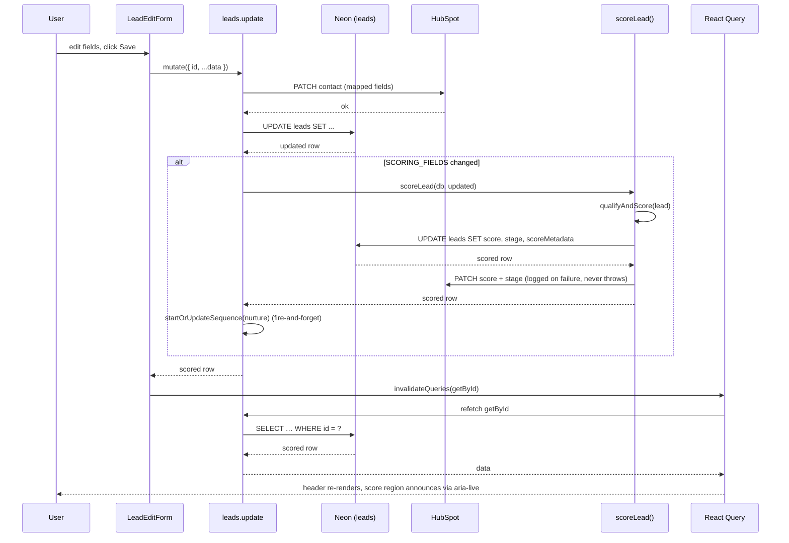
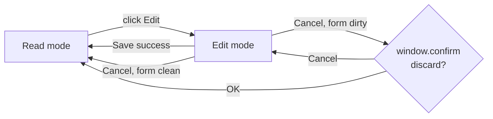

# Lead profile

> The single screen at `/leads/[id]` that shows the consultant everything known about one lead — score, ranked gaps, the next question to ask — and lets them edit in place without leaving the page.

## User value

**Who it's for**: the Creation Homes QLD pilot consultant.

**Problem it solves**: before calling a lead, the consultant needs one screen that answers *what do I know, what's the score, what should I ask next?* — and after the call, one place to log what they learned. The [pipeline board](pipeline-board.md) gives the overview; this page is the digging-in view.

**Outcome they get**: tap a card on `/pipeline` (or follow a "View profile" link from a freshly-captured lead) → the profile loads with no loading flash. A header shows the lead's name, tap-to-call phone, tap-to-email email, a colour-ringed score circle (0–100), the stage badge, and last-contacted date. Below it: a six-factor score breakdown, a ranked qualification gap list with a prominent "Suggested next question", and the lead's full details grouped into Contact / Land / Build / Preferences / Source. An Edit button swaps the read view for an inline form; Save re-scores and the score/stage update in place — no reload, no navigation.

**Out of scope**:
- Real conversation history — Epic 3 placeholder card only ("No conversations yet.").
- Scoring engine changes — this page renders what [`qualifyAndScore()`](ai-qualification-scoring.md) produces; it never recomputes on the client.
- Optimistic save — refetch-on-success is enough and matches the acceptance criteria.
- Multi-step edit wizard — single page-level toggle, all fields on one screen.
- Custom unsaved-changes dialog — uses `window.confirm` to avoid pulling in `AlertDialog`.

## Design

**Lives in**:
- `src/app/(application)/leads/[id]/page.tsx` — RSC entry, prefetches `leads.getById`, catches `TRPCError(NOT_FOUND)` → `notFound()`, hydrates the client
- `src/app/(application)/leads/[id]/not-found.tsx` — "Lead not found" empty state with a Back-to-pipeline link
- `src/app/(application)/leads/[id]/_components/lead-profile-view.tsx` — client root, owns `isEditing` + Edit-button ref, branches between read and edit layouts
- `src/app/(application)/leads/[id]/_components/profile-header.tsx` — name + tap-to-call/email + score circle + stage badge + last-contacted; `aria-live="polite"` on the score region
- `src/app/(application)/leads/[id]/_components/score-breakdown.tsx` — six factor rows in `FACTOR_ORDER`, each with a `role="progressbar"` segmented bar + reasoning line
- `src/app/(application)/leads/[id]/_components/qualification-gaps.tsx` — suggested-next-question block + ranked gap list (or "No gaps" success state)
- `src/app/(application)/leads/[id]/_components/lead-details.tsx` — five Cards: Contact / Land / Build / Preferences / Source, with `<dl>` semantics
- `src/app/(application)/leads/[id]/_components/lead-edit-form.tsx` — `useForm` + `zodResolver(leadFormResolver)`, reuses the four create-form step components, sticky Save/Cancel
- `src/app/(application)/leads/[id]/_components/conversation-history.tsx` — Epic-3 placeholder
- `src/app/(application)/leads/[id]/_lib/display.ts` — pure helpers: `stageLabel`, `stageTone`, `stageRingClasses`, `factorLabel`, `impactTone`, enum formatters, `formatDate`, `formatLastContacted`
- `src/app/(application)/leads/[id]/_lib/__tests__/display.test.ts` — unit tests for the helpers
- `src/server/api/routers/leads.ts:30-62` — `scoreLead()` helper (synchronous re-score + HubSpot push)
- `src/server/api/routers/leads.ts:154-164` — `getById` procedure
- `src/server/api/routers/leads.ts:221-289` — `update` procedure (re-scores when `SCORING_FIELDS` change)
- `e2e/pages/sections/lead-profile.section.ts` — Playwright section object
- `e2e/features/lead-profile.spec.ts` — five end-to-end tests covering read, score breakdown, next-question targeting, and edit-in-place

**Choice made**:
- **First consumer of the RSC dual-client prefetch + `<HydrateClient>` pattern.** `page.tsx` calls `queryClient.fetchQuery(trpc.leads.getById.queryOptions({id}))` server-side and ships the populated cache; the client `useQuery` reads the same key, so first paint costs zero client fetches.
- **Synchronous re-scoring in `leads.update` and `leads.create`.** An earlier `scoreLeadAsync` wrapper used `void`, so the mutation returned before `scoreMetadata` landed — a refetch-after-edit would race. The fix awaits `scoreLead()` in both paths, so the mutation response carries the final score; `invalidateQueries(getById)` then updates the score and stage in place.
- **Edit reuses the four create-form step components** (`ContactDetails`, `LandStatus`, `BuildDetails`, `AdditionalInfo`) inside `<Card>` sections — no parallel field tree, no duplicated validation.

**Rejected alternatives**:
- **Optimistic update on save** — refetch-on-success is simpler and matches the AC. Reconsider if the awaited HubSpot push starts blocking the UI.
- **Multi-step wizard for edit** — single page-level toggle keeps the user oriented and avoids step-state bugs.
- **A new `leads.scoreById` tRPC procedure** — `getById` already returns `scoreMetadata`; nothing else needs scoring exposed.
- **shadcn `AlertDialog` for unsaved-changes** — `window.confirm` ships zero new code for one button. Swap if a second unsaved-changes flow appears.
- **Skeleton loading states** — plain `"Loading lead…"` matches every other consultant page.

> [!NOTE]
> The "mutations return the scored row" contract this page depends on is recorded in [adr006](../adr/adr006-lead-mutations-return-post-scoring-row.md). Flipping it back to fire-and-forget would silently break the edit-in-place refresh.

**Trade-offs**:
- **Edit form re-renders every step** even when only one field changed — there is no partial-update form. Acceptable at pilot scale; the cost is one `useForm` mount per Edit click.
- **`window.confirm` is browser-native, not styled.** Fine for one button, but it side-steps the design system.
- **One extra awaited DB write per qualification-field update** — `scoreLead()` issues a second `UPDATE leads`. Negligible vs the HubSpot round-trip already in the same path.
- **Sticky action bar at `md:bottom-0 md:left-64`** hard-codes the desktop sidebar width. Low risk, but coupled to [dashboard-app-shell](dashboard-app-shell.md).
- **Legacy leads with `scoreMetadata: null`** render a "Score pending…" empty state instead of throwing. Any subsequent `update` populates it; no backfill.

### Operations

**Health signals**: *No PostHog events or structured logs from this feature today — open gap.* The one logged path is `[scoring] HubSpot sync failed for lead {id}` from `scoreLead()` (`src/server/api/routers/leads.ts:57`), which fires on HubSpot score/stage push failures; the mutation response still ships. E2E tests are the de-facto health check.

**Alerts**: none. A regression surfaces as a broken `/leads/[id]` page, not a page.

**Failure modes & fallback**:

| Failure | What the user sees | What to check |
|---|---|---|
| Bad UUID or deleted lead | `not-found.tsx` "Lead not found — Back to pipeline" | RSC `fetchQuery` caught `TRPCError(NOT_FOUND)` and called `notFound()` |
| `scoreMetadata: null` (legacy row) | "Score pending…" in both score-breakdown and gaps cards | Row created before the synchronous re-score landed; any `update` heals it |
| Server Zod error on save | Field-level error message under the offending input | `onError` maps `data.zodError.fieldErrors` via `form.setError` |
| Non-Zod server error on save | Red `
` banner above the action bar | tRPC server logs |
| HubSpot push failure inside `scoreLead` | Score and stage update locally; no UI signal | `[scoring] HubSpot sync failed for lead …` console error |
| `gaps.length === 0` | Suggested-next-question block hidden, "No gaps — this lead is fully qualified" success message | Working as intended |
| Cancel with dirty form | `window.confirm` discard prompt | Working as intended |

**Flags / env vars**: none beyond the `(application)` route group's session gate ([adr002](../adr/adr002-layout-level-auth-gates-over-middleware.md)).

## Flow

**Triggers** (all entry points):
- User taps a lead card on `/pipeline` → `<Link>` to `/leads/[id]`.
- User follows a "View profile" link from a freshly-captured lead in [quick-capture](quick-capture-form.md) or [full-lead-enquiry-form](full-lead-enquiry-form.md).

No cron, no webhook, no API entry point.

**Data path** (load):
`params.id` → RSC `fetchQuery(getById)` → Drizzle `SELECT … WHERE id = ?` → `<HydrateClient>` ships the populated cache → client `useQuery` reads same key → render.

**Data path** (save):
form values → `leads.update` → HubSpot PATCH (mapped fields only, if linked) → Drizzle `UPDATE leads` → if any `SCORING_FIELDS` changed, `scoreLead()` runs `qualifyAndScore`, writes `leadScore`/`leadStage`/`scoreMetadata`, pushes score + stage to HubSpot, and fires-and-forgets `startOrUpdateSequence` (nurture scheduler in `src/server/nurture/scheduler.ts`) → returns the scored row. Client `invalidateQueries(getById)` → background refetch → header re-renders.

**State transitions**: none owned by this feature. The [scoring engine](ai-qualification-scoring.md) sets `lead.leadStage` upstream; this page renders it. The one UI-side state is the read ↔ edit toggle:

**Edge cases**:
- Bad UUID or deleted lead → `not-found.tsx`.
- `scoreMetadata: null` → "Score pending…" in score-breakdown and gaps cards.
- `gaps.length === 0` → "No gaps" success message; next-question block hidden.
- `lastContactedAt: null` → "Never".
- Phone or email missing → corresponding tap-to-call / tap-to-email row omitted.
- Server Zod error on save → field-level error via `form.setError`.
- Non-Zod server error on save → `
` banner.
- HubSpot push failure inside `scoreLead` → logged, swallowed, mutation still succeeds.
- Cancel with dirty form → `window.confirm` discard prompt.

**Side effects** (Save path, qualification field changed):
1. HubSpot contact PATCH — mapped fields only.
2. Drizzle `UPDATE leads` — main write.
3. `scoreLead()` → second `UPDATE leads` (score / stage / scoreMetadata) + second HubSpot PATCH (score + stage).
4. Fire-and-forget `startOrUpdateSequence(nurture)` — kicks the nurture scheduler (`src/server/nurture/scheduler.ts`).

No PostHog events. No emails. No queue inserts.

## Links

- Design: [AI sales assistant for new home builders](../../thoughts/designs/2026-03-27-ai-sales-assistant-new-home-builders.md) — see "Dashboard UX — Lead Profile"
- Epic: [Epic 2: Lead management & AI qualification scoring](../../thoughts/epics/2026-03-27-epic-2-lead-management-ai-scoring.md)
- Plans:
  - [Lead profile page](../../thoughts/plans/2026-04-09-101-lead-profile-page.md) — initial build, shipped in PR #125
  - [Lead profile design-review fixes](../../thoughts/plans/2026-04-10-101-lead-profile-design-fixes.md) — accessibility + polish, shipped in the same PR
- Sibling features:
  - [AI qualification scoring](ai-qualification-scoring.md) — produces the `scoreMetadata` this page renders
  - [Pipeline board](pipeline-board.md) — primary entry point (tap a card → land here)
  - [Quick capture form](quick-capture-form.md) — creates the leads that arrive Unqualified with five gaps
  - [Full lead enquiry form](full-lead-enquiry-form.md) — creates leads that arrive Warm/Hot
  - [Dashboard app shell](dashboard-app-shell.md) — provides the sticky-bar offset (`md:left-64`) the edit action bar relies on
- GitHub issue: [#101](https://github.com/samjmarshall/rekurve/issues/101)
- Shipping PR: [#125](https://github.com/samjmarshall/rekurve/pull/125)

---
*Generated from interview on 2026-04-28. To regenerate, run `/document-feature lead-profile`.*
