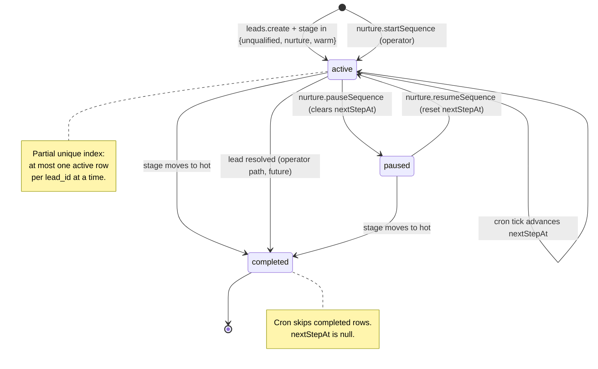

# Nurture scheduler

> A daily cron that drafts the next follow-up for stale leads — so the [action queue](action-queue.md) fills itself even on days the consultant captures nothing new.

## User value

**Who it's for**: the Creation Homes QLD pilot consultant.

**Problem it solves**: the action queue only fills when the consultant captures or edits a lead by hand. Without a background scheduler, leads in the `unqualified`, `nurture`, and `warm` stages go cold between touches and the queue empties out. Pilot follow-up compliance was the whole point of Epic 3 — an empty queue defeats it.

**Outcome they get**: every new lead gets a stage-appropriate sequence the moment it lands in the DB. Each midnight UTC, the cron walks every active sequence whose `nextStepAt` has passed, asks Claude to draft a follow-up via [ai-message-drafting](ai-message-drafting.md), inserts the draft into `message_queue` with `status='pending'`, and pushes `nextStepAt` forward by the cadence (3 / 14 / 7 days for `discovery` / `nurture` / `warm_progression`). The consultant opens `/dashboard` next morning and sees fresh rows ready to approve.

**Out of scope**:
- **UI for the nurture router** — `listActive`, `pauseSequence`, `resumeSequence`, `startSequence` exist as tRPC procedures with no page wired up. Operator-only today.
- **Lot-alert sequences** — `sequenceTypeEnum` includes `lot_alert` but the matcher (Epic 4, #133-#142) is not yet built. The cadence is set; nothing creates these rows.
- **Retry / backoff for `draftMessage` failures** — when Claude throws, the row's `nextStepAt` still advances. The scheduler loses one touch; the next tick picks the lead up again on cadence.
- **Idempotency keys on `message_queue`** — the cron advances `nextStepAt` before the next tick, so the scheduler cannot draft the same row twice in one sweep.
- **Concurrency control across simultaneous cron invocations** — Vercel Cron fires serially per path; sufficient at pilot.
- **Sequence analytics, open/click tracking, or touchpoint history** beyond what `nurture_sequences` already stores.
- **PostHog events or alerting** on the scheduler itself — open observability gap.

## Design

**Lives in**:
- `src/server/nurture/scheduler.ts` — pure module. `SEQUENCE_TYPE_BY_STAGE`, `CADENCE_DAYS`, `computeNextStepAt`, `startOrUpdateSequence`, `runSchedulerTick(db, draftFn?)`
- `src/server/api/routers/nurture.ts` — tRPC: `listActive`, `startSequence`, `pauseSequence`, `resumeSequence` (`protectedProcedure`)
- `src/server/api/schemas/nurture.ts` — Zod schemas mirroring `sequenceTypeEnum` / `sequenceStatusEnum` from `src/server/db/schema/enums.ts`
- `src/server/db/schema/nurture-sequences.ts` — table, status default `active`, partial unique index `nurture_active_one_per_lead_uidx ON (lead_id) WHERE status='active'`
- `src/app/api/cron/nurture-scheduler/route.ts` — `GET` handler. Bearer auth against `env.CRON_SECRET`, calls `runSchedulerTick(db, resolveDraftFn(request))`, returns `{ drafted, failed }`
- `src/app/api/dev/nurture/advance/route.ts` — `POST { sequenceId }`. Backdates `nextStepAt` by 60s. Returns 404 in production
- `src/server/ai/stub.ts` — `resolveDraftFn(req)`. When `x-ai-stub: 1` is set, returns a deterministic draft fn that re-uses real `selectChannel` and `computePriority` and prefixes `body`/`aiReasoning` with `[ai-stub]`
- `src/server/api/routers/leads.ts:142` (create) and `:270` (update on qualification change) — auto-start hook points; both wrap `startOrUpdateSequence` in `.catch(console.error)`
- `vercel.json` — root config: `{ crons: [{ path: "/api/cron/nurture-scheduler", schedule: "0 0 * * *" }] }`
- `e2e/features/nurture-scheduler.spec.ts` — three serial-mode tests: auto-start (migration gate), cron drafts a pending message, action queue renders the draft
- `e2e/utils/nurture-helper.ts` — Neon client: `seedActiveSequence`, `getActiveSequenceByLead`, `getPendingMessagesByLead`, `waitForPendingMessage`, `cleanupSequences`, `cronRequestContext`
- `src/env.js:32,68` — `CRON_SECRET: z.string().min(16)` (Vercel Cron auto-sets the bearer in prod)

**Choice made**:
- **Daily cron at midnight UTC**, not every 15 minutes. The original plan called for `*/15 * * * *`; commit `b36a9ec` walked it back to `0 0 * * *` to keep Anthropic spend predictable at pilot scale (one tick × ~handful of due rows per day vs. 96 ticks × possible-empty result sets).
- **Pure scheduler module with an optional `draftFn` argument**. `runSchedulerTick(db, draftFn?)` falls back to dynamic `import('~/server/ai/draft-message').draftMessage` when no fn is passed. The seam exists for unit tests *and* for the E2E `x-ai-stub` header path — same code, two consumers.
- **Always advance `nextStepAt` even on `draftMessage` failure** (`scheduler.ts:125-132`). A poison row that consistently throws would otherwise block every later row in the same tick. Cost: one missed touch per failure. The next tick picks the lead up again.
- **`leads.create` / `leads.update` swallow auto-start failures** (same `.catch(console.error)` pattern HubSpot push uses, see [adr003](../adr/adr003-hubspot-source-of-truth-for-contacts.md)). Lead creation must succeed even if the nurture infra is degraded — the consultant capturing a walk-in is the load-bearing path.
- **Partial unique index** `(lead_id) WHERE status='active'` enforces "at most one active sequence per lead" at the DB level. Application-level check in `startSequence` is a friendly error; the index is the actual invariant.
- **Cadences hardcoded** in `CADENCE_DAYS` (`discovery`: 3, `nurture`: 14, `warm_progression`: 7, `lot_alert`: 7). MVP tuning lives in code, not config — easy to read, easy to PR.
- **`hot` stage gets no sequence**. `SEQUENCE_TYPE_BY_STAGE.hot === null`; `startOrUpdateSequence('hot')` marks any active row `completed` and clears `nextStepAt`. The consultant takes over once a lead is hot.
- **Stage transitions update the existing sequence in place**, not insert a new row. `startOrUpdateSequence(stage)` updates `sequenceType` and recomputes `nextStepAt` when the existing row's `sequenceType` differs.
- **`x-ai-stub: 1` request header** is the convention for any AI-touching route that wants a deterministic test path. The cron route is the first consumer; future AI routes adopt the same two-line wiring (`const draftFn = resolveDraftFn(request);`). The route honours the header *only after* its own auth — anonymous stub requests get 401 before reaching `resolveDraftFn`.
- **Bearer auth via `CRON_SECRET` on the route**, not Vercel Deployment Protection. Vercel Cron auto-injects the bearer; no app-level coupling to Vercel-specific cookies.
- **Dev-advance route is `NODE_ENV !== 'production'` gated**, returns 404 otherwise. No bearer required — local + preview only. Lets devs exercise the cron loop end-to-end without waiting 24h.

**Rejected alternatives**:
- **Vercel Workflows for nurture + dispatch retry** — spike tracked in #153, deferred. The Cron + advance-then-draft-then-insert pattern is simple enough at pilot scale that the workflows abstraction would be overkill.
- **Idempotency keys on `message_queue` inserts** — unnecessary because the scheduler advances `nextStepAt` before the next sweep can fire. Same lead cannot be drafted twice in one tick.
- **Retry / backoff for `draftMessage` failures** — adds a state column (`failed_count`?) and a retry sweep. Lost touch on cadence is cheaper than the operational complexity at this volume.
- **15-minute cron** — first-pass schedule. Walked back to daily for cost; the consultant doesn't read the queue 96 times a day.
- **One-off-per-tick global lock** — Vercel Cron already serializes per-path firing.
- **Action-queue-side filter for "scheduled" rows** — keeps the action queue contract simple: `status='pending'` with no `snoozedUntil` is the only thing it cares about. Scheduler drafts and edit drafts look identical to the queue.

> [!NOTE]
> Two hard-to-reverse decisions in this feature are recorded as their own ADRs:
>
> 1. **`leads.create` / `leads.update` swallow auto-start failures** (`leads.ts:142,270`) — see [adr008 — Nurture auto-start is best-effort](../adr/adr008-nurture-auto-start-is-best-effort.md). Sibling rule to adr003 (HubSpot swallow inside `scoreLead`) and adr004 (webhook always-200), scoped to the lead write path. A regression in `startOrUpdateSequence` (enum drift, partial-index drift) silently degrades nurture coverage; E2E test 1 is the migration gate.
> 2. **"Always advance `nextStepAt` on draft failure"** (`scheduler.ts:125-132`) — see [adr009 — Nurture scheduler advances `nextStepAt` even on draft failure](../adr/adr009-nurture-advances-on-draft-failure.md). Accepts losing one touch per Claude failure rather than blocking the tick or building a retry surface. Cost is bounded; rule prioritises forward progress over guaranteed delivery.

**Trade-offs**:
- **Daily cadence means a lead added at 23:55 UTC could wait ~24h for its first draft** (and its `nextStepAt` was set to ~3-14-7 days *out*, so the actual first-draft-time is `created_at + cadence` rounded up to the next midnight). Acceptable at pilot; revisit if responsiveness becomes a complaint.
- **`runSchedulerTick` calls `draftMessage` sequentially**, not via `Promise.all`. Sequential lets the Anthropic prompt cache (`cache_control: { type: "ephemeral" }` in `draft-message.ts`) hit on rows 2..N within the same tick. Throughput cap = `O(due_rows × claude_latency)`; fine at single-digit due-row counts.
- **No PostHog events, no structured logger output** — the only observability surface is `[nurture-scheduler]` `console.error` lines plus the cron-response JSON `{ drafted, failed }`. Vercel surfaces both in the deployment logs view; nothing else does. Open observability gap shared with the [action queue](action-queue.md).
- **Vercel Cron only fires on production deployments**. Preview / staging deployments never trigger the cron automatically — exercising it requires either the dev-advance route + a manual `curl`, or the E2E spec invoking the route directly with `cronRequestContext()`.
- **`x-ai-stub: 1` is gated only by `CRON_SECRET`**. A leaked cron secret could flood `message_queue` with stub rows. Audit query: `SELECT count(*) FROM message_queue WHERE body LIKE '[ai-stub]%'` must return 0 in production. Tracked as a broader secrets-hygiene concern.
- **`startOrUpdateSequence('warm')` after `('nurture')` updates `sequenceType` and `nextStepAt`** — but skips a fresh message at the transition moment. The consultant sees the new cadence, not an immediate touch. Intentional: stage transitions happen via the lead-update path, which already returns the post-scoring row; an inline draft would double-write into `message_queue` on every qualification edit.
- **Cron schedule and `CADENCE_DAYS` are decoupled.** Daily cron fires every day; `CADENCE_DAYS` says how far forward each row's `nextStepAt` jumps. Don't conflate "the cron runs daily" with "every lead gets a daily message" — leads are quiet for `CADENCE_DAYS[sequenceType]` between touches.
- **`leads.delete` cascades to `nurture_sequences` via FK `onDelete: cascade`**. No orphan cleanup needed; deleting a lead removes its sequence row.

### Operations

**Health signals**:
- **Vercel deployment logs** for `/api/cron/nurture-scheduler` — the cron-response JSON `{ drafted, failed }` is the canonical "did the tick run" signal. `drafted = 0` on a day with active sequences whose `nextStepAt` has passed is the regression smell.
- **`[nurture-scheduler] draftMessage failed for sequence <id>:`** lines in `console.error` — fire per-row when Claude throws; the row's `nextStepAt` still advances.
- **`[leads.create] nurture sequence start failed for lead <id>:`** / **`[leads.update] nurture sequence update failed for lead <id>:`** — fire when `startOrUpdateSequence` rejects (e.g. unique-index violation, missing migration).
- **`SELECT count(*) FROM nurture_sequences WHERE status='active' AND next_step_at < now()`** — stays near zero outside the daily window. A growing backlog means the cron is silently failing.
- **`SELECT count(*) FROM message_queue WHERE body LIKE '[ai-stub]%'`** — production audit. Always zero. Non-zero means an `x-ai-stub: 1` request reached the cron route in production (`CRON_SECRET` leak).

**Alerts**: none wired. Regression surfaces as the action queue going empty for a day.

**Failure modes & fallback**:

| Failure | What happens server-side | Recovery |
|---|---|---|
| Migration not applied (table / enum / partial-index missing) | `startOrUpdateSequence` INSERT throws; lead-create swallows the error and logs `[leads.create] nurture sequence start failed`. Lead row still saves; no `nurture_sequences` row exists. | E2E test 1 catches it on every PR. In prod, `make db_migrate`. |
| `draftMessage` throws (Anthropic 5xx, timeout, schema-validation reject) | `failed++`; row's `nextStepAt` still advances by the cadence; tick continues to next row. Cron returns `{ drafted: N, failed: M }`. | Lead picks up again next cadence boundary (`+3` / `+14` / `+7` days). One touch lost. |
| Anthropic outage spans the whole tick window | Every due row counts as `failed`; every `nextStepAt` advances regardless. | Recovery = next-day tick. |
| Multiple active sequences for one lead (race) | `nurture_active_one_per_lead_uidx` rejects the second insert with `unique_violation`. Caller surface: `nurture.startSequence` returns `BAD_REQUEST` via the application-level pre-check; `leads.create` swallows the `startOrUpdateSequence` failure. | DB invariant holds. |
| `CRON_SECRET` missing or wrong on the request | Route returns 401 before reading the DB. | Verify the secret on Vercel; redeploy. |
| Dev-advance route hit in production | Returns 404 with empty body (`env.NODE_ENV === 'production'` gate). | Intended. |
| Lead deleted while a sequence is active | FK cascade removes the `nurture_sequences` row. Subsequent ticks see one fewer active sequence. | Intended. |
| `startOrUpdateSequence('hot')` called repeatedly | Idempotent: each call updates `status='completed'` and `nextStepAt=null` on the active row (or no-ops if none). | None needed. |
| Two ticks fire concurrently (theoretical, against Vercel's docs) | Both ticks would `SELECT` overlapping due rows, but each `INSERT INTO message_queue` succeeds independently — no unique constraint on `(lead_id, scheduled_for)`. Result: duplicate pending drafts. | Vercel Cron guarantees serial firing per path. Monitor Vercel logs for overlap signals. |

**Flags / env vars**:
- `CRON_SECRET` (required, `z.string().min(16)`) — auto-set by Vercel Cron on production. Required for the route to authenticate.
- `ANTHROPIC_API_KEY` — consumed by `draftMessage` inside `runSchedulerTick`. Tick fails open: rows still advance.
- `NODE_ENV` — gates the dev-advance route. `production` returns 404.
- `DATABASE_URL` — pooled connection used by both auto-start and the scheduler tick.
- `x-ai-stub: 1` request header — opt-in deterministic draft fn for tests. Honoured *only after* `CRON_SECRET` auth passes.
- No PostHog flag gates this feature.

## Flow

**Triggers** (all entry points):
- `leadsRouter.create` → after `scoreLead()` returns the post-scoring row → `await startOrUpdateSequence(ctx.db, scored.id, scored.leadStage).catch(console.error)` (`leads.ts:142`).
- `leadsRouter.update` → when `Object.keys(data).some((k) => SCORING_FIELDS.has(k))` is true → after re-`scoreLead()` → same `startOrUpdateSequence(...).catch()` call (`leads.ts:270`). Stage transitions ride this path.
- Vercel Cron `0 0 * * *` → `GET /api/cron/nurture-scheduler` with `Authorization: Bearer ${CRON_SECRET}` → `runSchedulerTick(db, resolveDraftFn(request))`.
- `nurture.startSequence` / `pauseSequence` / `resumeSequence` (tRPC) — operator path, no UI.
- `POST /api/dev/nurture/advance` — dev/preview only; backdates `nextStepAt` for testing.
- `e2e/features/nurture-scheduler.spec.ts` — exercises trigger 3 directly via `cronRequestContext()` with `x-ai-stub: 1`.

**Data path** (auto-start on lead create):
form submit → `leads.create` mutation → `db.insert(leads)` → `scoreLead(db, lead, hubspotContactId)` returns post-scoring row → `startOrUpdateSequence(db, scored.id, scored.leadStage)` → match `SEQUENCE_TYPE_BY_STAGE[stage]` → if `null` (hot), update active sequence to `completed`; else if no active row exists, `db.insert(nurtureSequences) values(leadId, sequenceType, status='active', nextStepAt=computeNextStepAt(sequenceType))`; else if `existing.sequenceType !== sequenceType`, update in place. Failure logged and swallowed; lead-create returns the scored row regardless.

**Data path** (cron tick):
Vercel fires `GET /api/cron/nurture-scheduler` with bearer → route validates header → `resolveDraftFn(request)` returns `undefined` (production) or stub fn (test) → `runSchedulerTick(db, draftFn)` → `select seq, lead from nurture_sequences inner join leads where status='active' AND next_step_at <= now()` → for each `{ seq, lead }`: try `draft({ lead })`; on success, `db.insert(messageQueue) values(leadId, channel, subject, body, aiReasoning, priority, status='pending')` and `drafted++`; on throw, log error and `failed++`; *always* `db.update(nurtureSequences) set nextStepAt = computeNextStepAt(seq.sequenceType), updatedAt = now() where id = seq.id` → return `{ drafted, failed }`.

```mermaid
sequenceDiagram
    participant Cron as Vercel Cron
    participant Route as /api/cron/nurture-scheduler
    participant Stub as resolveDraftFn
    participant Sched as runSchedulerTick
    participant DB as Neon (nurture_sequences + message_queue)
    participant Claude as Anthropic

    Cron->>Route: GET (Authorization: Bearer CRON_SECRET)
    Route->>Route: validate bearer (else 401)
    Route->>Stub: resolveDraftFn(request)
    Stub-->>Route: draftFn | undefined
    Route->>Sched: runSchedulerTick(db, draftFn)
    Sched->>DB: SELECT due rows (status='active' AND nextStepAt <= now)
    DB-->>Sched: [{ seq, lead }, ...]

    loop for each due row
        alt draftFn provided (test path)
            Sched->>Stub: draftFn({ lead })
            Stub-->>Sched: { channel, body: "[ai-stub] body for <id>", ... }
        else production
            Sched->>Claude: draftMessage({ lead })
            alt success
                Claude-->>Sched: { channel, subject, body, aiReasoning, priority }
                Sched->>DB: INSERT message_queue (status='pending')
                Note over Sched: drafted++
            else throws
                Claude--xSched: error
                Sched->>Sched: console.error; failed++
            end
        end
        Sched->>DB: UPDATE nurture_sequences SET nextStepAt = +cadence (always)
    end

    Sched-->>Route: { drafted, failed }
    Route-->>Cron: 200 { drafted, failed }
```

**State transitions** for `nurture_sequences.status`:



**Stage → sequence type mapping** (`SEQUENCE_TYPE_BY_STAGE` in `scheduler.ts:11`):

| Lead stage | Sequence type | Cadence (`CADENCE_DAYS`) |
|---|---|---|
| `unqualified` | `discovery` | 3 days |
| `nurture` | `nurture` | 14 days |
| `warm` | `warm_progression` | 7 days |
| `hot` | *(none — completes any active)* | n/a |
| *(matcher)* | `lot_alert` | 7 days *(unused; Epic 4 not built)* |

**Edge cases**:
- **Migration not applied** → INSERT inside `startOrUpdateSequence` throws; lead-create's `.catch()` swallows it. Lead row still saves; no `nurture_sequences` row exists. E2E Test 1 is the migration gate on every PR.
- **`draftMessage` throws on row N** → `failed++`; `nextStepAt` advances; tick continues to row N+1.
- **Lead reaches `hot` mid-sequence** → `startOrUpdateSequence` sets `status='completed'` and `nextStepAt=null`. Cron skips completed rows.
- **Lead deleted with active sequence** → FK cascade removes the row. Cron sees one fewer due row next tick.
- **Two concurrent `startOrUpdateSequence` calls for same lead** → `nurture_active_one_per_lead_uidx` rejects the second insert with `unique_violation`. `nurture.startSequence` returns `BAD_REQUEST`; `leads.create`/`update` swallow it.
- **Cron with no Authorization header / wrong bearer** → 401, no DB writes, no draft calls.
- **Cron with correct bearer + `x-ai-stub: 1`** → stub draft fn replaces Claude. Body / reasoning prefixed `[ai-stub]`. Used by the E2E spec.
- **`pauseSequence` on an already-paused or completed row** → `BAD_REQUEST` with status name.
- **`resumeSequence` on an active or completed row** → `BAD_REQUEST` with status name.
- **`startSequence` for a lead with an existing active sequence** → `BAD_REQUEST` ("An active sequence already exists for this lead").
- **Dev-advance route in production** → 404 with empty body.
- **Lead in `nurture` stage edited but no qualification field changes** → `leads.update` skips re-scoring entirely; sequence untouched.

**Side effects**:
- **DB**: `INSERT nurture_sequences` (auto-start), `UPDATE nurture_sequences` (stage transition / advance / pause / resume / complete), `INSERT message_queue` (cron, per drafted row).
- **Anthropic**: one `draftMessage` call per due row per tick (production path).
- **Logs**: `[nurture-scheduler] draftMessage failed for sequence <id>:` (per-row failure); `[leads.create]` / `[leads.update]` `nurture sequence ... failed for lead <id>:` (auto-start failure); `[ai-stub] route=/api/cron/nurture-scheduler leadId=<id>` (per-stub invocation).
- **Action queue**: pending rows inserted by the cron flow into `messages.listPending` on the next refetch — no special action-queue change ([action-queue](action-queue.md) treats them like any other pending draft).
- **No HubSpot writes, no PostHog events, no email sends, no webhook fan-out** from the scheduler itself. Email dispatch is downstream, on Approve, in [hubspot-email-dispatch](hubspot-email-dispatch.md).

## Links

- Design: [AI sales assistant for new home builders](../../thoughts/designs/2026-03-27-ai-sales-assistant-new-home-builders.md) — Epic 3 "Background nurture sequences".
- Plans:
  - [Nurture scheduler + tRPC router](../../thoughts/plans/2026-04-20-ENG-132-nurture-scheduler.md) — initial two-phase build (scheduler + cron + auto-start). Shipped in PR #147.
  - [Nurture scheduler E2E coverage](../../thoughts/plans/2026-04-21-ENG-132-nurture-scheduler-e2e.md) — AI-stub mechanism + three-test spec + CI wiring. Shipped inside PR #147.
- Companion design: [Nurture scheduler — end-to-end test design](../../thoughts/designs/2026-04-21-nurture-scheduler-e2e.md).
- ADRs:
  - [adr008 — Nurture auto-start is best-effort](../adr/adr008-nurture-auto-start-is-best-effort.md) — `leads.create` / `leads.update` swallow `startOrUpdateSequence` failures.
  - [adr009 — Nurture scheduler advances `nextStepAt` even on draft failure](../adr/adr009-nurture-advances-on-draft-failure.md) — the cron tick advances regardless to bound failure cost and prevent backlog growth.
  - [adr002 — layout-level auth gates over middleware](../adr/adr002-layout-level-auth-gates-over-middleware.md) — protects the `nurture` tRPC router via `protectedProcedure`.
  - [adr003 — HubSpot source of truth for contacts](../adr/adr003-hubspot-source-of-truth-for-contacts.md) — sibling swallow pattern for HubSpot push inside `scoreLead`.
  - [adr005 — deterministic lead scoring](../adr/adr005-deterministic-lead-scoring.md) — produces the stage that drives `SEQUENCE_TYPE_BY_STAGE`.
- Sibling features:
  - [AI message drafting](ai-message-drafting.md) — the `draftMessage` call the cron tick invokes per due row.
  - [Action queue](action-queue.md) — where the cron-inserted `pending` rows land for the consultant to approve.
  - [HubSpot email dispatch](hubspot-email-dispatch.md) — what runs after Approve on email-channel rows.
  - [AI qualification scoring](ai-qualification-scoring.md) — produces `leadStage` which drives sequence type.
- GitHub issues: [#132](https://github.com/samjmarshall/rekurve/issues/132) (this feature), [#87](https://github.com/samjmarshall/rekurve/issues/87) (Epic 3 parent), [#153](https://github.com/samjmarshall/rekurve/issues/153) (open spike — Vercel Workflows alternative).
- Shipping PR: [#147](https://github.com/samjmarshall/rekurve/pull/147).
- Vercel — [Managing Cron Jobs](https://vercel.com/docs/cron-jobs/manage-cron-jobs).

---
*Generated from interview on 2026-04-28. To regenerate, run `/document-feature nurture-scheduler`.*
