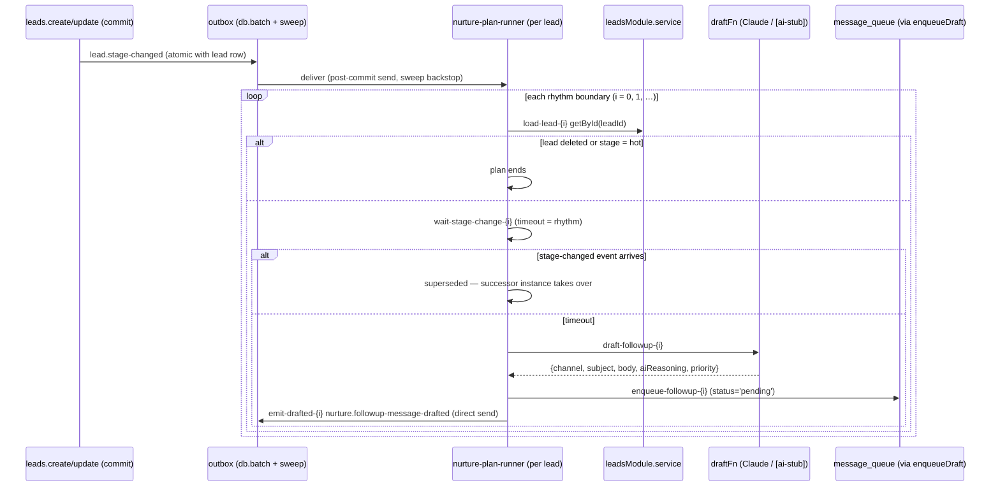
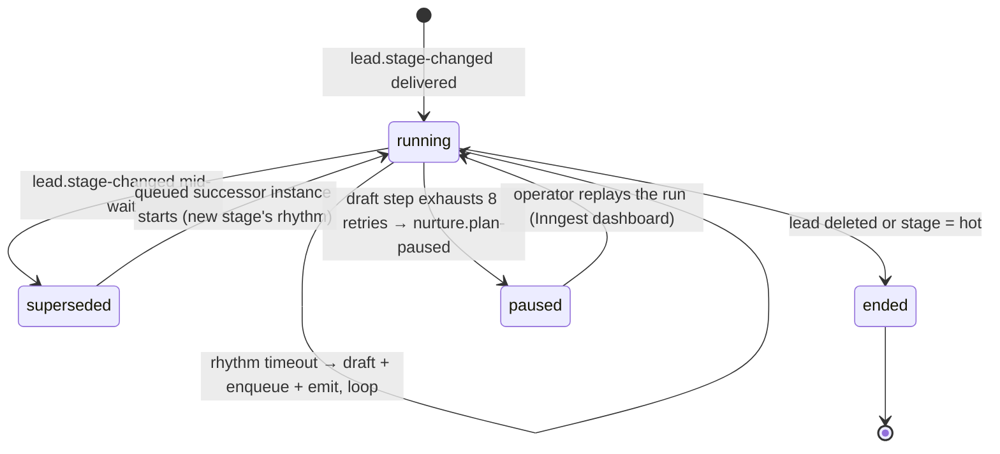

# Nurture follow-up plan runner

> One durable Inngest function instance per active lead drafts the next follow-up on the lead's stage rhythm — so the [action queue](action-queue.md) fills itself even on days the consultant captures nothing new. (This doc previously described a daily-cron scheduler over a `nurture_sequences` table; that system was retired by [adr010](../adr/adr010-inngest-source-of-truth-for-followup-plan.md) and migrations `0006`/`0007`.)

## User value

**Who it's for**: the Creation Homes QLD pilot consultant.

**Problem it solves**: the action queue only fills when the consultant captures or edits a lead by hand. Without a background runner, leads in the `unqualified`, `nurture`, and `warm` stages go cold between touches and the queue empties out. Pilot follow-up compliance was the whole point of Epic 3 — an empty queue defeats it.

**Outcome they get**: every captured lead starts a follow-up plan automatically (the capture commits a `lead.stage-changed` outbox event; at-least-once delivery, not best-effort). Each time the stage's rhythm elapses (3 / 14 / 7 days for `unqualified` / `nurture` / `warm`), the lead's plan-runner instance asks Claude to draft a follow-up via [ai-message-drafting](ai-message-drafting.md), inserts the draft into `message_queue` with `status='pending'`, and sleeps to the next rhythm boundary. The consultant opens `/dashboard` and sees fresh rows ready to approve.

**Out of scope**:
- **In-app UI for plan state** — "how many leads are in the warm rhythm right now?" is answered by the Inngest dashboard, not a Rekurve page (adr010's explicit carve-out).
- **Lot-alert sequences** — the Epic 4 matcher is not built; no lot-driven plan exists.
- **A consumer for `nurture.plan-paused`** — the pause event is emitted on retry exhaustion but nothing subscribes yet; paused plans surface in the Inngest dashboard only.
- **Sequence analytics, open/click tracking, or touchpoint history** — the plan's only outputs are `message_queue` rows.
- **PostHog events or alerting** on the runner itself — open observability gap.

## Design

**Lives in**:
- `src/server/nurture/nurture.worker.ts` — `makeRunNurturePlan(deps)` (the pure loop core) + `makeNurturePlanRunner(deps)` (the Inngest adapter: id `nurture-plan-runner`, trigger `lead.stage-changed`, `concurrency: [{ key: "event.data.leadId", limit: 1 }]`, `retries: 8`, `onFailure` emits `nurture.plan-paused`)
- `src/server/nurture/rhythm.ts` — `RHYTHM_DAYS` (`unqualified: 3`, `nurture: 14`, `warm: 7`, `hot: null`) + `rhythmForStage()` with the non-production `NURTURE_TEST_RHYTHM` override
- `src/server/nurture/nurture.workers.ts` — workers composition root; wires the leads read port, messaging's `enqueueDraft` write door, the AI draft port, and `inngest.send`. Deliberately no `nurture.module.ts` — worker-only domain (adr020 collapse rule)
- `src/server/inngest/events.ts` — `lead.stage-changed`, `nurture.followup-message-drafted`, `nurture.plan-paused` payload schemas (the naming authority)
- `src/server/leads/leads.decide.ts` — `stageChangedEvent()`: every capture/update whose stage changes rides a `lead.stage-changed` outbox event out of the same `db.batch` as the lead write
- `src/server/messaging/messaging.service.ts` — `enqueueDraft()`: the plan-runner's port into `message_queue` (one pending row per touch; no outbox event — the drafted emit is the worker's own step)
- `src/server/ai/ai.module.ts` + `src/server/ai/stub.ts` — `resolveWorkerDraftFn()`: real `draftMessage` in production, deterministic `[ai-stub]` draft when `AI_STUB=1` outside production (resolved per-invocation, so the gate is read at draft time)
- `src/server/nurture/__tests__/nurture.worker.test.ts` — unit coverage through fake deps + the shared step fake (frozen step ids pinned)
- `src/server/nurture/__tests__/nurture.worker.integration.test.ts` — real-Neon coverage of the enqueue path
- `e2e/features/nurture-scheduler.spec.ts` — skipped unless `NURTURE_TEST_RHYTHM` is set; drives capture → rhythm timeout → pending draft in the action queue
- `e2e/utils/nurture-helper.ts` — `getPendingMessagesByLead`, `waitForPendingMessage`
- `drizzle/0007_seed_nurture_cutover.sql` — the one-time cutover: seeded one `lead.stage-changed` outbox event per then-active lead so Inngest spun up a runner each (pairs with `0006`, which dropped `nurture_sequences`)

**Choice made**:
- **Inngest owns the control state** ([adr010](../adr/adr010-inngest-source-of-truth-for-followup-plan.md)). There is no `nurture_sequences` table, no cron route, no `CRON_SECRET`. The live plan — which rhythm, when the next touch fires — *is* the running function instance. The local DB owns only the outputs (`message_queue`, `conversations`).
- **One active plan per lead via `concurrency: { key: leadId, limit: 1 }`.** A `lead.stage-changed` event arriving mid-wait resolves the runner's `waitForEvent` and ends that instance ("superseded"); the new instance, queued behind the concurrency key, starts with the fresh stage. The constraint lives at the workflow layer, not as a DB partial index.
- **Sleep-by-`waitForEvent`, not polling.** Each loop iteration re-reads the lead, then waits `rhythmForStage(leadStage).duration` for a stage change. Timeout means "rhythm elapsed" → draft + enqueue + emit `nurture.followup-message-drafted`, then loop.
- **Retry then pause** ([adr011](../adr/adr011-followup-drafts-retry-then-pause.md)). `retries: 8` (~6 h of backoff) absorbs transient Anthropic/Neon failures as latency, not lost touches; exhaustion pauses the plan and emits `nurture.plan-paused` with the leadId. Operator action: fix the data, replay the run from the Inngest dashboard. This supersedes the old "always advance on draft failure" rule (adr009).
- **Auto-start is at-least-once, not best-effort.** The old `.catch(console.error)` swallow around `startOrUpdateSequence` is gone; plan start is a `lead.stage-changed` outbox event committed atomically with the lead row ([adr013](../adr/adr013-local-db-canonical-for-lead-data.md)/[adr014](../adr/adr014-outbox-pattern-for-inngest-delivery.md)), delivered post-commit with the hourly sweep as backstop ([adr019](../adr/adr019-system-wide-transactional-outbox-posture.md)).
- **Drafts enter `message_queue` through messaging's write door.** `enqueueDraft` commits exactly `{leadId, channel, subject, body, aiReasoning, priority, status: 'pending'}` and returns only the id (the Inngest-memoised step value). The `nurture.followup-message-drafted` emit is a separate worker step via the typed `SendEvent` port — deliberately not a commit rider.
- **Rhythms hardcoded** in `RHYTHM_DAYS`, exhaustiveness-checked against the stage enum — adding a stage forces a cadence decision at compile time. `hot` maps to `null`: the runner exits and the consultant takes over.
- **`AI_STUB=1` env gate** (non-production only) replaces the old `x-ai-stub` request header: with no HTTP entry point left, the deterministic draft path is resolved inside `resolveWorkerDraftFn()` at draft time.

**Rejected alternatives**:
- **Local DB run state with Inngest as a dumb worker** — recreates the dual-source-of-truth drift adr003/adr010 exist to avoid (adr010 option 2).
- **The previous daily-cron scheduler** (`/api/cron/nurture-scheduler` + `nurture_sequences` + `startOrUpdateSequence`) — retired: it was best-effort on start, silent-forever on persistent draft failure, and carried a second store to keep in sync. Shipped in PR #147, removed by the adr010 migration.
- **A thin local mirror row for analytics** — the Inngest dashboard answers the operator questions pre-PMF (adr010 option 3).
- **Keeping `nurture_sequences` as an audit log** — speculative tooling; recovery is replaying `lead.stage-changed` events (adr010 option 4).

> [!NOTE]
> The load-bearing decisions live in their own ADRs: [adr010](../adr/adr010-inngest-source-of-truth-for-followup-plan.md) (Inngest owns control state; output state stays local), [adr011](../adr/adr011-followup-drafts-retry-then-pause.md) (8 retries ≈ 6 h, then DLQ + `nurture.plan-paused`). adr008/adr009 described the retired cron system and are superseded on this surface.

**Trade-offs**:
- **Inngest lock-in is real and accepted** (adr010). Rebuilding plan state in a successor scheduler means replaying `lead.stage-changed` events.
- **No in-app visibility.** Plan state questions require the Inngest dashboard. Acceptable pre-PMF; revisit if a consultant-facing "next follow-up in N days" surface is wanted (one Inngest API call from the loader, per adr010).
- **`nurture.plan-paused` has no subscriber.** A paused lead is visible in Inngest (failed run) and in the event stream, but nothing in-app flags it. Open gap, tracked with the wider observability work.
- **A superseded instance restarts its rhythm from zero.** A stage change mid-wait ends the old instance and the new one waits a full fresh rhythm — a lead can go quiet slightly longer than either cadence across a transition. Bounded and intentional (the new stage's rhythm is the contract).
- **Worst-case start latency is the sweep interval.** If the post-commit `inngest.send` fails, the hourly `outbox-sweep` delivers the start event up to ~1 h late (adr019). At 3–14-day rhythms this is noise.
- **Sequential cost profile changed**: drafts now happen one per lead-instance at rhythm boundaries rather than batched in a tick, so Anthropic prompt-cache hits across leads are no longer guaranteed. At pilot volume this is cents.

### Operations

**Health signals**:
- **Inngest dashboard → `nurture-plan-runner`**: running instances = active plans; failed runs = paused plans (post-retry exhaustion); the displayed next-fire time includes any active retry.
- **`nurture.followup-message-drafted` / `nurture.plan-paused`** in the event stream — per-touch and per-pause signals.
- **`SELECT count(*) FROM message_queue WHERE status='pending'`** — the queue the consultant actually sees; a day with active leads past their rhythm and no new pending rows is the regression smell.
- **`SELECT count(*) FROM message_queue WHERE body LIKE '[ai-stub]%'`** — production audit, always zero. Non-zero means `AI_STUB=1` was set on a production deployment.

**Alerts**: none wired. Regression surfaces as the action queue going empty.

**Failure modes & fallback**:

| Failure | What happens | Recovery |
|---|---|---|
| Draft step throws (Anthropic 5xx, timeout, Zod reject) | Inngest retries the step — 8 attempts, exponential backoff ≈ 6 h. Transient outages become latency, not lost touches. | Automatic within the window. |
| Failures persist past 8 retries | Run fails; `onFailure` emits `nurture.plan-paused { leadId }`. Plan is paused, visible in Inngest. | Fix the data; replay the run from the Inngest dashboard — it resumes at the same rhythm boundary. |
| Lead deleted mid-plan | Next `load-lead-{i}` returns undefined; plan ends cleanly. | Intended. |
| Lead reaches `hot` | `rhythmForStage` returns null on the next iteration — or the `lead.stage-changed` event supersedes the wait immediately — and the new instance exits at the rhythm check. | Intended — consultant owns hot leads. |
| Post-commit `inngest.send` of `lead.stage-changed` fails | Outbox row remains unprocessed; the hourly `outbox-sweep` delivers it (≤ ~1 h). | Automatic (adr014/adr019). |
| Two stage changes in quick succession | Each event queues an instance behind the per-lead concurrency key; each earlier instance is superseded by the next event. Exactly one runner survives. | Intended. |
| `AI_STUB=1` leaks to production | Impossible by construction: the stub also requires `NODE_ENV !== 'production'`. Audit query above as belt-and-braces. | — |

**Flags / env vars**:
- `ANTHROPIC_API_KEY` — consumed by `draftMessage` inside the draft step.
- `AI_STUB=1` (non-production only) — deterministic `[ai-stub]`-prefixed drafts; used by E2E.
- `NURTURE_TEST_RHYTHM` (non-production only) — overrides the wait duration (e.g. `10s`) so tests don't wait days; also the skip-gate for the E2E spec.
- `DATABASE_URL` — the enqueue path.
- No `CRON_SECRET`, no cron entry in `vercel.json` — the cron surface is gone.

## Flow

**Triggers** (all entry points):
- `lead.stage-changed` outbox event — emitted by `decideCaptureLead` (every fresh capture: `fromStage: null → stage`), `decideCaptureFromHubspot` (HubSpot-origin ingest), and `decideUpdateLead` (qualification edit that moves the stage). Committed in the same `db.batch` as the lead write; delivered post-commit or by the hourly sweep.
- `drizzle/0007_seed_nurture_cutover.sql` — the historical one-time trigger that started plans for pre-migration leads.

No cron, no tRPC surface, no manual start endpoint.

**Data path** (one loop iteration of `runNurturePlan(leadId)`):
`load-lead-{i}` (leads port `getById`) → lead gone? end : `rhythmForStage(leadStage)` → `hot`? end : `wait-stage-change-{i}` (`waitForEvent` on `lead.stage-changed`, `match: data.leadId`, `timeout: rhythm`) → event arrived? end (superseded; successor instance queued behind the concurrency key) : timeout → `draft-followup-{i}` (`draftFn({ lead })`) → `enqueue-followup-{i}` (`messagingModule.service.enqueueDraft` → `message_queue` row, `status='pending'`) → `emit-drafted-{i}` (`sendEvent({ name: 'nurture.followup-message-drafted', data: { leadId, messageId } })`) → loop with `i+1`.

```mermaid
sequenceDiagram
    participant Capture as leads.create/update (commit)
    participant Outbox as outbox (db.batch + sweep)
    participant Runner as nurture-plan-runner (per lead)
    participant Leads as leadsModule.service
    participant AI as draftFn (Claude / [ai-stub])
    participant MQ as message_queue (via enqueueDraft)

    Capture->>Outbox: lead.stage-changed (atomic with lead row)
    Outbox->>Runner: deliver (post-commit send, sweep backstop)

    loop each rhythm boundary (i = 0, 1, …)
        Runner->>Leads: load-lead-{i} getById(leadId)
        alt lead deleted or stage = hot
            Runner->>Runner: plan ends
        else
            Runner->>Runner: wait-stage-change-{i} (timeout = rhythm)
            alt stage-changed event arrives
                Runner->>Runner: superseded — successor instance takes over
            else timeout
                Runner->>AI: draft-followup-{i}
                AI-->>Runner: {channel, subject, body, aiReasoning, priority}
                Runner->>MQ: enqueue-followup-{i} (status='pending')
                Runner->>Outbox: emit-drafted-{i} nurture.followup-message-drafted (direct send)
            end
        end
    end
```

**State transitions** — the plan's lifecycle is Inngest run state, not a DB column:

```mermaid
stateDiagram-v2
    [*] --> running: lead.stage-changed delivered
    running --> running: rhythm timeout → draft + enqueue + emit, loop
    running --> superseded: lead.stage-changed mid-wait
    superseded --> running: queued successor instance starts (new stage's rhythm)
    running --> ended: lead deleted or stage = hot
    running --> paused: draft step exhausts 8 retries → nurture.plan-paused
    paused --> running: operator replays the run (Inngest dashboard)
    ended --> [*]
```

**Stage → rhythm mapping** (`RHYTHM_DAYS` in `src/server/nurture/rhythm.ts`):

| Lead stage | Rhythm |
|---|---|
| `unqualified` | 3 days |
| `nurture` | 14 days |
| `warm` | 7 days |
| `hot` | *(none — plan ends)* |

**Edge cases**:
- **Fresh capture** always emits `lead.stage-changed` (`fromStage: null`), so every new lead gets a plan — including score-0 quick captures (`unqualified`, 3-day rhythm).
- **Stage change that lands on the same stage** (re-score to identical stage) emits nothing (`fromStage === toStage` is suppressed in `stageChangedEvent`); the running plan is untouched.
- **HubSpot-origin ingest** rides the same path — `decideCaptureFromHubspot` emits `lead.stage-changed` like any capture.
- **`NURTURE_TEST_RHYTHM`** shortens the wait outside production; step ids stay identical, so test and prod replay semantics match.
- **Loop-indexed step ids** (`load-lead-0`, `wait-stage-change-0`, …) are frozen Inngest memoisation keys — renaming them strands in-flight plans (registry-golden pins the function id; the unit suite pins the step ids).

**Side effects**:
- **DB**: one `message_queue` insert per touch (via messaging's `commit` write door). Nothing else — no nurture-owned tables exist.
- **Anthropic**: one `draftMessage` call per touch (production path).
- **Inngest**: `nurture.followup-message-drafted` per touch; `nurture.plan-paused` on retry exhaustion.
- **Action queue**: pending rows appear in `messages.listPending` on the next refetch — the queue treats them like any other pending draft.
- **No HubSpot writes, no PostHog events, no email sends** from the runner itself. Dispatch is downstream, on Approve, in [hubspot-email-dispatch](hubspot-email-dispatch.md).

## Links

- Design: [AI sales assistant for new home builders](../../thoughts/designs/2026-03-27-ai-sales-assistant-new-home-builders.md) — Epic 3 "Background nurture sequences".
- ADRs:
  - [adr010 — Inngest is the source of truth for Follow-up plan run state](../adr/adr010-inngest-source-of-truth-for-followup-plan.md) — the control-state/output-state split this feature implements.
  - [adr011 — Retry Follow-up drafts ~6 h, then pause](../adr/adr011-followup-drafts-retry-then-pause.md) — the failure-handling rule (`retries: 8` + `nurture.plan-paused`).
  - [adr014 — Transactional outbox for Inngest delivery](../adr/adr014-outbox-pattern-for-inngest-delivery.md) / [adr019 — system-wide outbox posture](../adr/adr019-system-wide-transactional-outbox-posture.md) — how `lead.stage-changed` reaches the runner at-least-once.
  - [adr013 — Local DB canonical for lead data](../adr/adr013-local-db-canonical-for-lead-data.md) — the commit the start event rides on.
  - [adr005 — deterministic lead scoring](../adr/adr005-deterministic-lead-scoring.md) — produces the stage that drives the rhythm.
  - Historical (retired cron system): [adr008](../adr/adr008-nurture-auto-start-is-best-effort.md), [adr009](../adr/adr009-nurture-advances-on-draft-failure.md) — superseded on this surface by adr010/adr011.
- Sibling features:
  - [AI message drafting](ai-message-drafting.md) — the `draftFn` invoked per touch.
  - [Action queue](action-queue.md) — where the pending rows land for approval.
  - [HubSpot email dispatch](hubspot-email-dispatch.md) — what runs after Approve on email-channel rows.
  - [AI qualification scoring](ai-qualification-scoring.md) — produces `leadStage`, which drives the rhythm.
- GitHub issues: [#132](https://github.com/samjmarshall/rekurve/issues/132) (original cron feature), [#87](https://github.com/samjmarshall/rekurve/issues/87) (Epic 3 parent), [#328](https://github.com/samjmarshall/rekurve/issues/328) (worker-only nurture domain, adr020 port).
- Shipping PRs: [#147](https://github.com/samjmarshall/rekurve/pull/147) (original cron system), [#336](https://github.com/samjmarshall/rekurve/pull/336) (current worker shape).
- Cutover artifacts: `drizzle/0006_slimy_dagger.sql` (drops `nurture_sequences`), `drizzle/0007_seed_nurture_cutover.sql` (seeds the start events).

---
*Generated from interview on 2026-04-28; re-truthed to the Inngest plan-runner reality on 2026-07-15 (#330). To regenerate, run `/document-feature nurture-scheduler`.*
