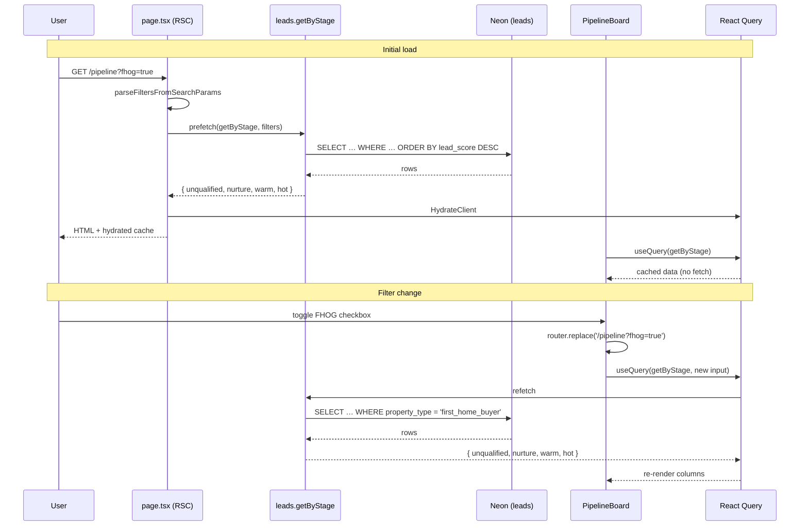

# Pipeline board

> A four-column Kanban view at `/pipeline` that groups leads by stage (unqualified · nurture · warm · hot) so the consultant can see at a glance who to chase next.

## User value

**Who it's for**: the Creation Homes QLD pilot consultant.

**Problem it solves**: a flat lead list hides urgency. The consultant has to scan, remember each score, and decide who's worth a call today. The pipeline board shows the four temperature groups side-by-side, sorted by score, with the next question to ask on every card — so triage takes seconds, not minutes.

**Outcome they get**: open `/pipeline` from the sidebar (desktop) or bottom nav (mobile). Four columns appear, each headed by a lead count. Each card shows the lead's name, score badge, last-contact time, and top qualification gap. Tap a card to open the lead profile. Filter by estate, FHOG eligibility, or construction timeline; toggle which columns to show. The URL holds the filter state, so reload and share-link both work.

**Out of scope**:
- Drag-and-drop stage changes — stage is set by the [scoring engine](ai-qualification-scoring.md), not by the consultant.
- Sort controls — the only ordering is `lead_score DESC` within each stage.
- Pagination or infinite scroll — pilot scale is hundreds of leads, full fetch is fine.
- Real-time updates — Tanstack Query invalidation on mutations is sufficient; no websockets.
- Lot matcher integration — Epic 4 work, not yet built.

## Design

**Lives in**:
- `src/app/(application)/pipeline/page.tsx` — RSC entry point, parses filters from `searchParams` and prefetches `leads.getByStage`
- `src/app/(application)/pipeline/_components/pipeline-board.tsx` — client root, `useQuery` reader, empty-state vs board branching
- `src/app/(application)/pipeline/_components/stage-column.tsx` — one of four columns, header (label + count) plus card list
- `src/app/(application)/pipeline/_components/lead-card.tsx` — `<Link>`-wrapped card with name, score badge, relative last-contact, top gap
- `src/app/(application)/pipeline/_components/pipeline-filters.tsx` — estate input, FHOG checkbox, timeline `<Select>`, four stage checkboxes, clear button
- `src/app/(application)/pipeline/_lib/stage-meta.ts` — `STAGE_ORDER` + `STAGE_META` (label + Badge variant per stage)
- `src/app/(application)/pipeline/_lib/filters.ts` — `parseFiltersFromSearchParams`, `parseVisibleStages`, `buildPipelineSearchParams`
- `src/app/(application)/pipeline/_lib/format-last-contact.ts` — `Intl.RelativeTimeFormat` helper
- `src/app/(application)/pipeline/_lib/top-gap.ts` — picks `gaps[0].description` from `score_metadata`
- `src/app/(application)/pipeline/_lib/__tests__/{filters,format-last-contact,top-gap}.test.ts` — pure-function tests
- `src/server/api/routers/leads.ts:298-325` — `leads.getByStage` procedure
- `src/server/api/schemas/leads.ts:121-129` — `pipelineFiltersSchema`
- `e2e/pages/sections/pipeline-board.section.ts` — Playwright section object
- `e2e/features/leads-crud.spec.ts:193-449` — five board E2E tests

**Choice made**: a single tRPC procedure (`leads.getByStage`) returns all four stage arrays in one round-trip. The RSC prefetches that query using filters parsed from the URL; the client component reads the same query via React Query, so the first paint costs zero client fetches. Filter changes call `router.replace()` to update the URL, which re-derives the query input and triggers a background re-fetch — previous data stays on screen. Stage *visibility* (which columns appear) is a client-only render filter; toggling a column off costs no round-trip.

**Rejected alternatives**:
- **Routing filtered loads through `leads.list`** — would mix two return shapes on one page. Extending `getByStage` keeps one shape and one cache key.
- **Server-side stage visibility filtering** — would round-trip on every checkbox toggle. Client-side partition is instant.
- **Drag-and-drop stage changes** — leads's stage is computed by the scorer; manual override is not in the consultant workflow.
- **A date library (`date-fns`, `dayjs`)** — `Intl.RelativeTimeFormat` covers "3 days ago" / "Never contacted" cleanly with zero dependencies.

**Trade-offs**:
- **Full unpaged `SELECT … ORDER BY lead_score DESC` per filter change.** Fine at pilot scale (tens to low hundreds of leads). Revisit at ~2k rows.
- **`score_metadata` JSONB hydrates on every row** but the card only reads `gaps[0].description`. A SQL projection (`score_metadata->'gaps'->0`) is the obvious optimisation at scale; not worth it today.
- **The `__any__` sentinel** in the timeline `<Select>` is a literal string. Radix Select rejects `null`/`undefined`, so the value space had to absorb a sentinel. Safe today but would collide with any future timeline enum value starting with `__`.

### Operations

**Health signals**: *No instrumentation today — open gap.* The board emits no PostHog events and no structured logs. E2E tests verify health; no metrics today.

**Alerts**: none. A regression surfaces as a broken board on `/pipeline`, not a page.

**Failure modes & fallback**:
| Failure | What the user sees | What to check |
|---|---|---|
| `leads.getByStage` throws | React Query's default error state (no custom error boundary on the board) | tRPC server logs; Drizzle SQL parse errors |
| Lead created but `scoreMetadata` not yet written | Card shows "0" score badge AND "Score pending" gap line — confusing dual signal | Brief race window between `leads.create` insert and the synchronous scorer write — should be sub-millisecond. See [known issues](#known-issues) |
| Filter narrows result to zero | "No leads yet — Add your first lead" CTA fires (incorrectly) | Known issue — see below |
| `lead.leadStage` is null/unknown | `STAGE_META[lead.leadStage]` throws on the card | Should not happen — DB column has `default 'unqualified'` |
| `lastContactedAt: null` | "Never contacted" | Expected for every lead until the first outreach is sent |

**Flags / env vars**: none.

#### Known issues

A design review (2026-04-10) flagged twelve issues. None have shipped yet. The fix recipe lives at [`thoughts/plans/2026-04-10-100-pipeline-board-design-fixes.md`](../../thoughts/plans/2026-04-10-100-pipeline-board-design-fixes.md). Highlights:

- **Hot column off-screen at 1280px desktop.** No scroll-shadow affordance — the user must discover horizontal scroll on their own. Plan: positioned wrapper + gradient masks + `lg:snap-none` (currently `md:snap-none`).
- **Filter-narrowed-to-zero shows the wrong empty state.** A non-matching filter renders "Add your first lead" instead of per-column "No {stage} leads". Plan: extract `shouldShowGlobalEmpty` helper that suppresses the global CTA when any filter is active.
- **`brand` Badge variant has `bg-none`** at `src/components/ui/Badge.tsx:14` — not a valid Tailwind utility, so Nurture badges render as plain orange numerals in light mode while Warm/Hot have full pill fills. Plan: replace with `bg-primary/10 hover:bg-primary/20`.
- **Null score renders as `0`** instead of `—`. Conflicts with the "Score pending" gap line on the same card.
- **Eight polish items**: column accent borders, card hover affordance, timeline `aria-label`, `__any__` sentinel safety guard, filter-bar layout, `font-mono` → `tabular-nums` on count badges, page H1 size bump.

## Flow

**Triggers** (all entry points):
- User navigates to `/pipeline` from the sidebar (`src/app/(application)/_components/nav-config.ts`) or bottom nav.
- User toggles a filter — `pipeline-filters.tsx` calls `router.replace('/pipeline?…', { scroll: false })`. The URL change re-derives the React Query input, triggering a background re-fetch.
- User taps a card — `<Link>` navigates to `/leads/[id]`. No board-side mutation.

**Data path**: `searchParams` → `parseFiltersFromSearchParams` → `prefetch(leads.getByStage)` → Drizzle `SELECT … WHERE … ORDER BY lead_score DESC` → partition by `leadStage` into four arrays → `<HydrateClient>` ships cache → client `useQuery` reads same key → `<StageColumn>` × 4 renders cards.

**State transitions**: none in this feature. The board is a read-only view. Stage is computed upstream by the [scoring engine](ai-qualification-scoring.md) on `leads.create`/`leads.update`.

**Edge cases**:
- **Empty DB** → "No leads yet — Add your first lead" CTA (`pipeline-empty` testid).
- **All four columns hidden** → defensive fallback in `parseVisibleStages` re-adds all four; UI prevents zero-checked state via `toggleStage` (`pipeline-filters.tsx:98-100`).
- **Estate filter with whitespace-only string** → `pipelineFiltersSchema` requires `min(1)`, so the parse returns `null` and the query runs unfiltered.
- **Bogus `?stages=…` value** (e.g. `?stages=bogus`) → `parseVisibleStages` falls back to all four stages.
- **`scoreMetadata: null`** → top-gap shows "Score pending".
- **`gaps: []`** → top-gap shows "Fully qualified".

**Side effects**: none. The board issues a single read query and renders. No mutations, no external API calls, no events fired.

## Links

- Design: [AI sales assistant for new home builders](../../thoughts/designs/2026-03-27-ai-sales-assistant-new-home-builders.md) — see "Dashboard UX — Pipeline Board"
- Epic: [Epic 2: Lead management & AI qualification scoring](../../thoughts/epics/2026-03-27-epic-2-lead-management-ai-scoring.md)
- Plans:
  - [Pipeline board view](../../thoughts/plans/2026-04-09-100-pipeline-board-view.md) — shipped in PR #124
  - [Pipeline board design-review fixes](../../thoughts/plans/2026-04-10-100-pipeline-board-design-fixes.md) — **not yet shipped**, see [known issues](#known-issues)
- Sibling features:
  - [AI qualification scoring](ai-qualification-scoring.md) — assigns the `lead_stage` the board groups by
  - [Quick capture form](quick-capture-form.md) — every quick-captured lead lands in the Unqualified column
  - [Full lead enquiry form](full-lead-enquiry-form.md) — fills enough fields to score Warm/Hot on submit
- GitHub issue: [#100](https://github.com/samjmarshall/www/issues/100)
- Shipping PR: [#124](https://github.com/samjmarshall/www/pull/124)

---
*Generated from interview on 2026-04-28. To regenerate, run `/document-feature pipeline-board`.*
