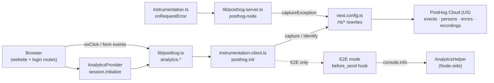
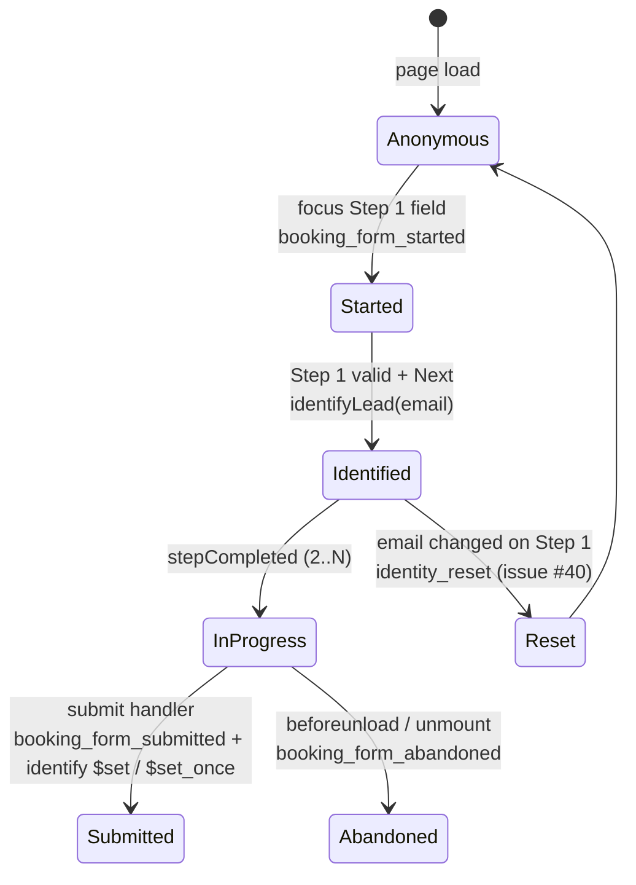

# PostHog analytics

> The marketing site's measurement layer — every CTA click, FAQ toggle, form step, login, and server error flows to PostHog so we can see who's interested, where they drop off, and what's broken.

## User value

**Who it's for**: Sam (founder) reading dashboards to triage funnel drop-offs and prioritise marketing-site fixes. Secondary user: any future sales engineer watching `booking_form_submitted` come in.

**Problem it solves**: Without measurement, the marketing site is a black box — no way to tell whether visitors abandon at "company size" or "challenges", whether the hero CTA outperforms the pricing CTA, or whether a deploy quietly broke form submit. PostHog answers all three at once: events, person profiles, session recordings, and server-side error capture.

**Outcome they get**: Every interesting interaction lands in PostHog within seconds, attributed to a person once email is captured (Step 1 of the booking form, or email entry on `/login`). Funnels, recordings, and alerts can be built on top of a stable event vocabulary.

**Out of scope**:
- Section-visibility scroll tracking and per-field timing (intentionally cut from the integration plan to keep volume manageable).
- Server-side product analytics — server only sends `captureException` from `instrumentation.ts`. Business events fire from the browser.
- A/B testing / feature flags — the SDK supports it but no experiments run yet (see issue #108).
- Marketing-attribution beyond first-touch UTM — multi-touch is open work (issue #42).

## Design

**Lives in**:
- `src/instrumentation-client.ts` — `posthog.init` with `person_profiles: 'identified_only'` and an E2E `before_send` capture hook
- `src/instrumentation.ts` — Next.js `onRequestError` ships server exceptions to PostHog with the visitor's distinct id pulled from the `ph_phc_*` cookie
- `src/lib/posthog.ts` — typed event vocabulary and `analytics` namespace (`cta`, `form`, `faq`, `section`, `pricing`, `link`, `session`, `recording`, `auth`)
- `src/lib/posthog-server.ts` — lazy `posthog-node` singleton for the server runtime
- `src/providers/AnalyticsProvider.tsx` — client provider that calls `analytics.session.initialize()` once on mount; mounted in `(website)/layout.tsx` and `(login)/layout.tsx`
- `src/app/global-error.tsx` — top-level error boundary calling `posthog.captureException`
- `next.config.ts` — `/rk/*` rewrites that proxy events to `us.i.posthog.com` (and `/rk/static/*` to `us-assets.i.posthog.com`); `withPostHogConfig` wires sourcemap upload
- `e2e/utils/analytics-helper.ts` — Node-side `AnalyticsHelper` listens to `console.info("[E2E:captured]…")` lines emitted by the `before_send` hook in E2E mode

**Choice made**: PostHog Cloud (US) reached via a Next.js `/rk/*` reverse-proxy, `posthog-js` for the browser and `posthog-node` for the server, person profiles created **only** after `posthog.identify` runs. The browser identifies on Step 1 of the booking form and on email submit at `/login`, then again on full submit with `$set` / `$set_once` property splits.

**Rejected alternatives**:
- **Direct `us.i.posthog.com` host** — adblockers and corporate proxies drop those domains; the `/rk` rewrite tree (commits `dca4cee`, `4fae033`) makes events look first-party.
- **Default `person_profiles`** — would create a profile per anonymous visitor; flipped to `identified_only` to keep PostHog billing tied to leads, not bots.
- **Network interception in E2E** — Playwright can't read PostHog's gzipped fetch bodies. Window-scoped capture buckets — `router.push(...)` after `login_success` discards the document. Console-line emission via `before_send` survives navigation.
- **Window-scoped E2E flag** — using `window.__E2E_MODE__` set by `addInitScript` lets the same bundled init pick test mode without an env-var rebuild.

**Trade-offs**:
- **No per-route ADR** — choosing PostHog over Mixpanel/GA isn't recorded. Easy to reverse (event surface is centralised in `analytics.*`), so an ADR isn't load-bearing today, but worth one if a swap is on the table.
- **Loose event types** — `safeCapture` accepts `Record<string, unknown>` for properties; type safety stops at the wrapper functions. Drift between code and dashboards is a risk; the `analytics.*` namespace and `CTALocation` / `FormStep` unions limit it for the most-trafficked events.
- **Bot filter bypassed in E2E** — `opt_out_useragent_filter: true` runs only when `window.__E2E_MODE__` is true, so production still benefits from PostHog's bot detection.
- **Open backlog** — issues #37, #39, #40, #41 record events that don't fire in production despite being wired in code, and #42–#46 are dashboard / alert / recording-trigger gaps. The instrumentation contract is stable; the bugs are isolated to specific call sites.

### Operations

**Health signals**:
- Event volume: `cta_clicked`, `booking_form_started`, `form_step_completed`, `booking_form_submitted`, `login_otp_requested`, `login_success`, `page_viewed`, `utm_captured`
- Person properties: `email`, `lead_score`, `form_started`, `form_completed`, `last_cta_clicked`, first-touch `initial_referrer` / `initial_utm_*`
- Server errors: PostHog "Error tracking" tab — populated by `onRequestError` and `global-error.tsx`
- Sourcemaps uploaded on each CI build (`withPostHogConfig` in `next.config.ts:92-101`) so the stack traces resolve

**Alerts**: *Not configured yet* — the four threshold alerts (lead-volume spike, lead drought, conversion drop, abandonment spike) and dashboard digest subscriptions are open work (issues #43, #45). Until then, PostHog has to be checked manually.

**Failure modes & fallback**:
| Failure | What happens | What to check |
|---|---|---|
| PostHog SDK fails to load | `isPostHogReady()` returns false; `safeCapture` logs `[PostHog] Not ready, event queued` and the call is a no-op — page keeps working | Browser console; `/rk/static/array.js` 200; CSP headers in `next.config.ts:60-69` |
| Adblocker blocks `/rk/*` | Same as above — silent degrade | Network tab shows `/rk/e/` blocked; the proxy hides the PostHog domain but not the path |
| Wrong / missing env var | Build fails in `src/env.js` (`NEXT_PUBLIC_POSTHOG_KEY`, `NEXT_PUBLIC_POSTHOG_HOST`, `POSTHOG_ERROR_TRACKING_API_KEY`, `POSTHOG_PROJECT_ID`) | Vercel env vars; pull with `make env_pull` |
| E2E events don't appear in `AnalyticsHelper` | Tests time out in `expectEvent(...).toBeFired()` | `__E2E_MODE__` is set on the page (see `addInitScript` in `e2e/fixtures`); `before_send` log line shape unchanged |
| User changes email mid-form | `identity_reset` event should fire and `posthog.reset()` should run; today it doesn't (issue #40) | The `useEffect` watching `currentStep` and `watch('email')` in `BookingForm.tsx` |

**Flags / env vars**:
- `NEXT_PUBLIC_POSTHOG_KEY` — public project key (`src/env.js:45`)
- `NEXT_PUBLIC_POSTHOG_HOST` — `https://us.i.posthog.com` (`src/env.js:46`)
- `POSTHOG_ERROR_TRACKING_API_KEY` — server-side personal API key for sourcemap upload (`src/env.js:25`)
- `POSTHOG_PROJECT_ID` — `254485`, used by `withPostHogConfig` (`src/env.js:26`)
- No feature flags. The SDK initialises on every `(website)` and `(login)` page load.

## Flow

**Triggers** (all entry points):
- **CTA clicks** — header / hero / pricing / final-CTA / FAQ-bottom / mobile-nav buttons each call `analytics.cta.click(<location>)` from their `onClick`.
- **Booking-form interactions** — `BookingForm.tsx` calls `analytics.form.started` (first-field focus), `analytics.form.identifyLead` (Step 1 success), `analytics.form.stepCompleted`, `analytics.form.submitted`, `analytics.form.abandoned` (`beforeunload` / unmount).
- **FAQ accordion** — `FAQ.tsx` calls `analytics.faq.expanded` / `.collapsed` / `.searched` (debounced 500 ms).
- **Login** — `(login)/login/page.tsx` calls `analytics.auth.identify(email)` after a successful OTP send and `analytics.auth.loginSuccess()` after verify.
- **Page load** — `AnalyticsProvider` calls `analytics.session.initialize` once: parses UTM params, captures `utm_captured` + `page_viewed`, sets first-touch person properties.
- **Server error** — Next.js `onRequestError` in `instrumentation.ts` ships the exception to `posthog-node` with the cookie distinct-id.
- **Client error** — `global-error.tsx` calls `posthog.captureException` from React's top-level boundary.

**Data path**: browser event → `analytics.*` wrapper → `posthog.capture` / `posthog.identify` → POST to `/rk/e/` → Next.js rewrites to `us.i.posthog.com` → PostHog Cloud → dashboards / recordings / alerts. Errors take a parallel path through `/rk/error_tracking/*`.

**State transitions** (booking-form lead identity):

**Edge cases**:
- **`isPostHogReady()` false** — every event helper exits silently; the page never breaks because of analytics.
- **`posthog.identify` called twice with the same email** — `identifyLead` short-circuits via `posthog.get_distinct_id()`.
- **Step 4 `form_step_completed`** — current open bug (#37): the event doesn't fire. Submission still works.
- **`booking_form_submitted` fired but person not identified** — fixed in #38; both events now share the email distinct id.
- **`faq_collapsed`** wired on `analytics.faq.collapsed` but never invoked because the accordion's `onValueChange` only tracks newly-opened items (issue #39).
- **E2E gzip body** — assertions read events from `AnalyticsHelper`, not from network captures, because Playwright cannot read PostHog's gzipped fetch bodies.

**Side effects**:
- Outbound POSTs to `/rk/e/`, `/rk/decide`, `/rk/array.js`, `/rk/error_tracking/*` (all proxied to PostHog).
- Person-property writes (`$set`, `$set_once`, `setPersonPropertiesForFlags`).
- Session recording starts on `analytics.form.started` (`posthog.startSessionRecording()`).
- In E2E mode: `console.info("[E2E:captured]…")` per capture.
- Server: `posthog.captureException` from `onRequestError` and `global-error.tsx`.

## Links

- Designs:
  - [PostHog analytics implementation](../../thoughts/designs/2025-11-25-posthog-analytics-implementation.md)
  - [PostHog dashboards, funnels & alerts](../../thoughts/designs/2025-11-26-posthog-dashboards-funnels-alerts.md)
- Plans:
  - [PostHog analytics integration](../../thoughts/plans/2025-11-25-posthog-analytics-integration.md)
  - [PostHog user identification](../../thoughts/plans/2025-11-27-posthog-user-identification.md)
  - [PostHog dashboards, funnels & alerts](../../thoughts/plans/2025-11-27-posthog-dashboards-funnels-alerts.md)
- GitHub issues: [#37](https://github.com/samjmarshall/www/issues/37), [#39](https://github.com/samjmarshall/www/issues/39), [#40](https://github.com/samjmarshall/www/issues/40), [#41](https://github.com/samjmarshall/www/issues/41), [#42](https://github.com/samjmarshall/www/issues/42), [#43](https://github.com/samjmarshall/www/issues/43), [#44](https://github.com/samjmarshall/www/issues/44), [#45](https://github.com/samjmarshall/www/issues/45), [#46](https://github.com/samjmarshall/www/issues/46), [#108](https://github.com/samjmarshall/www/issues/108)
- Shipping PRs: [#144](https://github.com/samjmarshall/www/pull/144) (E2E capture harness)

---
*Generated from interview on 2026-04-28. To regenerate, run `/document-feature posthog-analytics`.*
