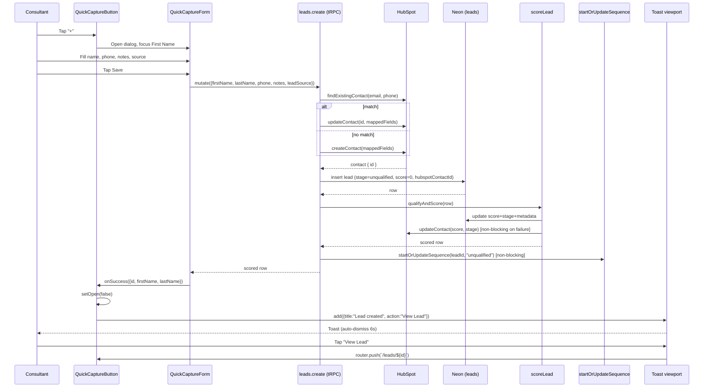

# Quick capture form

> A floating "+" button on the dashboard that opens a one-screen form to log a new lead in under 60 seconds.

## User value

**Who it's for**: the Creation Homes QLD pilot consultant.

**Problem it solves**: not every lead walks into a display home. The consultant meets buyers at networking events, BBQs, and through referrals, and needs to capture just enough to follow up later — without losing the conversation to a multi-step form.

**Outcome they get**: tap the FAB on `/dashboard`, type first name, last name, AU mobile, optional notes, pick a source, hit Save. A toast confirms "Lead created" with a one-tap **View Lead** link. The full flow fits in ~60 seconds on a phone.

**Out of scope**:
- Bulk import or CSV upload.
- A "Quick Add" button on every page — `/dashboard` only.
- Networking as a `lead_source` value (not in the enum; submissions default to `other`).
- Splitting a single "Full name" field into first/last on submit (we use two separate inputs).
- HubSpot, AI scoring, and nurture *as quick-capture-specific concerns* — they happen, but via the shared router, not bespoke wiring (see *Trade-offs*).

## Design

**Lives in**:
- `src/app/(application)/_components/quick-capture/button.tsx` — FAB + controlled `Dialog`, owns success toast wiring
- `src/app/(application)/_components/quick-capture/form.tsx` — RHF form, tRPC mutation, server-error hydration
- `src/app/(application)/_components/quick-capture/schema.ts` — Zod schema + custom resolver that maps `""` → `undefined` for optional fields
- `src/app/(application)/_components/quick-capture/__tests__/schema.test.ts` — 6 schema unit tests
- `src/components/ui/dialog.tsx` — base-ui `Dialog` adapter (bottom sheet on mobile, centered modal on `md+`)
- `src/components/ui/toast.tsx` — base-ui `Toast` adapter, `toastManager` singleton, `useToastManager` hook
- `src/app/(application)/layout.tsx` — mounts `<ToastProvider>` once for every route in the route group
- `src/app/(application)/dashboard/page.tsx` — renders `<QuickCaptureButton />` alongside the action queue
- `src/lib/phone.ts` — shared `AU_MOBILE_REGEX` + `isValidAuMobile` (extracted from the full enquiry form)
- `src/server/api/routers/leads.ts` — `leads.create` mutation; this form reuses it as-is
- `e2e/pages/sections/quick-capture.section.ts` — Playwright page-object section
- `e2e/features/leads-crud.spec.ts:126-179` — happy-path + phone-validation specs

**Choice made**: reuse the existing `leads.create` tRPC mutation. The server schema (`leadCreateSchema`) already accepts the minimal `{ firstName, lastName, phone, notes, leadSource }` shape — every other field is `.nullish()`. The router hardcodes `leadStage: "unqualified"` and `leadScore: 0` on insert.

The dialog adapter and toast adapter are the **first** Dialog and Toast in the codebase. Both wrap `@base-ui/react@1.3.0` primitives following the same thin-adapter convention as `select.tsx` and `checkbox.tsx`. The dialog renders as a bottom sheet on `< md` and a centered modal on `md+` via Tailwind responsive variants — one component, two layouts.

**Rejected alternatives**:
- **Dedicated `leads.quickCreate` tRPC procedure** — `leadCreateSchema` already accepts the minimal payload; a second procedure would duplicate validation.
- **Single "Full name" field with client-side splitting** — separate first/last inputs map cleanly to the DB columns and avoid edge cases ("Mary Anne van der Berg").
- **URL-driven dialog state / intercepting routes** — local `useState` is simpler and the dialog never needs to be deep-linked.
- **Global FAB on every page** — dashboard-only for MVP. The component lives at `_components/quick-capture/` so it can be dropped onto another route later without moving files.
- **Adding `networking` to `leadSourceEnum`** — the existing values (`walk_in`, `referral`, `social`, `web`, `other`) cover the pilot; a schema migration for one label was rejected.

**Trade-offs**:
- **Shared router, shared side effects.** When the plan shipped, `leads.create` was a thin DB insert. Three later PRs hooked into the *same* mutation: HubSpot contact upsert (`#123`), synchronous scoring (`#99`), and nurture sequence start (`#132`). Quick capture inherits all three for free — and pays for them on every submit. A quick-capture row scores 0 (every qualification field is empty) and lands in the `unqualified` nurture sequence. If quick capture ever needs a lighter path, split the router; today the shared path is fine.
- **AU mobile only.** `isValidAuMobile` rejects anything that isn't `04xxxxxxxx` or `+614xxxxxxxx`. International leads can't be entered without bypassing client validation.
- **Phone is required client-side, optional server-side.** `leadCreateSchema.phone` is `.nullish()` but the form schema is `.min(1)`. The server is the looser contract; the client tightens it for quick capture. If a future caller needs phone-less quick capture, change the form schema, not the router.
- **`Toast.Root` carries a single `data-testid="app-toast"`.** Every toast in the app shares it. E2E specs filter by toast text, not test ID, to disambiguate.
- **No PostHog tracking.** The form fires no events, so we can't measure adoption or time-to-complete without instrumenting.

### Operations

**Health signals**: *No instrumentation yet — open gap.* The form has no PostHog events; submission failures only surface via server logs (`[leads.create] local insert failed for HubSpot contact …`).

**Alerts**: none wired up.

**Failure modes & fallback**:
| Failure | What the user sees | What to check |
|---|---|---|
| HubSpot create/update fails | tRPC error bubbles up; form shows the error message under the submit button | HubSpot API status, `HUBSPOT_*` env vars |
| Local DB insert fails after HubSpot succeeds | Form shows: "Lead saved to HubSpot (contact ID: …) but local save failed. Retry or check HubSpot." | Server logs in Vercel; the lead exists in HubSpot but not in `leads` table |
| Scoring fails | Submission still succeeds (scoring is awaited inside the same mutation, errors propagate — see code) | `[scoring]` log lines |
| Nurture sequence start fails | Submission still succeeds; error is logged, not thrown | `[leads.create] nurture sequence start failed` log |
| Invalid AU mobile | Inline field error: "Enter a valid AU mobile number (e.g. 0412 345 678)" | n/a — client-side check |
| Server-side Zod error | Field-level errors hydrate via `setError` from `error.data.zodError.fieldErrors` | tRPC error data shape |

**Flags / env vars**: none. The feature ships behind the `(application)` layout's auth gate, no flags, no env-var dependencies of its own. HubSpot side-effects depend on `HUBSPOT_*` env vars wired through the shared router.

## Flow

**Triggers** (all entry points):
- User taps the FAB at the bottom-right of `/dashboard` (the only entry point today)

**Data path**: form values → tRPC `leads.create` → HubSpot dedup-and-upsert → DB insert (with `leadStage: "unqualified"`, `leadScore: 0`) → synchronous re-score (still 0) → nurture sequence start (fire-and-log) → mutation returns the scored row → client closes dialog and fires success toast.

**State transitions**:
- Dialog: `closed` → `open` (FAB click) → `closed` (Esc, backdrop click, X button, or successful submit)
- Lead: `(none)` → row inserted with `leadStage: "unqualified"`, `leadScore: 0`. Quick capture leaves the lead in `unqualified` because every qualification field (`hasLand`, `budget`, `propertyType`, …) is empty.

**Edge cases**:
- **Empty submit**: inline errors on first name, last name, and phone (`mode: "onSubmit"`, then `reValidateMode: "onChange"`).
- **Bad phone format** (e.g. `555-1234`): inline error "Enter a valid AU mobile number (e.g. 0412 345 678)".
- **Phone with spaces / `+61` prefix**: accepted — `isValidAuMobile` strips spaces, dashes, and parens before regex.
- **Server-side Zod error**: each `error.data.zodError.fieldErrors[field]` message is hydrated onto the matching form field via `setError`.
- **HubSpot success + DB failure**: form shows the "saved to HubSpot but local save failed" message; the consultant must retry, and the duplicate prevention in `leads.create` (upsert on `hubspotContactId`) handles the second attempt cleanly.
- **Dialog focus restore**: base-ui returns focus to the FAB when the dialog closes (built-in behaviour).
- **FAB stacking on mobile**: the FAB sits at `z-50` (raised in commit `55c2e13`) so it paints over the `z-40` bottom nav.

**Side effects**:
- HubSpot: `findExistingContact` lookup; `createContact` *or* `updateContact` upsert; second `updateContact` from the scoring step.
- DB: one `INSERT ... ON CONFLICT DO UPDATE` on `leads`, then one `UPDATE` from scoring; nurture scheduler may insert a `nurture_sequences` row.
- Toast: 6-second auto-dismiss with a `View Lead` action that calls `router.push("/leads/[id]")`.

## Links

- Design: [AI sales assistant for new home builders](../../thoughts/designs/2026-03-27-ai-sales-assistant-new-home-builders.md) — see "Quick Capture" section
- Epic: [Epic 2: Lead Management & AI Qualification Scoring](../../thoughts/epics/2026-03-27-epic-2-lead-management-ai-scoring.md)
- Plan: [Quick Capture Form (#98) Implementation Plan](../../thoughts/plans/2026-04-05-ENG-98-quick-capture-form.md)
- Sibling features that hooked into the shared `leads.create` mutation:
  - [HubSpot contact sync (#102)](../../thoughts/plans/2026-04-08-102-hubspot-contact-sync.md)
  - [AI qualification scoring (#99)](../../thoughts/plans/2026-04-08-99-ai-qualification-scoring-engine.md)
  - [Nurture scheduler (#132)](../../thoughts/plans/2026-04-20-ENG-132-nurture-scheduler.md)
- GitHub issues: [#98](https://github.com/samjmarshall/www/issues/98)
- Shipping PRs: [#121](https://github.com/samjmarshall/www/pull/121) (plus follow-up commit `55c2e13` raising the FAB above the bottom nav)

---
*Generated from interview on 2026-04-28. To regenerate, run `/document-feature quick-capture-form`.*
